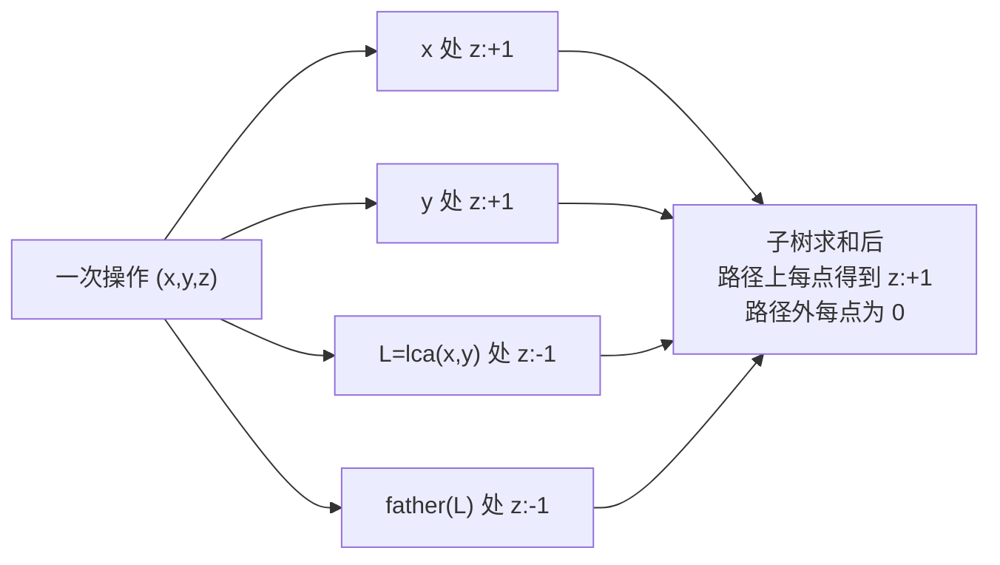
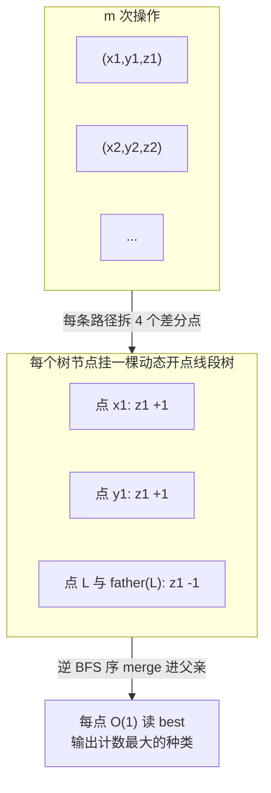

[[TOC]]

## 形式化题目

给一棵 $n$ 个点的树（点编号 $1 \sim n$）和 $m$ 次操作。每次操作给出 $(x, y, z)$，表示给路径 $x \to y$ 上（含两端）的每个点放入一袋 $z$ 类物品。全部操作结束后，对每个点输出存放次数最多的物品种类编号；若并列，输出编号最小的；若一个点没有任何物品，输出 $0$。

数据范围：$1 \le n, m \le 10^5$，$1 \le z \le 10^9$。

## 直接正解

### 思路

**第一步：把"路径覆盖"转成"点上差分"。**

如果每次操作都真的沿路径走一遍，单次最坏 $O(n)$，总代价 $O(nm) = 10^{10}$，不可接受。树的基本套路是先求出每条路径两端的 LCA，然后在**点上**做差分：对每次操作 $(x,y,z)$，

- 在 $x$、$y$ 处给种类 $z$ 记 $+1$；
- 在 $\mathrm{lca}(x,y)$ 与它的父亲处给种类 $z$ 记 $-1$。

之后让每个点汇总**整个子树**的差分值，得到的恰好是"多少条路径覆盖了这个点、各是什么种类"。验证一下正确性：对点 $u$ 与一次操作 $(x,y,z)$，$x$、$y$ 两个 $+1$ 与 LCA 处的 $-1$、LCA 父亲处的 $-1$ 相互配合——$u$ 在路径上时恰好被计入 $+1$，不在路径上时正负抵消为 $0$。

**第二步：每个点要的是"众数种类"，不是计数和。**

子树求和本身好办：逆 BFS 序遍历，把每个点的差分表并进父亲即可。难点在于每个点存的是"各种类各多少袋"，而 $z$ 高达 $10^9$、种类数可达 $10^5$，若每个点都开一张完整表，空间是 $O(n \cdot z)$ 级别，爆炸。

观察合并过程：一个点的表 = 自己的差分表 + 所有儿子的表。如果用**每种一个下标的权值线段树**来存这张表，合并两棵线段树时，只在"两边同时存在的区间"才递归，代价是 $O(\min(s_1, s_2) \log)$（$s$ 为节点数）——这正是经典的**线段树合并**。每次操作只新增 $O(\log)$ 个差分点，全部 $m$ 次操作总共只会有 $O(m \log)$ 个动态开点的节点，合并总代价被每个新节点"每向上并一次掉一层"摊住，为 $O(m \log)$ 级。

**第三步：线段树节点上存什么才能 O(1) 拿众数？**

这是本题最容易踩的坑。若节点只存**子树计数和** `sum`，查询众数时每层走向 `sum` 更大的孩子，是**错误**的：`sum` 是区间和，右边可能有 2 个种类各 1 袋（和为 2），左边只有 1 个种类 3 袋（和为 3），但若右边和比左边大就会走错方向。正确做法是节点额外维护：

- `mx`：该节点子树内**单个叶子的最大计数**；
- `best`：取到该最大计数的叶子编号（即种类）。

插入差分点时沿路径更新叶子，再从叶子往上回推所有祖先的 `(mx, best)`；合并时用两棵树孩子的 `(mx, best)` 重算父亲。这样每个点的答案在查询时是 $O(1)$ 的：`mx[根] > 0` 时答案就是 `kinds[best[根]]`。并列取编号最小，靠"比较时取左孩子优先 + 叶子编号即离散化后的种类顺序"天然实现。

**整体流程：**

| 步骤 | 做法 | 代价 |
| --- | --- | --- |
| 建树 + 求 LCA | BFS 定父/深，倍增表 `up[k][v]` | $O(n \log n)$ |
| 处理操作 | 每条路径差分成 4 个单点 $\pm 1$，动态开点插入对应点的线段树 | $O(m \log n)$ |
| 汇总答案 | 逆 BFS 序：先取该点线段树根的 `best`，再 `merge` 进父亲 | $O(m \log n)$ 摊还 |

一个实现细节：线段树的叶子数 $K$ 不能只取"种类数"。合并时两棵树的**区间必须完全一致**（否则区间长度不同的两棵树无法逐层对应），而每个点的线段树在差分点插入时是按"种类数"开叶子的，若某子树只插过 1 个种类、父亲插过 3 个种类，合并就会错位。因此取 $K = \max(\text{种类数}, \lceil \log_2 n \rceil)$，保证所有树的区间结构一致。

### 代码

@include-code(./main.cpp, cpp)

@include-code(./main.py, python)

### 复杂度

- 时间：$O((n + m)\log n)$。LCA 倍增 $O((n+m)\log n)$；差分点插入 $O(m\log)$；线段树合并总摊还 $O(m \log)$；答案查询 $O(1)$/点。
- 空间：$O(m \log)$ 个线段树节点（约 $m \cdot 17 \cdot 2$ 级别）+ 倍增表 $O(n \log n)$，在 $n = m = 10^5$ 下约几十 MB，可以接受。

## 总结

- 树上"路径批量加减、最后逐点查询"先差分到点上，再子树汇总，是固定套路。
- "每点维护多种类计数、要众数"用权值线段树 + 线段树合并，空间从 $O(n \cdot z)$ 压到 $O(m \log)$。
- 众数查询不能依赖区间和，线段树节点必须显式维护 `(区间最大计数, 取到最大值的叶子)` 二元组——这是本题最隐蔽的错误来源。
- 合并要求两棵树区间结构一致，所以叶子总数要取 $\max(\text{种类数}, \lceil \log_2 n \rceil)$ 而不是种类数。
