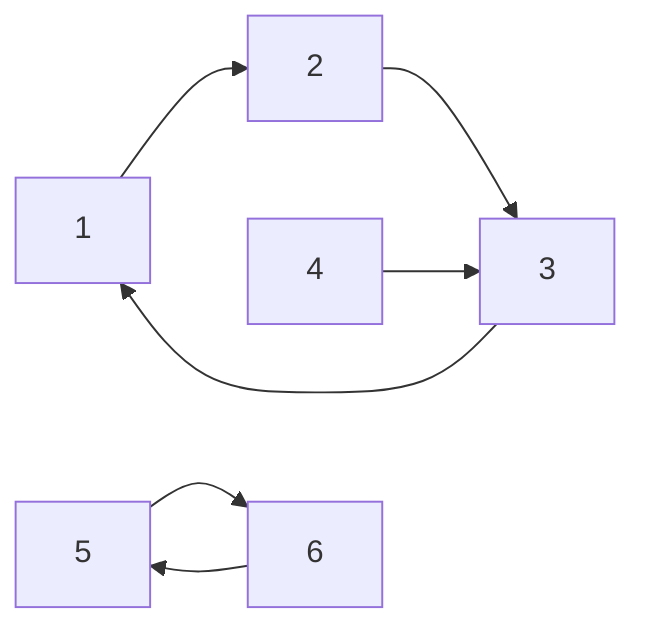

[[TOC]]

## 形式化题目

有 $N$ 个点，每个点 $i$ 有一条有向出边指向 $A[i]$，其中 $1 \leqslant A[i] \leqslant N$。
选出点集 $S$，要求对每个 $u \in S$，都存在 $v \notin S$ 使得 $A[v] = u$：

$$\forall u \in S,\quad \exists v \notin S:\ A[v] = u .$$

求 $|S|$ 的最大值。

注意约束是**单向**的：只对"被投放"的点提要求。没被投放的点不受任何限制，
所以"一个都不投放"永远合法，答案至少是 $0$，题目不会无解。

由于每个点出度为 $1$，这张图是一个**函数图**：每个弱连通块恰好含有一个环，
环上的点挂着若干棵内向树，整体是一片**基环树森林**。

以样例 $N = 6$，$A = [2, 3, 1, 3, 6, 5]$ 为例，箭头由 $i$ 指向 $A[i]$：



左边 $1 \to 2 \to 3 \to 1$ 是一个三元环，点 $4$ 挂在 $3$ 下面；右边 $5 \leftrightarrow 6$
是一个二元环。两个连通块彼此独立，把各自的最优值加起来就是答案。

## 正解

### 思路

**第一步：把条件翻译成"孩子"的语言。**

把边反向，记 $\mathrm{children}(u) = \{\,v : A[v] = u\,\}$，也就是"所有能限制 $u$ 的点"。
那么题目的条件等价于

$$u \in S \;\Longrightarrow\; \mathrm{children}(u) \nsubseteq S ,$$

即：$u$ 一旦被选，它的孩子里至少有一个不能被选。

**第二步：先做树。** 环外的点构成以环上点为根的内向树。对树上的点 $v$，
设父节点 $p = A[v]$（$v$ 是 $p$ 的一个孩子）。我们只关心两个数：

| 记号 | 含义 |
| --- | --- |
| $\mathrm{off}[v]$ | $v$ 不投放时，$v$ 的子树（不含 $v$）最多能投放多少个 |
| $\mathrm{gain}[v]$ | 在 $v$ 的孩子里挑一个不投放，所牺牲的最小值；没有孩子时记为 $\infty$ |

子树各自独立，$v$ 不投放时孩子 $c$ 可以自由地取它的最优值，于是
$\mathrm{off}[v] = \sum_c \mathrm{best}[c]$。若为了让 $v$ 投放而必须牺牲某个孩子 $c$，
就要把 $c$ 从"最优"压回"不投放"。这个损失是

$$\mathrm{slack}[c] = \max\bigl(0,\ 1 - \mathrm{gain}[c]\bigr),$$

取 $\mathrm{gain}[v] = \min_c \mathrm{slack}[c]$ 损失最小——因为 $v$ 投放只需要**一个**孩子不投放。
`gain` 的取值只可能是 $0$、$1$ 两档（$\mathrm{slack} \leqslant 1$），代码里用 $2$ 表示“没有孩子”。
$\mathrm{slack}$ 里那个 $\max(0, \cdot)$ 是减免：如果 $c$ 本来就已经没被投放，
那逼它不投放不花任何代价。

于是对 $v$ 自身：

$$v \notin S \Rightarrow \mathrm{off}[v], \qquad
  v \in S \Rightarrow \mathrm{off}[v] + 1 - \mathrm{gain}[v].$$

这一步实现时不必显式建树：用入度做拓扑排序（剥叶子）自底向上汇总即可，
剥完还剩下入度非 $0$ 的点就正好是环上的点。

**第三步：再做环。** 环上点 $v$ 的限制者分两类——环上的那个孩子，和挂在它下面的整棵树。
把环按"孩子在前、父亲在后"排成 $\mathrm{ring}[0..k-1]$，即 $A[\mathrm{ring}[i]] = \mathrm{ring}[i-1]$，
环尾 $\mathrm{ring}[k-1]$ 是环首 $\mathrm{ring}[0]$ 的限制者。

只要**枚举环尾是否投放**这两种情况，环就断成一条链，链上相邻两点之间是一条真实的
限制关系，可以线性 DP 扫完。用 $dp_0, dp_1$ 表示"刚处理的点不投放 / 投放"的最优值，
它同时就是下一个点的限制者，转移为：

| 新状态 | 取值 | 说明 |
| --- | --- | --- |
| $dp_0'$ | $\max(dp_0, dp_1) + \mathrm{off}[v]$ | $v$ 不投放，对孩子无要求 |
| $dp_1'$ | $\max(dp_0,\ dp_1 - \mathrm{gain}[v]) + \mathrm{off}[v] + 1$ | $v$ 投放，见证来自环上前驱 $dp_0$，或改让挂树孩子不投放 |

两种环尾状态分别给环首定下不同的初值，并在链尾取对应的那一维：

| 环尾 | 环首 $dp_0, dp_1$ | 链尾取 |
| --- | --- | --- |
| 不投放 | $\mathrm{off}[r_0],\ \mathrm{off}[r_0]+1$（可以拿环尾当见证） | $dp_0$ |
| 投放 | $\mathrm{off}[r_0],\ \mathrm{off}[r_0]+1-\mathrm{gain}[r_0]$（只能靠挂树） | $dp_1$ |

长度为 $1$ 的自环要单独处理：唯一的环上候选就是自己，不能拿自己当见证，
答案是 $\max(\mathrm{off}[v],\ \mathrm{off}[v]+1-\mathrm{gain}[v])$。

**用样例走一遍。** 点 $4$ 没有任何孩子（没人指向它），所以它永远不能投放，
它给 $\mathrm{off}[3]$ 的贡献是 $0$，并且让 $\mathrm{gain}[3] = 0$。
对环 $\{1,2,3\}$：若环尾 $3$ 不投放，可取 $\{2,3\}$ 两个（$2$ 由 $1$ 见证，$3$ 由 $4$ 见证，
但 $4$ 不在 $S$ 里）——这正是 $dp_0 = 2$；若环尾 $3$ 投放，$1$ 就失去见证者，只能取 $1$ 个。
另一块 $\{5,6\}$ 只能取 $1$ 个。合计 $2 + 1 = 3$。

**复杂度。** 每个点进出栈一次、环上每个点被扫两次，时间 $O(N)$，空间 $O(N)$。

### 代码

@include-code(./main.cpp, cpp)

@include-code(./main.py, python)

### 复杂度

时间 $O(N)$，空间 $O(N)$。整份实现全部迭代，不含递归，$N = 10^6$ 也可安全运行。

实现上有一点需要留意：$N$ 到 $10^6$ 时，四个 Python `list[int]` 会占掉约 160MB，
超过本题 128MB 的限制。因此 `parent`、`indeg`、`off` 用 `array('i')`（32 位整型），
`gain` 只取 $0/1/2$ 三档故用 `array('b')`，把峰值压到约 85MB。

## 总结

这道题的难点不在 DP 本身，而在**看出图的结构**：每个点出度为 $1$，所以是基环树森林。
之后把它拆成两件事——环外的挂树可以自底向上一次算完，环上只需要枚举环尾一个点的状态
就能断开成链。整个过程中最关键的观察是"$u$ 投放只需要一个孩子不投放"，
它把指数级的组合选择压缩成 $\min_c \mathrm{slack}[c]$ 一个数。

## 图示解析

这张图串起本题从建模到得到答案的主线：

```text
输入: 每个点一条出边 i -> A[i]
`- 每个弱连通块恰好一个环  =>  基环树森林
   |- 环外的挂树: 自底向上剥叶子
   |  |- off[v] = Σ (off[c] + slack[c])        v 不投放
   |  `- gain[v] = min slack[c]                逼一个孩子不投放的最小牺牲
   `- 环上: 枚举环尾投放 / 不投放两种, 环断成链
      |- dp0' = max(dp0, dp1) + off[v]
      `- dp1' = max(dp0, dp1 - gain[v]) + off[v] + 1
         `- 各连通块最优值相加 = 答案
```

顺着读：函数图决定了"一个环 + 若干挂树"的结构；挂树只向环上传两个数
$\mathrm{off}$ 和 $\mathrm{gain}$；环上因为首尾相连才需要枚举一个点的状态来断环；
断环后就是普通的链上 DP，逐块求和即得答案。
