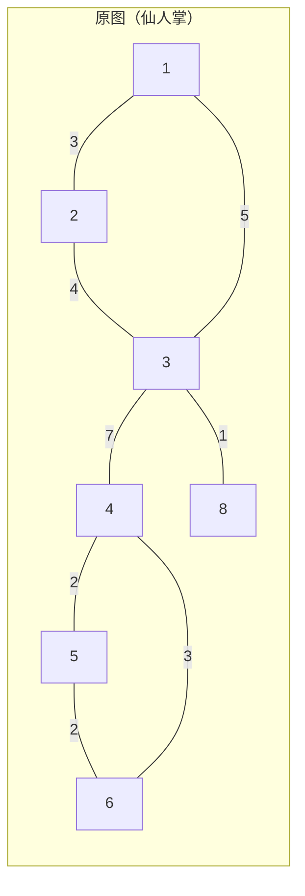
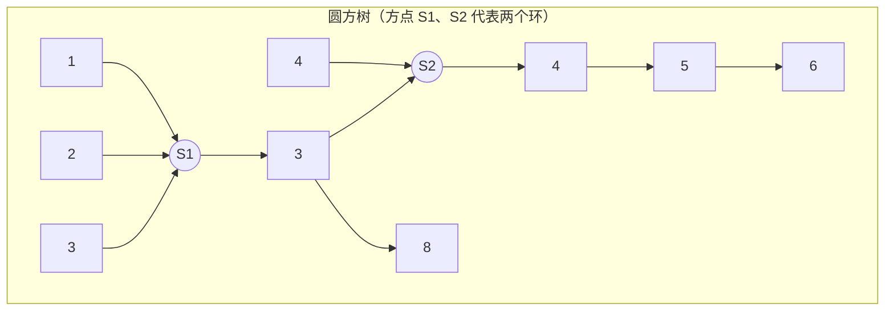

[[TOC]]

## 形式化题目

给定一张 $N$ 个点、$M$ 条边的连通无向带权图，其中每条边至多属于一个环（即题面 A、B、C 三类结构合并后的仙人掌图）。给出 $Q$ 次询问，每次给定两个点 $x, y$，求它们之间路径边权和的最小值。

## 正解

### 思路

**朴素做法。** 每次询问对 $x$ 跑一遍 Dijkstra 求到 $y$ 的最短路：单次 $O(M\log N)$，$Q$ 次就是 $O(QM\log N)$，在 $Q = 10000$、$M \leqslant 12000$ 的规模下必然超时。瓶颈在于 $Q$ 次询问重复扫描了同一张图，所以要把图的结构一次性预处理出来，让每次询问只花 $O(\log N)$。

**图长什么样。** 三类结构 A（$M=N-1$，树）、B（$M=N$，一个环）、C（每个环互不共享边）合起来只有一句话：**$M-(N-1)$ 条"多余"的边，每条边至多属于一个环**——环与环最多"点接触"，这就是仙人掌图。下图是一个典型例子：一个三角形与一个四边形共享顶点 $3$，另外还挂着桥边。

**先找环。** 任取一棵生成树（$N-1$ 条边），剩下 $M-(N-1)$ 条非树边。每加一条非树边就形成唯一一个环，而仙人掌里这条非树边只属于这一个环，于是**每条非树边恰好对应一个环**：浅的一端是环顶 $top$，深的一端是环底 $bottom$，环就是「生成树上 $top \rightsquigarrow bottom$ 的路径 + 这条非树边」。同一条非树边会被两个方向各扫到一次，用一个标记数组去重即可。

**把环缩成方点。** 每个环新建一个**方点**（编号 $N+r$），原图的顶点叫**圆点**：

| 原图对象 | 圆方树中的写法 |
| --- | --- |
| 环顶 $top$ | 方点的父节点（方点父边权 $0$） |
| 环上其他点 $v$ | 父节点是这个方点，父边权 $\min(pos_v,\ L - pos_v)$ |
| 桥边 $(u,v)$ | 保持为树边，权取原边权 |

其中 $pos_v$ 是"环顶沿生成树弧到 $v$"的距离，$L$ 是环长（生成树弧长 + 非树边权）。每种取法都把"环内二选一取短"提前算好，于是环顶到环上任意点的最短路就是方树上的父边权。

把每个环压成方点后得到一棵树，以 $1$ 为根做一次遍历，令 $\text{sd}[v]$ 为根到 $v$ 的方树距离。**关键性质：$\text{sd}[v]$ 恰好等于原图中 $1$ 到 $v$ 的最短路长度**——因为进入任何环的入口都是该环的环顶（环顶一定是割点），而环顶到环上各点的最短路正是前面设置的父边权。

**回答询问。** 设 $a = \operatorname{LCA}(x, y)$（圆方树上）：

| LCA 类型 | 含义 | 答案 |
| --- | --- | --- |
| 圆点（$a \leqslant N$） | 两条路径在环之前就分开，环内不产生合流 | $\text{sd}[x] + \text{sd}[y] - 2\,\text{sd}[a]$ |
| 方点（$a > N$） | 两条路径从环上不同顶点 $ax, ay$ 进入同一个环 | $\bigl(\text{sd}[x]-\text{sd}[ax]\bigr) + \bigl(\text{sd}[y]-\text{sd}[ay]\bigr) + \min(d, L-d)$ |

方点情形里，$ax$ 与 $ay$ 分别是 $x$、$y$ 向上跳到方点的那两个儿子，$d = \lvert pos_{ax} - pos_{ay}\rvert$，$L$ 是这个环的环长；环内两点之间只有两条弧可选，取短的那条。由于边权都是正数，绕整圈不可能更优。

样例验证（样例是一棵树，只走第一行公式）：

| 询问 | 路径 | 答案 |
| --- | --- | --- |
| `3 5` | $3 \to 1 \to 2 \to 5$，$1+1+1$ | 3 |
| `2 1` | $2 \to 1$ | 1 |

与样例输出一致。为了确认公式在环上成立，另外用随机仙人掌生成器与本机 Dijkstra 对拍了 5000 组小数据（纯树、单环、共享顶点的三角形链、大环挂树四种形态），结果全部一致。

### 代码

@include-code(./main.py, python)

### 复杂度

- 时间：$O\bigl((N+M)\log(N+M) + Q\log N\bigr)$。建生成树、圈环、建圆方树各是线性；倍增表占 $O((N+M)\log(N+M))$；每次询问一次 LCA 加上至多两次 $O(\log N)$ 跳步。
- 空间：$O\bigl((N+M)\log(N+M)\bigr)$，主要来自倍增祖先表 `up`。

## 总结

本题的核心是把"图上多次询问最短路"化成"树上距离 + 至多一处环内取短"：

1. 题面 A/B/C 三类结构等价于**仙人掌**，于是"每条非树边恰好圈出一个环"，用一次迭代 DFS 就能把全部环找出来。
2. 把每个环缩成**方点**、环上各点按"环顶到它的最短路"设置父边权，得到**圆方树**；根到点的方树距离就是原图最短路。
3. 询问时按 LCA 是圆点还是方点分两类：圆点直接相减，方点在环内取两条弧中较短的一条。

用 Python 实现时注意两点：DFS 写成显式栈避免深递归；输入一次读完再用切片取三列，比逐 token `next()` 更快。
