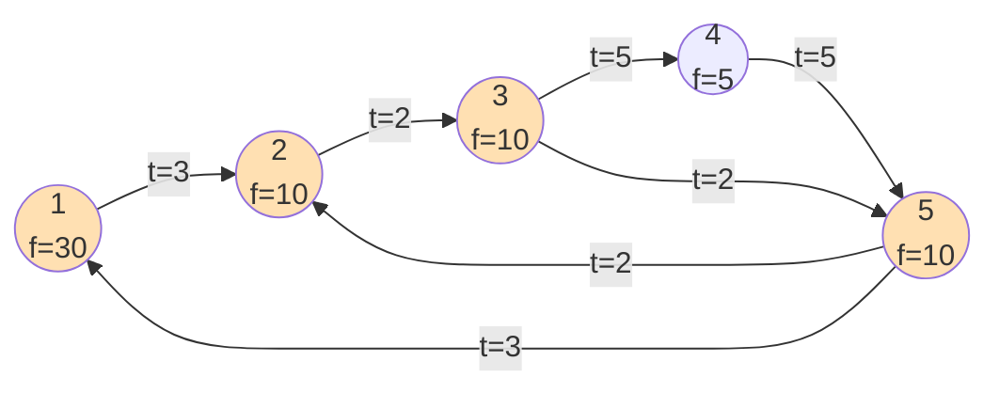
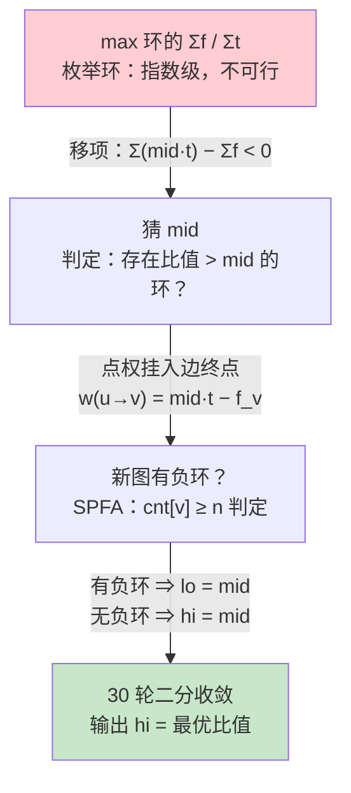

[[TOC]]

## 形式化题目

给定 $L$ 个点、$P$ 条边的有向图。点 $v$ 有点权 $f_v$（乐趣值），边 $u \to v$ 有边权 $t(u,v)$（耗时）。找一个环 $C$（点与边交替、首尾相接，至少含一条边），最大化

$$
\frac{\sum_{v \in C} f_v}{\sum_{e \in C} t_e}
$$

输出最大比值，保留两位小数。数据保证至少存在一个环。

下面用样例图展示环的结构：每个点标 $f$ 值，每条边标 $t$ 值，加粗路线 $1 \to 2 \to 3 \to 5 \to 1$ 就是最优环。

样例答案来自粗线环 $1 \to 2 \to 3 \to 5 \to 1$：分子 $f_1+f_2+f_3+f_5 = 30+10+10+10 = 60$，分母 $3+2+2+3 = 10$，比值 $60/10 = 6.00$。观察这张图可以发现一个关键结构：**环上每个点恰好对应一条入边**（点 $v$ 的入边就是环上指向它的那条边），点与边一一交替——这正是下一步把点权"挂"到边上的伏笔。

## 正解

### 思路

**朴素做法及其瓶颈**：把图中每个环都找出来，逐个算 $\sum f / \sum t$ 取最大。有向图简单环的数量是指数级的（$L \leqslant 1000$），根本枚举不完。瓶颈在于「环」没法线性枚举，必须把「找一个环」换成「回答一个能高效判定的问题」。

**第一步：01 分数规划（分式转线性）。** 设当前猜测比值 $mid$，问：存在环 $C$ 使 $F(C)/T(C) > mid$ 吗？其中 $F(C)$ 是环上点权和、$T(C)$ 是环上边权和。移项：

$$
F(C) - mid \cdot T(C) > 0
\iff mid \cdot T(C) - F(C) < 0
$$

右边就是「把每条边的权改成 $mid \cdot t_e$、再把环上点权全部减掉后，环权和为负」。利用上面观察到的「环上点与入边一一对应」，把 $f_v$ 挂到 $v$ 的入边上——给每条边 $u \to v$ 定新权：

$$
w(u \to v) = mid \cdot t(u,v) - f_v
$$

这样环 $C$ 的边权和恰好等于 $mid \cdot T(C) - F(C)$，于是

$$
\text{存在比值} > mid \text{ 的环} \iff \text{新图存在负环}
$$

「找环」变成了「判负环」，后者是经典可解问题。

**第二步：SPFA 判负环。** 图不一定强连通，等效做法是从一个虚拟超级源点向所有点连 $0$ 边跑最短路——实现上就是 `dis` 全 $0$、所有点初始入队。用 `cnt[v]` 记录点 $v$ 的 `dis` 被成功松弛的次数：无负环时最短路至多经过 $n-1$ 条边，每点至多被松弛 $n-1$ 次；一旦 `cnt[v] >= n`，由抽屉原理必经过负环，立即返回有负环。

**第三步：二分收敛。** $mid$ 越大，每条边权 $mid \cdot t_e - f_v$ 越大，负环从「有」单调变「无」，所以二分方向明确：

| $mid$ 取值 | 判定（样例图） | 含义 | 二分动作 |
| --- | --- | --- | --- |
| $5.0$ | 有负环（最优环 $10 \cdot 5 - 60 = -10 < 0$） | 存在比值 $>5$ 的环 | `lo = mid` |
| $5.9$ | 有负环（$10 \cdot 5.9 - 60 = -1 < 0$） | 存在比值 $>5.9$ 的环 | `lo = mid` |
| $6.0$ | 无负环（$10 \cdot 6 - 60 = 0$） | 所有环比值 $\leqslant 6$ | `hi = mid` |
| $7.0$ | 无负环（$10 \cdot 7 - 60 = 10 > 0$） | 所有环比值 $\leqslant 7$ | `hi = mid` |

即：有负环说明答案比 $mid$ 大，抬 `lo`；无负环说明答案不超过 $mid$，压 `hi`。比值上界是 $1000/1 = 1000$（分子每点至多 $1000$、分母每边至少 $1$），下界 $0$。30 轮二分后区间长 $1000/2^{30} < 10^{-6}$，两位小数输出绰绰有余。最优比值由某个真实环取到，收敛后输出 `hi` 即答案。

### 代码

@include-code(./main.py, python)

### 复杂度

- 时间：每轮 SPFA 最坏 $O(L \cdot P)$，二分 30 轮，总计 $O(30 \cdot L \cdot P) \approx 1.5 \times 10^8$（上界；实际 SPFA 表现远好于最坏情况，全部测试数据在 Python 下本地最大耗时 0.2s）。
- 空间：邻接表与每轮重建的带权边表均为 $O(L + P)$。

## 总结

- 本题模型是**最优比率环**：分式目标 $\max F(C)/T(C)$ 用 01 分数规划转成线性判定「新图是否有负环」，二分 + SPFA 解决。
- 三个实现关键点：
  1. 点权必须挂到边的**终点**（$w = mid \cdot t - f_v$），环上点与入边一一对应，环权和才恰好是 $mid \cdot T - F$；
  2. 二分方向：有负环 ⇒ 答案 $> mid$ ⇒ 抬 `lo`；
  3. 判负环用精确准则 `cnt[v] >= n`，且所有点初始入队——图不强连通，「总松弛次数超过常数倍 $n$」这类启发式早停会在无负环的大图上误判。
- 同一套套路适用于所有「最大化 分子量/分母量」的图上结构问题（最优比率生成树、最优比率路径等），差别只在分子分母挂在什么元素上、以及用什么算法判负权。

## 图示解析

### 01 分数规划的转化路线

从「枚举所有环」到「二分 + 判负环」的完整推导链：

从上到下是本题的完整思路链：左列说明每一步**消除了什么瓶颈**——第一步把指数级的环枚举换成单个 $mid$ 的判定问题，第二步把「存在比值更大的环」换成图论里成熟的负环判定，第三步利用单调性把判定问题还原成数值答案。读者对照代码时，可以逐层确认 Mermaid 图中每个箭头对应 `main.py` 里的哪一段：边权变换对应 `graph_adj` 推导式，负环判定对应 `has_neg_cycle`，二分方向对应 `lo/hi` 的更新。
