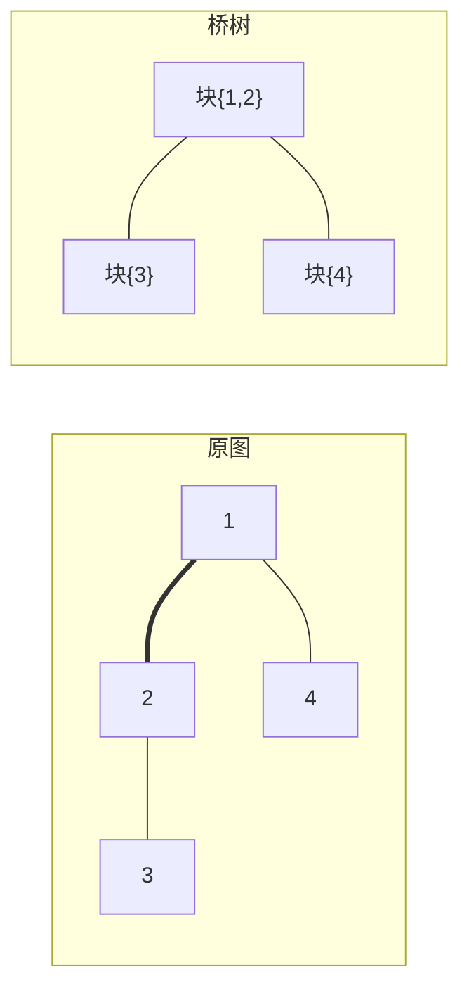

[[TOC]]

## 形式化题目

给定一张 $N$ 个点、$M$ 条边的无向连通图 $G$。依次加入 $Q$ 条边
$(a_1,b_1), (a_2,b_2), \dots, (a_Q,b_Q)$，对每个 $i$ 求出加入第 $i$ 条边**之后**图中桥的数量。

这里「桥」指删掉后会使图不连通的边；加入的边是累积的，不会撤销。

约束：$N \leqslant 10^5$，$M \leqslant 2 \times 10^5$，$Q \leqslant 1000$。

注意 $Q$ 只有 $10^3$，而 $M$ 高达 $2 \times 10^5$：**图很大，但「重新来一遍」的机会很少**。
这个不对称就是本题的题眼。

## 正解

### 思路

**第一步：先发现「桥只会减少」。**

往图里加边只会制造新的环，不会破坏已有的环。因此一条非桥边永远是非桥边，
一条桥边有可能因为新环覆盖它而失效，但绝不会反过来。所以答案是单调不增的。

更精确地说，新边 $(a,b)$ 只会消灭**它所在环上的**桥；不在任何新环上的桥保持不变。
于是问题变成：怎么快速找出「被 $(a,b)$ 消灭的那些桥」。

**第二步：把一般图压缩成树。**

把图上所有非桥边构成的连通块各自缩成一个点——这正好是**边双连通分量**，
记为 $\mathrm{id}(v)$。缩点之后，原图的桥就变成了这些新点之间的边。关键结论是：

> 缩点得到的图是**一棵树**，称为**桥树**。

理由是：如果缩点图里有环，环上每条边都不可能是桥（环上两点总有两条边不相交的路径），
与缩点方式矛盾；又因为原图连通，缩点图连通。连通无环即树。

于是「$(a,b)$ 消灭它所在环上的桥」可以翻译得很干净：设 $u = \mathrm{id}(a)$、$v = \mathrm{id}(b)$，
树上有唯一的 $u \to v$ 路径，**路径上的每条树边都恰好是一条被新边消灭的桥**，路径之外的桥全都不受影响。

维护桥数就变成了维护桥树上的剩余边数：**每次询问把树上 $u \to v$ 路径上的所有边删掉。**

下图是样例第 2 组数据（$N=4$，边 $1-2, 2-1, 2-3, 1-4$）的桥树：左边是原图，
两条 $1-2$ 之间的重边让 $1,2$ 落进同一个边双连通分量，整张图缩成三个点、两条桥。



观察重点：重边 $1-2$ 不是桥，于是 $1,2$ 合成一个块；原图的三条非桥边在桥树里全部消失，
只剩下两条真正的桥。加 $3-4$ 相当于在桥树上删掉 $3 \to \{1,2\} \to 4$ 这条路径上的两条边，
桥数从 2 直接降到 0，这就是样例输出的 `2`、`0`。

**第三步：用并查集把「删路径」做成摊还线性。**

树上的路径删边不必逐条找。维护一个并查集：若某个节点的父边已经被删，
就把它并进父亲的集合。这样 `find(u)` 直接给出「沿父边向上的第一个还有桥的点」。

```text
while u != v:
    if depth[u] < depth[v]:
        u, v = v, u          # 让 u 是更深的那一侧
    uf[u] = find(uf, parent[u])
    u = uf[u]
    remaining -= 1
```

为什么取更深的一侧一定对？设 $w$ 是 $u,v$ 的最近公共祖先。当 $u \neq v$ 时，
二者不可能都落在 $w$ 上，所以较深的那个点到父亲的边必定在 $u \to v$ 的路径上，
删掉它不会多删；上跳后 $u,v$ 的距离严格变小，循环必然终止于 $u = v$，
此时路径上的桥正好全部删完，也不会少删。

每个树节点至多被合并一次，所以 $Q$ 次询问的**总**跳数不超过 $N-1$。

下面把样例第 2 组的两步询问摊开，看 `remaining` 怎么走：

| 步骤 | 询问 | 桥树上的路径 | 本次删掉的桥 | 输出 |
| --- | --- | --- | --- | --- |
| 初始 | — | — | — | 桥数 $= 2$ |
| 第 1 次 | $1\ 2$ | 块 $\{1,2\}$ 到自身 | 无（两端已同块） | `2` |
| 第 2 次 | $3\ 4$ | $3 \to \{1,2\} \to 4$ | 两条 | `0` |

第 1 次询问两端落在同一个块里，`find` 结果相等，循环体一次都不执行，
这正是「重边不改变任何东西」在算法里的体现。

### 代码

@include-code(./main.py, python)

### 复杂度

| 阶段 | 复杂度 |
| --- | --- |
| Tarjan 求初始桥 | $O(N + M)$ |
| 缩点、建桥树、求父与深度 | $O(N + M)$ |
| $Q$ 次询问的路径缩点 | $O\big((N + Q)\,\alpha(N)\big)$ |
| 总计 | $O\big(N + M + Q\,\alpha(N)\big)$ |

空间 $O(N + M)$。作为对照，每次加边重跑一遍 Tarjan 是 $O(Q(N+M))$，
在 $Q = 10^3$、$N + M \approx 3 \times 10^5$ 时要约 $3 \times 10^8$ 次操作，
而正解只有约 $7 \times 10^5$ 次，差了两个数量级以上。

实现上有三处值得注意：

- 无向边存成配对弧 $2i$ 与 $2i+1$，Tarjan 里用 `e == (进入弧 ^ 1)` 跳过「沿原路边返回父亲」；
- 桥的**两条配对弧都要打标记**，缩点时若只标一条，配对弧会被误当成非桥边而错合并分量；
- 三个 DFS（Tarjan、标分量、建树）全部写成迭代，$N = 10^5$ 也不会爆栈。

## 总结

本题的核心不是 Tarjan，而是**把「加边」翻译成树上操作**：先在初始图上求一次桥并缩成桥树，
之后每次加边都等价于在桥树上删掉一条路径上的边。因为加边只减不增，桥树的形状永远不变，
父节点和深度一次预处理即可永久使用；再用并查集把「已经删掉的边」合并到父亲，
使得 $Q$ 次询问的总跳数与 $Q$ 无关。整个套路就是「一次 Tarjan + 一张桥树 + 一个并查集」。

## 图示解析

下面这张图串起从建模到输出的全部环节：

```text
输入: N 点 M 边无向连通图 + Q 次加边
`- 观察: 加边只制造环 => 桥只减不增
   `- 关键: 新边 (a,b) 只消灭 "所在环上" 的桥
      `- 结构: 把非桥边缩成块(边双连通分量) => 桥树(一棵树)
         |- 路径之外无影响
         `- "消灭 (a,b) 所在环的桥" ⇔ "删桥树上 id(a) -> id(b) 的路径边"
            `- 维护: 并查集把"已删父边的点"并入父亲
               |- u != v 时取更深一侧上跳, remaining -= 1
               `- 每点至多被合并一次 => 总跳数 <= N-1
                  `- 答案 = remaining (当前桥树剩余边数)
```

顺着读：无向图上的桥问题先被化简成桥树上的删边问题；桥树不变的性质让父节点与深度可以
只算一次；并查集沿用「已缩点集合」的经典技巧，把路径删边摊还到线性。
最后剩下的边数就是答案，全程不需要任何动态树结构。
