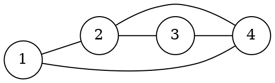

[[TOC]]

## 形式化题目

给定无向图 $G=(V,E)$，$1\in V$，$|V|=N$，$|E|=M$（允许自环与重边）。
要求给出顶点序列

$$
v_0,v_1,\dots,v_{2M},\quad v_0=v_{2M}=1,
$$

使得把序列相邻两项看成一条有向弧后，这 $2M$ 条弧恰好是：每条无向边 $\{a,b\}$
贡献弧 $a\to b$ 与 $b\to a$ 各一次。

换句话说，求一条从 $1$ 出发、回到 $1$、并且**每条边正反两个方向各经过一次**的闭合路径。

样例图（$N=4$，边为 $1\!-\!2,\ 1\!-\!4,\ 2\!-\!3,\ 2\!-\!4,\ 3\!-\!4$）：



图中每条边都要被走两遍（一去一回），所以答案有 $2M+1=11$ 个顶点。
样例给出的是 `1 2 3 4 2 1 4 3 2 4 1`，但题目允许任意一种方案。

## 正解

### 思路

**第一步：把"每条边正反各走一次"改写成"每条弧恰好用一次"。**

输入一条无向边 $\{a,b\}$ 时，直接向有向图里插两条弧 $a\to b$ 和 $b\to a$。
$M$ 条边变成 $2M$ 条弧，"每条边两个方向各一次"就逐字变成"每条弧恰好使用一次"：

> 在有向图上求一条从 $1$ 出发、回到 $1$ 的欧拉回路。

这样改写的好处是：后面完全按**有向图**处理，不需要在遍历时反复判断"这条边是不是桥"。

**第二步：确认一定有解，从而不必写可行性判断。**

拆弧后，每个点 $v$ 的出度等于入度，都等于原图中的度数 $deg(v)$；所有带边的点又在
同一个连通块里。这正是有向图存在欧拉回路的判据，所以从 $1$ 出发一定能走完所有弧
并回到 $1$。

**第三步：放弃 Fleury，改用 Hierholzer。**

朴素思路"每步随便挑一条没走过的弧"可能走进死胡同——走进一个与剩余部分不连通的
区域。Fleury 的修法是：除非无路可走，否则不走桥。但每步判桥要一次连通性检查，
总计 $O(M(N+M))$，不可接受。

Hierholzer 换了个角度：**一路走到底，走进死胡同就回溯，把剩下的圈缝进已有回路**。

```text
dfs(v):
    while v 还有未使用的出弧 (v, u):
        标记该弧已用
        dfs(u)
    tour.append(v)          # v 的出边用光了，此刻 v 就是回路末尾
```

关键在于"出边用光的点可以立刻固定到回路末尾"：由于每个点入出度平衡，只要还有弧
没用完，从死胡同里一定还能走回主干，于是这段闭合的圈可以整体插进正在构造的回路。
所以走进死胡同从来不是错误，只是一个可以回退的局部结构。

**第四步：递归改成迭代。**

上面的递归深度最坏是 $O(M)$（沿长链一路深入、一步也不回退），$M=5\times10^4$ 时
Python 直接爆栈。把"尚未走完的路径前缀"放进显式栈：

```python
stack = [start]
tour = []                              # 已固定的回路后缀（逆序）
while stack:
    arc = head[stack[-1]]              # 栈顶 = 递归里的当前点 v
    if arc == NO_ARC:                  # v 的出边用光了
        tour.append(stack.pop())       # 等价于 dfs 返回前的 tour.append(v)
    else:
        head[stack[-1]] = nxt[arc]     # 摘掉这条弧 = 标记已用
        stack.append(to[arc])          # 顺着这条弧深入
```

两个实现要点：

- **"标记弧已用"就是摘链表头。** `head[v]` 同时充当"$v$ 还未使用的弧的链表"和
  "已用标记"：摘掉之后 `head` 再也指不到它，正反两条弧各自只可能被用一次，
  不需要额外的 `used` 数组。
- **记录顺序是逆序。** 出边用光就出栈的点是回路**末尾**的点，所以 `tour[::-1]`
  才是答案。

**样例推演。** 用样例跑迭代替换版，看栈与答案序列如何演化：

| 步骤 | 本步动作 | 变化后的栈（底 → 顶） | 已定下的序列（尾 → 头） |
| --- | --- | --- | --- |
| 1 | 用弧 2: 1 -> 4 | `[1, 4]` | `[]` |
| 2 | 用弧 9: 4 -> 3 | `[1, 4, 3]` | `[]` |
| 3 | 用弧 8: 3 -> 4 | `[1, 4, 3, 4]` | `[]` |
| 4 | 用弧 7: 4 -> 2 | `[1, 4, 3, 4, 2]` | `[]` |
| 5 | 用弧 6: 2 -> 4 | `[1, 4, 3, 4, 2, 4]` | `[]` |
| 6 | 用弧 3: 4 -> 1 | `[1, 4, 3, 4, 2, 4, 1]` | `[]` |
| ... | ...（继续用弧 0、4、5、1 走到 `[1, 4, 3, 4, 2, 4, 1, 2, 3, 2, 1]`） | ... | ... |
| 11 | 出边用光，钉到答案末尾 | `[]` | `[1]` |
| 12 | 出边用光，钉到答案末尾 | `[]` | `[1, 2]` |
| ... | ...（连续 11 次回退） | ... | ... |
| 21 | 出边用光，钉到答案末尾 | `[]` | `[1, 2, 3, 2, 1, 4, 2, 4, 3, 4, 1]` |

前 10 步是一条不断深入的路径，栈正是这条前缀；第 11 步开始"出边用光"连续触发
11 次，栈整体回退，回退顺序恰好是回路**从尾到头**的顺序。把最后一列翻转，得到

```text
1 4 3 4 2 4 1 2 3 2 1
```

它与 `main.py` 的实际输出一致：首尾都是 $1$，而且相邻点对恰好把 5 条边各走了两遍
（$2\times5+1=11$ 个数）。这个解和样例给出的解不同，但题目允许输出任意一种。

### 代码

@include-code(./main.cpp, cpp)

@include-code(./main.py, python)

### 复杂度

设 $N$ 为点数、$M$ 为边数。

- 时间：读入建图 $O(N+M)$，Hierholzer 中每条弧恰好压栈一次、出栈一次，$O(N+M)$，
  输出 $2M+1$ 行 $O(M)$，合计 $O(N+M)$。
- 空间：链式前向星三个数组各 $O(N+M)$，栈与回路 $O(M)$，合计 $O(N+M)$。

## 总结

- 题目的"每条边正反各经过一次"等价于"每条弧恰好经过一次"，于是本题就是**有向图
  欧拉回路**模板。
- 拆弧后出度 = 入度自动成立，解一定存在，不需要可行性判断。
- Hierholzer 用"随便走 + 回溯拼接"免掉了 Fleury 的判桥，把 $O(M(N+M))$ 降到 $O(N+M)$。
- Python 实现必须把递归改成显式栈，并用"摘链表头"代替 `used` 数组；记录顺序要翻转。

## 图示解析

这张图串起本题从建模到得到答案的主线：

```text
无向图 (N 个点, M 条边)：每条边正、反方向各走一次
`- 建模：把每条无向边拆成两条有向弧，问题变成"每条弧恰好用一次"
   `- 关键观察：拆弧后每个点 出度 = 入度 = 原度数
      |- 有向图欧拉回路判据成立 → 一定有解，不需要可行性特判
      |- 放弃 Fleury（每步判桥 O(M(N+M))）
      `- Hierholzer：一路随便走，走进死胡同再回溯
         |- 递归版会 O(M) 层爆栈 → 改成显式栈
         |- "标记弧已用" = 从邻接链表头摘掉该弧
         `- 出边用光的点立刻钉到回路末尾 → tour 逆序 → 翻转输出 2M+1 个数
```

先看第一层如何把"每条边两个方向"翻译成"每条弧一次"，再顺着分支看平衡条件怎样保证
解必定存在、Hierholzer 又怎样把"避桥"这个瓶颈彻底消掉，最后一步只是把记录顺序翻过来。
