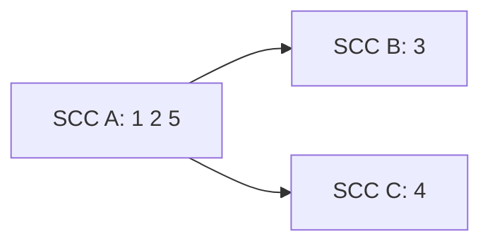
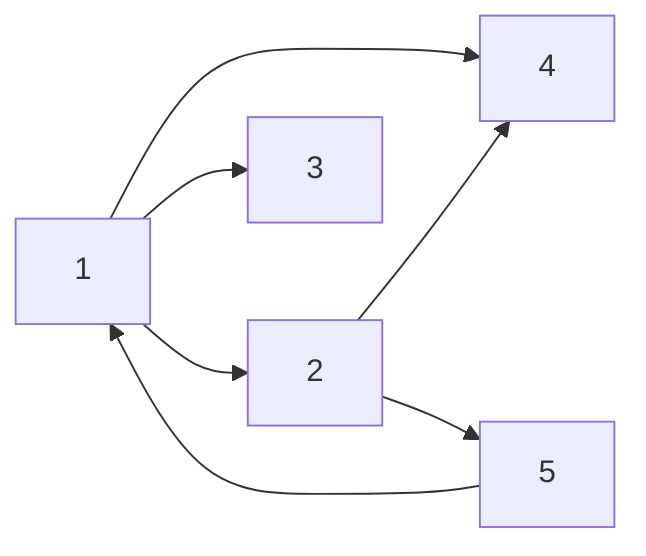

[[TOC]]

## 形式化题目

给定有向图 $G = (V, E)$，$|V| = n$。一条边 $A \to B$ 表示学校 $A$ 会把软件传给学校 $B$，且传播会沿边一直继续。

1. 求最少的起点集合 $S \subseteq V$，使得从 $S$ 中每个点出发的可达点并集等于 $V$；
2. 求最少添加多少条有向边，使得加边后的图**任意两点互相可达**（强连通）。

样例的图是 $1 \to 2,\ 1 \to 4,\ 1 \to 3,\ 2 \to 4,\ 2 \to 5,\ 5 \to 1$：其中 $\{1, 2, 5\}$ 互相可达，另外 $3, 4$ 各自单独成一块。下面的图展示缩点后的结构。

图中只有 $A$ 没有入边，所以至少要给它一个软件（第一问答案 $1$）；$B$ 和 $C$ 都没有出边，要把它们接进环里至少各需要一条新边。源分量只有 $1$ 个、汇分量有 $2$ 个，取较大值得到第二问答案 $2$。

## 正解

### 思路

#### 朴素想法

第一问可以直接枚举起点集合，逐个检查能否覆盖全部点；第二问可以枚举要添加的边集合，每加一次就跑一遍强连通判定。第一问要试 $2^{n}$ 个集合，第二问的候选边更多、枚举量更大，$n = 100$ 时都完全不可行。

但本题真正值得利用的性质不是"枚举得太慢"，而是**结构本身很规整**：传播关系是传递的，"互相可达"这一关系把点天然划成了等价类。

#### 关键观察：缩点后只剩度数

把"互相可达"的点合并成一个强连通分量（SCC），就得到一张 DAG——分量之间不可能再互相可达，否则它们就该被合并。**同一个分量内的点，要么全部收到软件，要么全部收不到**，因此两个问题都只需要在缩点后的 DAG 上回答。

设缩点后有 $S$ 个入度为 0 的分量（源分量，没有任何分量指向它），$T$ 个出度为 0 的分量（汇分量）。

**第一问的答案是 $S$。**

- 每个源分量都没有入边，外部任何点都到不了它，所以每个源分量都必须自己提供一个起点，起点数 $\geqslant S$；
- 反过来，取每个源分量里任意一点作为起点，DAG 上任意分量 $D$ 沿反向边一直往回退，由于 DAG 无环必然停在某个入度为 0 的分量上，把这条路径反向就是源分量到 $D$ 的一条路径，于是 $D$ 也被覆盖。起点数 $\leqslant S$。

两边夹起来，答案就是 $S$。

**第二问的答案是：只有一个分量时为 $0$，否则 $\max(S, T)$。**

- **下界**：加边后图强连通，则每个源分量必须获得至少一条新的入边（它原本一条入边都没有），每个汇分量必须获得至少一条新的出边。而一条新边只能给一个源分量补入度、同时给一个汇分量补出度，所以加边数 $\geqslant \max(S, T)$。
- **上界（可以构造出来）**：把 $S$ 个源分量和 $T$ 个汇分量首尾配对连成环——给每个源分量牵一条来自某个汇分量的入边，给每个汇分量牵一条通往某个源分量的出边，多余的配额挂到已经连好的分量上，总共 $\max(S, T)$ 条边。环一旦形成，环上任意两点互相可达；而任何其它分量都能从某个源分量走到、也能走到某个汇分量，因此也被卷进环里，全图强连通。
- **特判**：全图本身只有一个 SCC 时 $S = T = 1$，但此时不需要加任何边，答案是 $0$。所以必须先判"分量个数是否为 1"，不能只看 $S = T = 1$。反例：一条 $1 \to 2 \to \dots \to n$ 的链，$S = T = 1$ 却需要补 $1$ 条边（本题真实数据 input-1 就是这个形状）。

#### 样例对照

样例缩点后只有一个源分量 $A$、两个汇分量 $B, C$，对应答案 $1$ 和 $\max(1,2) = 2$。

| 分量 | 包含的点 | 跨分量出边 | 跨分量入边 | 是源？ | 是汇？ |
| --- | --- | --- | --- | --- | --- |
| $A$ | $1, 2, 5$ | $A \to B$、$A \to C$ | 无 | 是 | 否 |
| $B$ | $3$ | 无 | $A \to B$ | 否 | 是 |
| $C$ | $4$ | 无 | $A \to C$ | 否 | 是 |

表格逐行给出每个分量是否含有跨分量的入边/出边：只有 $A$ 是源、$B$ 与 $C$ 是汇，于是 $S = 1$、$T = 2$。分量内部的边（例如 $1 \to 2$、$2 \to 5$、$5 \to 1$）不出现在两列里——缩点后它们变成分量里的自环，对度数统计没有影响。

#### 实现：Kosaraju 两遍 DFS

求 SCC 用 Kosaraju：

1. 在原图上 DFS，记录每个点的**完成时间**（出边全部走完的时刻）；
2. 按完成时间**从晚到早**的顺序，在**反图**上再 DFS，每次 DFS 访问到的点集就是一个强连通分量。

直觉是：完成时间最晚的点一定属于某个"源头侧"的分量，在反图上从它出发只能走回它自己所在的分量内部。

代码里两遍 DFS 都写成迭代式：栈元素是 `(点, 下一条待走出去的边的下标)`，当边的下标走到尽头时弹出该点，就等价于递归版的"函数返回"。这样既不依赖 `sys.setrecursionlimit`，也避免了深链上的递归风险。分量编号直接取该分量第二遍 DFS 的起点（完成时间最晚的那个点），不同分量的起点互不相同，所以编号天然唯一。

### 代码

@include-code(./main.py, python)

### 复杂度

- 时间复杂度：两遍 DFS 与一次度数统计都是 $O(n + m)$，合计 $O(n + m)$，其中 $m$ 是支援关系条数（$m \leqslant n^2$）。$n \leqslant 100$ 时开销可忽略。
- 空间复杂度：邻接表、反图、`seen` / `comp` 数组与 DFS 栈，合计 $O(n + m)$。

## 总结

本题的两个问题都是强连通分量缩点后的度数统计：

- 第一问 = 源分量数 $S$。因为源分量既"收不到"别人，又是所有点的可达性来源。
- 第二问 = 分量数大于 1 时 $\max(S, T)$。下界来自"每个源要补入边、每个汇要补出边，一条边只能同时补一对"，上界来自"源汇配对连成环"的构造；只有一个分量时答案为 $0$，必须单独判断。

算法本身（Kosaraju 两遍 DFS）是 $O(n+m)$，瓶颈只在实现细节上：迭代 DFS 的完成时间、反图上的第二遍遍历、以及"单分量特判不能写成 $S = T = 1$"。

## 图示解析

下面用样例把 Kosaraju 的两遍 DFS 走完，说明"完成时间"和"分量编号"是怎么来的。原图如下，$1 \to 2 \to 5 \to 1$ 构成一个三元环，$3$ 和 $4$ 只有入边。

方框编号就是学校编号，箭头方向就是支援方向。

第一遍在原图上从 $1$ 开始 DFS：走进 $2$，再走进 $4$（$4$ 无出边，完成），回到 $2$ 之后走进 $5$，$5$ 走到已访问的 $1$，于是 $5$ 完成、$2$ 完成；回到 $1$ 再走进 $3$，$3$ 完成；最后 $1$ 完成。完成顺序是 $4, 5, 2, 3, 1$。

| 步骤 | 当前栈 | 刚完成的点 | 累计完成顺序 |
| --- | --- | --- | --- |
| 走出 $1 \to 2 \to 4$ | $1, 2, 4$ | $4$ | $4$ |
| $2 \to 5$，$5 \to 1$ 已访问 | $1, 2, 5$ | $5$ | $4, 5$ |
| $2$ 无剩余出边 | $1, 2$ | $2$ | $4, 5, 2$ |
| $1 \to 3$ | $1, 3$ | $3$ | $4, 5, 2, 3$ |
| $1$ 无剩余出边 | $1$ | $1$ | $4, 5, 2, 3, 1$ |

第二遍按完成时间**从晚到早**（即 $1, 3, 2, 5, 4$）在反图上 DFS：从 $1$ 出发，反边 $1 \to 5$、$5 \to 2$、$2 \to 1$ 把 $\{1, 2, 5\}$ 一次收完，这就是分量 $A$，编号取起点 $1$；接着 $3$ 未访问，单独成分量 $B$；最后 $4$ 单独成分量 $C$。缩点后即得到上文 $A \to B$、$A \to C$ 的图，于是 $S = 1$、$T = 2$。

| 第二遍的起点 | 反图上能走到的点 | 分量编号 |
| --- | --- | --- |
| $1$ | $1, 2, 5$ | $A = 1$ |
| $3$ | $3$ | $B = 3$ |
| $4$ | $4$ | $C = 4$ |

读表时注意两点：完成顺序里 $1$ 排最后，所以它成为第二遍的第一个起点——这正是"完成时间最晚的点落在源头侧分量"的直观体现；而 $4$ 完成得最早、在第二遍里反而最后被处理，因为它在原图里是纯粹的汇点。
