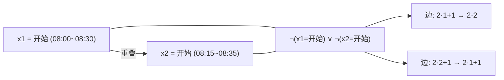
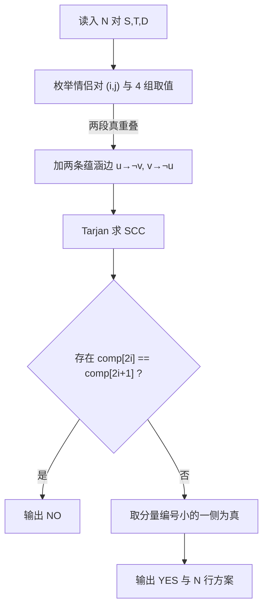

[[TOC]]

## 形式化题目

有 $N$ 个布尔变量 $x_1, \dots, x_N$，第 $i$ 个变量给出两段固定的候选区间

$$
A_i = [S_i,\ S_i + D_i], \qquad B_i = [T_i - D_i,\ T_i].
$$

$x_i = 1$ 表示选 $A_i$，$x_i = 0$ 表示选 $B_i$。
要求给每个变量赋值，使得选出的 $N$ 段区间两两不重叠（$[a_1,b_1]$ 与 $[a_2,b_2]$ 重叠当且仅当 $a_1 < b_2$ 且 $a_2 < b_1$），
并输出任意一组具体方案；不存在方案时报告无解。

约束：$1 \leqslant N \leqslant 1000$。

## 正解

### 思路

**第一步：发现「每个约束只涉及两个变量」。**

每对情侣的候选是**固定的两段**，所以整个决策就是 $N$ 个布尔变量。
任取两对情侣 $i, j$，把它们的取值组合列出来，只有 4 种：

| 第 $i$ 对 | 第 $j$ 对 | 该组合是否允许 |
| --- | --- | --- |
| 开始 $A_i$ | 开始 $A_j$ | 只有两段真重叠时才禁止 |
| 开始 $A_i$ | 结束 $B_j$ | 只有两段真重叠时才禁止 |
| 结束 $B_i$ | 开始 $A_j$ | 只有两段真重叠时才禁止 |
| 结束 $B_i$ | 结束 $B_j$ | 只有两段真重叠时才禁止 |

每种组合要么被允许、要么被禁止，判定只看一次区间比较：`a1 < b2 and a2 < b1`。
而「整体不重叠」等价于「每组两两组合都被允许」——重叠是二元关系，看两两就够了。
于是问题变成：$N$ 个布尔变量，每个约束都形如「这两个文字不能同时为真」。

**第二步：化成 2-SAT。**

给每个变量 $x_i$ 开两个文字点：

- $2i + 1$ 表示 $x_i = 1$（仪式在婚礼**开始时**举行）；
- $2i$ 表示 $x_i = 0$（仪式在婚礼**结束时**举行）。

两个点互为否定，所以否定就是 `p ^ 1`。

如果第 $i$ 对取 $v_i$、第 $j$ 对取 $v_j$ 会让两段真重叠，
那么这个组合非法，要加入子句「$x_i \ne v_i$ **或** $x_j \ne v_j$」，即

$$
\lnot (x_i = v_i) \;\lor\; \lnot (x_j = v_j).
$$

按 2-SAT 的标准转换，「$\lnot u \lor \lnot v$」拆成两条蕴涵边：

$$
u \to \lnot v, \qquad v \to \lnot u .
$$

两条都要连：2-SAT 要求每个子句的两种「反证方向」都成立，只连一条会让判定出错。

下图是样例中一次真实冲突的建模示意。第 1 对是 `08:00 09:00 30`，
第 2 对是 `08:15 09:00 20`；若两对都选「开始时」，两段分别落在 08:00~08:30 与 08:15~08:35，中间 08:15~08:30 真重叠。

图中左右两个文字点表示「都选开始时」，中间的子句说明这组取值非法，
右侧两条蕴涵边就是代码里加入 `graph` 的两条边。**注意两条边方向互补**，
这正是 2-SAT 与普通有向图约束的区别。

**第三步：Tarjan 判定 + 构造方案。**

在建好的蕴涵图上跑 Tarjan 求强连通分量。

- 判定：若存在 $i$ 使 $x_i$ 与 $\lnot x_i$ 落在同一个分量里，说明
  $x_i \Rightarrow \lnot x_i$ 且 $\lnot x_i \Rightarrow x_i$，无论取哪个值都会矛盾，输出 `NO`。
- 赋值：缩点后得到一张 DAG，$x_i$ 与 $\lnot x_i$ 的分量有确定的拓扑先后。
  取**拓扑序更靠后**的那个文字为真即可满足所有蕴涵边。
  用 Tarjan 实现时不需要真的做一次拓扑排序：**弹栈顺序正是缩点图的反拓扑序**，
  也就是分量编号越小、在拓扑序里越靠后。所以代码里取分量编号较小的一侧为真。

下图右边是「先判定、后赋值」的流程：判定只要看有没有一对互补文字同分量，
赋值则直接比较两个分量编号。

以上是完整算法的流程：建图是 $O(N^2)$，Tarjan 是 $O(N + M)$，
整体 $O(N^2)$ 对 $N \leqslant 1000$ 完全够用。

**为什么方案一定合法？** 设赋值为 $\alpha$，任取一条蕴涵边 $u \to \lnot v$。
若 $\alpha(u) = $ 真，则拓扑序上 $\lnot v$ 在 $u$ 之后，按「取靠后者为真」得 $\alpha(\lnot v) = $ 真，
即该子句满足；若 $\alpha(u) = $ 假则子句已满足。所以所有子句都成立，
等价于所有被选出的仪式段两两不重叠。

### 代码

@include-code(./main.cpp, cpp)

@include-code(./main.py, python)

### 复杂度

- 时间复杂度：建图 $O(N^2)$，Tarjan $O(N + M) = O(N^2)$，合计 $O(N^2)$。
- 空间复杂度：邻接表与分量数组共 $O(N^2)$。

## 总结

本题的关键有两点。

第一是**识别 2-SAT**：每对情侣的候选只有两段、每个冲突只牵涉两对情侣，
所以每个约束都是「两个文字不能同时为真」，正好是 2-SAT 的形状。
判断冲突时注意用严格不等号，端点相接不算重叠。

第二是**用 Tarjan 的弹栈顺序代替拓扑排序**：2-SAT 的赋值规则是「取拓扑序靠后的文字」，
而 Tarjan 弹栈得到的就是缩点图的反拓扑序，分量编号越小在拓扑序里越靠后，
因此直接比较 `comp` 编号即可，省掉一次显式拓扑排序。

## 图示解析

下面是样例 1 的完整方案推演。第 1 对只在开始时（08:00~08:30）留了位置，
第 2 对首尾两段都会和第 1 对撞上，只能取结束时的 08:40~09:00，
两者在 08:30~08:40 之间留下空隙——这也说明「端点相接不算重叠」的判据是对的。

| 情侣 | 婚礼区间 | $D_i$ | 候选 A（开始时） | 候选 B（结束时） | 取值 | 冲突原因 |
| --- | --- | --- | --- | --- | --- | --- |
| 1 | 08:00 ~ 09:00 | 30 | 08:00 ~ 08:30 | 08:30 ~ 09:00 | A | — |
| 2 | 08:15 ~ 09:00 | 20 | 08:15 ~ 08:35 | 08:40 ~ 09:00 | B | A 与 (1,A) 在 08:15~08:30 重叠 |

约定 $x_i = 1$ 选 A、$x_i = 0$ 选 B，那么只有 $(x_1, x_2) = (1, 0)$ 可行。
这就解释了样例输出为什么是 `08:00 08:30` 与 `08:40 09:00`。
读者可以顺便验证：$(x_1, x_2) = (0, 0)$ 时两段在 08:30 恰好相接，
按题目「结束时间等于开始时间不算重叠」，它其实也合法——本题方案不唯一，
输出任意一组即可。
