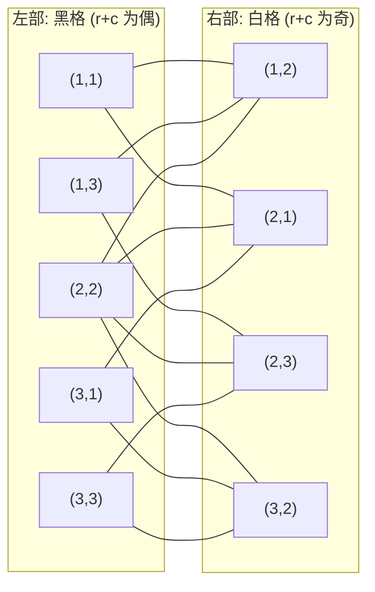

[[TOC]]

## 形式化题目

给定一张 $N \times N$ 的网格，以及禁止格集合 $B \subseteq \{1,\dots,N\}^2$。
可放格为 $F = \{1,\dots,N\}^2 \setminus B$。

在 $F$ 中选取尽可能多的格子对 $(u, v)$，要求：

1. $u, v$ 在网格中上下或左右相邻；
2. 所有被选中的格子两两不同（每对内部两个格子也不同）。

求这样的格子对的最大数量。

把可放格看成点、相邻关系看成边，得到网格图 $G = (F, E)$。上面两条要求正好是
"$G$ 的一个匹配"，因此问题等价于求 $G$ 的最大匹配 $|M^*|$。

样例 `8 0`（$8 \times 8$、无禁止格）是 $G$ 有完美匹配的情形，答案 $32 = 64 / 2$：

```text
    B W B W B W B W
    W B W B W B W B
    B W B W B W B W
    W B W B W B W B
    B W B W B W B W
    W B W B W B W B
    B W B W B W B W
    W B W B W B W B
```

按 $(r+c)$ 的奇偶把格子染成黑（$B$，$r+c$ 为偶）白（$W$）两色后，每个格子的四邻居
都正好是另一种颜色，所以每种颜色各 $32$ 个，恰好能用 $32$ 块骨牌一一配掉。

## 正解

### 思路

**第一步：贪心不行。**

最自然的想法是逐格扫描，能横放就横放，否则竖放。这个做法在 $3 \times 3$、
禁止格为 $(1,1),(3,2),(3,3)$ 时会给出 2，而最优是 3：

```text
    #  .  .
    .  .  .
    .  #  #
```

行优先的贪心会先把 $(1,2)$ 和 $(1,3)$ 横着配，再把 $(2,1)$ 和 $(2,2)$ 横着配，共 2 块，
剩下 $(3,1)$ 无格可配。实际上改成 $(1,2)$–$(2,2)$、$(1,3)$–$(2,3)$、$(2,1)$–$(3,1)$
三块竖放的骨牌，6 个可放格恰好全部用完：

```text
    #  b  a
    c  b  a
    c  #  #
```

问题的本质是：局部的最优搭配可能挡死全局，需要一个能**撤销已有决策**的模型。

**第二步：骨牌就是边。**

一块骨牌压住两个相邻格子，正好是网格图上的一条边；"骨牌互不重叠"就是"边两两不共享端点"。
所以

> 合法摆放 $\longleftrightarrow$ 匹配，最多骨牌数 $\longleftrightarrow$ 最大匹配。

**第三步：网格图是二分图，按奇偶染色。**

相邻两格 $(r,c)$ 与 $(r,c+1)$ 的 $r+c$ 奇偶性必然相反，所以把 $(r+c)$ 为偶数的可放格
放左部 $L$、为奇数的放右部 $R$，每条边都跨部，$G$ 是二分图。任何骨牌都必然一黑一白。

下面画出 $3 \times 3$ 空棋盘的二分图：左部是 5 个黑格，右部是 4 个白格，相邻关系就是边。



图中每条边就是一种可以横放或竖放的骨牌位置；选出的骨牌必须让每个格子最多只被用一次，
这正是匹配的定义。左部 5 个点、右部 4 个点意味着这个棋盘最多只能放 4 块骨牌（$\lfloor 9/2 \rfloor$），
增广路算法会正好求出 4。

**第四步：为什么答案要靠"增广路"而不是靠贪心。**

匹配理论的核心结论是 **Berge 增广路定理**：

> 匹配 $M$ 是最大匹配 $\iff$ 图中不存在 $M$ 的增广路（两端都是未匹配点的交错路）。

所以算法不需要枚举方案，只要反复做一件事：找一条增广路，把路上的匹配边与非匹配边
整体互换，匹配数就 +1；找不到增广路时，当前匹配就是最大的。这正好解释了贪心为什么错——
贪心只看一条边，而增广路允许撤销一串已有匹配，是一种"有结构的后悔"。

以 $3 \times 3$ 空棋盘为例，按行优先顺序左部点为 $B(1,1), B(1,3), B(2,2), B(3,1)$，
右部点记为 $W(r,c)$：

| 步骤 | 找到的交错路 | 增广后的匹配 |
| --- | --- | --- |
| 1 | $B(1,1) - W(2,1)$ | $B(1,1)-W(2,1)$ |
| 2 | $B(1,3) - W(2,3)$ | 再加上 $B(1,3)-W(2,3)$ |
| 3 | $B(2,2) - W(1,2)$ | 再加上 $B(2,2)-W(1,2)$ |
| 4 | $B(3,1) - W(2,1) - B(1,1) - W(1,2) - B(2,2) - W(3,2)$ | 前三条边翻转，$B(1,1)$ 改配 $W(1,2)$、$B(2,2)$ 改配 $W(3,2)$，$B(3,1)$ 拿到 $W(2,1)$ |

第 4 步的路径长度是 3（三条边），$B(3,1)$ 唯一的邻居 $W(2,1)$ 被占，于是顺着占有者
$B(1,1)$ 的另一条边继续走，最后停在空闲的 $W(3,2)$。翻转后 4 个左部点全部匹配，
答案从 3 变成 4。这就是"增广"能救回贪心决策的具体形态。

**第五步：用 Hopcroft–Karp 批量增广。**

匈牙利算法每个左部点依次找一个增广路，复杂度 $O(VE)$，$V \approx 10^4$、$E \approx 2\times10^4$
时最坏约 $2\times 10^8$，Python 会超时。Hopcroft–Karp 把它改成"每轮批量增广"：

1. **BFS 分层**：从所有未匹配左部点同时出发，交替走"未匹配边 → 匹配边"。走到右部点 $y$
   后下一步只能走 $y$ 的匹配边到 `match_r[y]`，没有分支，所以层号只需记在左部点上。
   第一次碰到空闲右部点时的层号就是最短增广路长度 $shortest$（BFS 保证最短）。
2. **DFS 批量增广**：只沿 $dist[z] = dist[x] + 1$ 的边往下走，并且只接受长度恰好等于
   $shortest$ 的路。长度相同的增广路彼此不共享端点，所以一轮里能一次增广多条。
3. 每轮结束后 $shortest$ 严格增大，轮数不超过 $O(\sqrt V)$，总复杂度 $O(E\sqrt V)$。

HK 的复杂度上界严格优于匈牙利（$O(E\sqrt V) \subseteq O(VE)$），没有为了省事而放宽算法。

**第六步：实现细节。**

- 棋盘四周补一圈禁止格，编号 $v = r \cdot (N+2) + c$。这样判断上下左右时可以无条件取
  $v \pm 1, v \pm (N+2)$，不必写四组边界条件；重复出现的禁止格由 `banned[v] = 1` 幂等处理。
- DFS 深度最坏可达 $O(V)$，改写成显式栈，避免递归开销与 `setrecursionlimit`。
- 迭代 DFS 的翻转顺序：命中空闲右部点 $y$ 时先写 `match_r[y] = x`、`match_l[x] = y`，
  再沿路径把每对 `(px, py)` 写成 `match_r[py] = px`、`match_l[px] = py`。路径里保存的正是
  "上一层的左部点与它连出去的右部点"，所以整条路同时翻转，不需要额外判断奇偶。

$4\times4$ 棋盘上禁止 $(2,2)$ 与 $(3,4)$ 时，最大匹配是 7 块，一种最优摆放如下
（相同字母的两格属于同一块骨牌）：

```text
    a  b  b  c
    a  #  e  c
    d  f  e  #
    d  f  g  g
```

其中竖放的是 $a=(1,1)(2,1)$、$c=(1,4)(2,4)$、$d=(3,1)(4,1)$、$e=(2,3)(3,3)$、
$f=(3,2)(4,2)$，横放的是 $b=(1,2)(1,3)$ 与 $g=(4,3)(4,4)$。禁止格 $(2,2)$ 一下子拿掉了
$(1,2),(2,1),(2,3),(3,2)$ 四个格子的一个邻居，$(3,4)$ 又使 $(4,4)$ 只剩 $(4,3)$ 可配，
其余格子随之整体错位——最终的 7 块是全盘协调的结果，任何只看单点的贪心都无法保证。

### 代码

@include-code(./main.py, python)

### 复杂度

- 时间复杂度：$O(E\sqrt V)$，其中 $V = (N+2)^2$ 是网格图顶点数、$E \leqslant 2N(N-1)$ 是边数。
  BFS 与 DFS 各 $O(E)$，而每轮最短增广路长度至少 +1，轮数不超过 $O(\sqrt V)$。
  $N = 100$ 时约 $2 \times 10^6$ 量级，实测每组数据 0.03s 以内。
- 空间复杂度：$O(N^2)$，主要是 `adj`、`banned` 与 `match_l`、`match_r`、`dist` 三个长度
  $(N+2)^2$ 的数组，实测峰值约 16MB，限制 128MB。

## 总结

这道题的关键是**换模型**：不要在网格上直接搜摆放方案，而是看出"骨牌 = 边、不重叠 = 不共端点"，
把问题化为网格图的最大匹配。之后按 $(r+c)$ 奇偶染色证明网格图是二分图，就能用增广路算法
精确求解，避免贪心和指数搜索。

实现上选择 Hopcroft–Karp 而不是匈牙利算法：它的 $O(E\sqrt V)$ 上界严格更优，也把 Python
的实现负担降到了毫秒级。整份代码只有"分层、批量增广、外层循环"三段，全部迭代，没有递归。

## 图示解析

从输入到答案的主线：

```text
输入: N x N 棋盘 + t 个禁止格
`- 可放格建图: 相邻(上下左右)连边
   |- 骨牌 = 一条边; 不重叠 = 边不共享端点
   |  `- 合法摆放 <=> 匹配  =>  答案 = 最大匹配
   `- (r+c) 奇偶染色: 每条边跨色 => 网格图是二分图
      |- 左部 = 黑格, 右部 = 白格, 邻居 = 边
      `- Hopcroft-Karp
         |- BFS 分层: 求最短增广路长度 shortest
         |- DFS 批量增广: 只走分层方向、只取长度 = shortest
         `- shortest = INF 时停机 => 由增广路定理即最大匹配
```

其中最后两个分支对应代码里的 `bfs_layers` 与 `augment_all`，两者被 `max_matching`
的 `while True` 反复调用，直到 `shortest == INF` 为止。

顺着读：先确认"骨牌就是边"这一步把组合摆放大问题变成匹配问题；再用奇偶染色说明为什么
可以用二分图算法（这是能套 HK 的前提）；最后 BFS 分层 + DFS 批量增广就是具体算法，
停机条件由 Berge 增广路定理保证正确。整条链上没有任何一步依赖"局部最优"，
所以贪心的反例在这里不会出现。
