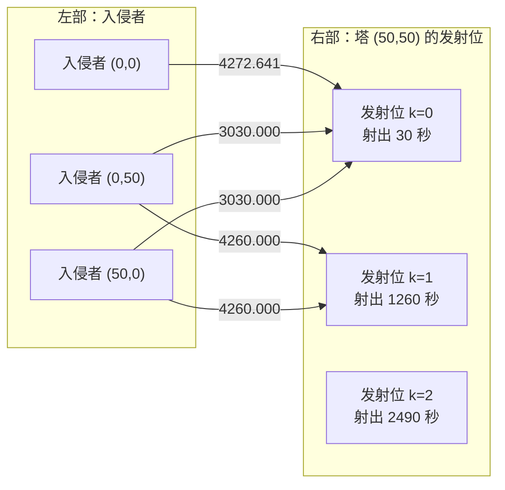

[[TOC]]

## 形式化题目

有 $N$ 座防御塔，坐标为 $P_i = (x_i, y_i)$；有 $M$ 个入侵者，坐标为 $Q_j = (u_j, v_j)$。参数为 $T_1$（秒）、$T_2$（分钟）、$V$。

每座塔都有无限多枚导弹，但**同一时刻最多发射一枚**，且每次发射后的 $T_2$ 分钟内不能再发射。
把「第 $i$ 座塔从 $0$ 开始编号的第 $k$ 次发射」记作一个**发射位** $p=(i,k)$，
它的射出时刻是

$$s_k = (k+1)\,T_1 + k \cdot 60\,T_2 \quad (\text{秒}).$$

导弹只算水平距离 $d(i,j) = \lVert P_i - Q_j \rVert_2$，飞行时间是 $d(i,j)/V$ 分钟，
所以发射位 $(i,k)$ 命中第 $j$ 个入侵者的时刻为

$$t(i,j,k) = \frac{60\, d(i,j)}{V} + (k+1)\,T_1 + k \cdot 60\,T_2 \quad (\text{秒}).$$

要求给**每个**入侵者指派一次命中 $(i,j,k)$，使被用到的发射位 $(i,k)$ 两两不同
（同一座塔的同一次发射只能服务一个目标），并最小化所有命中时刻的最大值。
输出这个最小值（分钟），四舍五入保留六位小数。

约束：$1 \leqslant N, M \leqslant 50$，$|坐标| \leqslant 10^4$，$T_1, T_2, V \leqslant 2000$。

## 正解

### 思路

**第一步：先把「发射位」这个概念提出来。**

题面里的时间单位混用（$T_1$ 是秒、$T_2$ 是分钟、飞行时间也是分钟），先统一折算成**秒**：

- 发射本身耗 $T_1$ 秒，所以编号 $k$ 的发射在第 $(k+1)T_1$ 秒射出；
- 每次发射后冷却 $T_2$ 分钟 $=60T_2$ 秒，编号 $k$ 之前已有 $k$ 次冷却，累计 $k \cdot 60T_2$ 秒；
- 飞行时间是 $d/V$ 分钟 $=60d/V$ 秒。

合起来就是 $t(i,j,k) = 60d(i,j)/V + (k+1)T_1 + k\cdot 60T_2$。

注意一个关键性质：$s_k$ 关于 $k$ **严格递增**。也就是说，只要规定「同一座塔被用到的发射编号
$k$ 各不相同」，冷却约束就自动满足了 —— 我们根本不需要真的去模拟时间轴。

发射位是本题唯一的稀缺资源：每座塔最多用 $M$ 次发射就足够（只有 $M$ 个目标要打），
所以一共只需考虑 $N \times M$ 个发射位。

**第二步：问题变成「指派」。**

于是所求就是：给每个入侵者 $j$ 指派一个发射位 $p=(i,k)$，代价是 $t(p,j)$；
每个发射位最多被用一次；最小化最大代价。

直接枚举指派是阶乘级别（约 $(NM)^M$），不可能。

**第三步：可行性单调 $\Rightarrow$ 二分答案。**

问「能不能在 $D$ 秒内打完」比问「最少要多少秒」容易得多：固定 $D$ 之后，
每个发射位对每个目标能否使用（$t(i,j,k) \leqslant D$）就是一个确定的布尔关系。
而且 $D$ 越大可用的组合只会越多，可行性关于 $D$ **单调**，可以二分。

二分区间也不需要连续：最优解一定等于某个 $t(i,j,k)$（取最晚的那次命中即可），
所以把所有 $NM^2$ 个时刻排序去重，在这张候选表上二分就行。

**第四步：判定用二分图最大匹配。**

固定 $D$ 后的判定问题是标准二分图匹配：

- 左部 $M$ 个点：入侵者；
- 右部 $NM$ 个点：发射位 $(i,k)$，展平成一维编号 $i \cdot M + k$；
- $j \to (i,k)$ 连边当且仅当 $t(i,j,k) \leqslant D$。

「每个入侵者都能分到一个发射位」$\iff$ 该二分图存在大小为 $M$ 的匹配。
左部只有 $M \leqslant 50$ 个点，用匈牙利算法跑 $M$ 轮增广即可。

下图是样例取 $D = 4272.641$ 秒（塔 $(50,50)$ 打 $(0,0)$ 的那次命中时刻）时的建图。
另两座塔 $(0,1000)$、$(1000,0)$ 到三个目标的距离都 $\geqslant 950$，
命中时刻最早也有 $57030$ 秒，此时一条边都连不上，图中省略。

边上的数字是这次命中的时刻（秒）；只有时刻不超过 $D$ 的发射位才会被连边。

观察重点有两个：**左部只有 3 个点、右部有 3 个发射位**，但 $D=4272.641$ 时只有
$S_0, S_1$ 收到了边，$S_2$（$5490$ 秒）还太晚，最大匹配只能是 $2 < 3$，判定失败。
把 $D$ 提高到 $5490$ 秒，$A_0 \to S_0,\ A_1 \to S_1,\ A_2 \to S_2$
三条边同时可用，匹配数达到 $3$，判定成功。

**第五步：两个实现细节。**

- **前缀截边**：固定 $D$ 时不必重扫全部 $NM$ 条边。对每个目标把 $NM$ 个发射位按
  $t$ 排序，用 `bisect_right` 一次就能截出「时刻 $\leqslant D$」的前缀作为邻接表。
- **候选时刻去重**：二分在排序去重后的候选表上做，保证最终输出的正是某次命中的时刻。

### 代码

`main.py` 分四层，覆盖上面五步：`slot_times()` 是时间公式，`max_matching()` 是判定用的
匈牙利算法，`minimum_time()` 是二分答案，`solve()` 只负责读入、调用和输出。
全程统一用**秒**计时，只有最后输出时除以 `SECOND = 60` 换回分钟。

@include-code(./main.cpp, cpp)

@include-code(./main.py, python)

### 复杂度

- 时间复杂度：$O(NM^3 \log(NM^2))$。预处理时刻表 $O(NM^2)$，一次匈牙利最坏 $O(NM^3)$，
  外层二分 $\log(NM^2) \approx 17$ 次。$N=M=50$ 时实测最慢一组约 $0.05$ s。
- 空间复杂度：$O(NM^2)$，即 $M \times NM$ 的时刻表与邻接表，峰值内存约 $34$ MB。

## 总结

本题的关键不是「模拟」，而是**把连续的发射过程离散成一个一个「发射位」**：
第 $i$ 座塔的第 $k$ 次发射的射出时刻 $(k+1)T_1 + k\cdot 60T_2$ 只由 $k$ 决定且关于 $k$ 递增，
于是冷却约束退化成「每个发射位最多用一次」，问题随之变成指派问题。
指派问题的最小最大代价用**二分答案 + 二分图最大匹配**处理：$D$ 越大可用边越多，
可行性单调，判定就是「$M$ 个入侵者能否各自抢到互不重复的发射位」。

三个容易踩的坑：单位要把 $T_2$ 的分钟乘 $60$ 折算成秒；每座塔保留 $M$ 次发射
（共 $NM$ 个发射位）就够，多留无用；输出要除以 $60$ 换回分钟并保留六位小数。

## 图示解析

下表是样例中塔 $(50,50)$ 的三次发射命中三个目标的时刻（秒），它就是二分使用的候选表的前几项。

| 发射编号 $k$ | 射出时刻（秒） | 打 $(0,0)$（$d=70.711$） | 打 $(0,50)$（$d=50$） | 打 $(50,0)$（$d=50$） |
| --- | --- | --- | --- | --- |
| 0 | 30 | 4272.641 | 3030.000 | 3030.000 |
| 1 | 1260 | 5502.641 | 4260.000 | 4260.000 |
| 2 | 2490 | 6732.641 | 5490.000 | 5490.000 |

从列方向看，同一列的时刻随 $k$ 递增；从行方向看，同一行的三格差别只来自距离（飞行时间）。
最优指派是「$(0,0)$ 用编号 0、$(0,50)$ 用编号 1、$(50,0)$ 用编号 2 的发射位」，
最晚时刻 $5490$ 秒 $=91.5$ 分钟，正好是样例输出 `91.500000`。

反过来验证为什么不能更早：下一个更小的候选值是 $4272.641$ 秒，
此时 $(0,0)$ 只能配编号 0 的发射位，而 $(0,50)$ 与 $(50,0)$ 只能配编号 0、1，
三个目标共用两个发射位，匹配数只有 $2$，判定失败 —— 这正是上面 Mermaid 图展示的状态。
