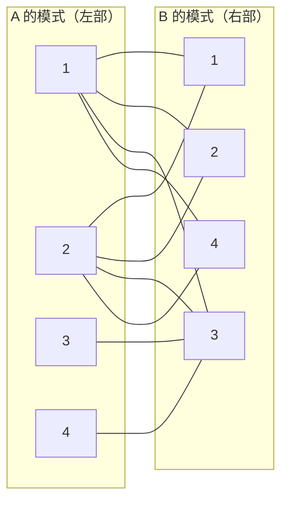

[[TOC]]

## 形式化题目

有两台机器 $A$、$B$，$A$ 有 $N$ 种模式 $0 \sim N-1$，$B$ 有 $M$ 种模式 $0 \sim M-1$，
初始都停在模式 $0$。给定 $K$ 个任务，任务 $i$ 交给 $A$ 做要求 $A$ 处于模式 $a_i$，
交给 $B$ 做要求 $B$ 处于模式 $b_i$；每个任务必须且只能由一台机器完成。

任务可以按任意顺序执行。一台机器每切换一次模式记一次重启，求完成全部任务所需的最少重启次数。

约束：$N, M < 100$，$K < 1000$，$0 \leqslant a_i < N$，$0 \leqslant b_i < M$，多组数据。

## 正解

### 思路

**朴素做法**：枚举每个任务分给 $A$ 还是 $B$，再枚举执行顺序。分配方案有 $2^K$ 种，
$K < 1000$ 时完全不可行；而且这个做法看不出题目真正的结构。

**关键观察：顺序其实是无关变量。** 对一台机器来说，重要的是"它最终要经过哪些模式"。
若分配给 $A$ 的任务需要的模式集合是 $S_A$，那么 $A$ 的最少重启次数就是
$|S_A \setminus \{0\}|$：从初始模式 $0$ 出发，依次切到每个新模式恰好一次即可，
重复访问某个模式不会更省。于是顺序被彻底消掉，问题只剩"选哪些模式"。

**坑点：模式 $0$ 是免费的，必须删掉。** 若 $a_i = 0$，这个任务交给 $A$ 时
$A$ 根本不用动（初始就在模式 $0$），它不强迫我们新增任何模式，也不产生代价。
所以 $a_i = 0$ 或 $b_i = 0$ 的任务可以直接删除。若把它当普通边建进图里，
最优解就被迫去覆盖那个本不需要付费的"模式 $0$"点，答案一定偏大，
而且偏大的量并不固定（后文图示解析给出对照）。

**化为最小点覆盖。** 删掉免费任务后，把所有"要付钱的模式"建成点：

- 左部点：$A$ 的模式 $1, 2, \dots, N-1$；
- 右部点：$B$ 的模式 $1, 2, \dots, M-1$；
- 剩下每个任务 $i$ 连一条无向边 $(a_i, b_i)$。

选哪些模式就是"选图中的哪些点"，代价是选中点数；而"每个任务至少被一台机器覆盖"
就是"每条边至少有一个端点被选中"——这正是**点覆盖**的定义。
度为 $0$ 的模式永远不会被最优解选中，忽略它们不改变结论。所以

$$\text{答案} = \text{二分图的最小点覆盖大小}$$

**König 定理。** 图是二分图（左侧只有 $A$ 的模式，右侧只有 $B$ 的模式），
由 König 定理：二分图最小点覆盖大小 $=$ 最大匹配大小。于是问题变成求最大匹配。

举个例子：题面样例 $N=M=5$，$K=10$ 且没有 $0$ 任务，建出的二分图如下（左 $A$ 右 $B$）。

任务的分配对应"每条边挑一个端点"，重启次数对应"被挑中的点数"。
最小的挑法是选 $A$ 的模式 $\{1, 2\}$ 覆盖前 $8$ 条边、再选 $B$ 的模式 $\{3\}$ 覆盖后 $2$ 条，
一共 $3$ 次重启，与样例输出一致。图中恰好存在 $3$ 条两两不共用端点的边
（例如 $(2,1), (3,3)$ 和 $(1,4)$），所以最大匹配为 $3$，最小点覆盖不可能更小。

**最大匹配用 Hopcroft–Karp。** 每一轮先 BFS 给左部点分层并求出最短增广路的长度，
再沿分层方向一次性把所有这么长的增广路都增广掉。每轮至少消掉一层，
最多 $O(\sqrt V)$ 轮，总复杂度 $O(E\sqrt V)$。本题规模很小（$V < 200$，$E < 1000$），
朴素的匈牙利算法 $O(VE)$ 同样能过，选 Hopcroft–Karp 只是渐近界更稳。

### 代码

@include-code(./main.cpp, cpp)

@include-code(./main.py, python)

### 复杂度

- 时间复杂度：Hopcroft–Karp 为 $O(E\sqrt V)$，其中 $E \leqslant K < 1000$、
  $V \leqslant N + M < 200$，单组数据在 $10^4$ 量级，多组数据也能在 1000ms 内轻松跑完。
- 空间复杂度：$O(V + E)$，即邻接表与匹配、层号数组。

## 总结

本题的推导是一条直线：**先证明执行顺序无关**（一台机器的代价只等于它需要的非 $0$ 模式数），
**再删掉两台机器都能在初始模式下完成的任务**，然后把"每个任务至少被一台机器覆盖"
翻译成二分图的点覆盖，最后由 König 定理转成最大匹配。之所以能转得这么干净，
关键在于模式 $0$ 是初始状态：它不需要重启，所以它对应的任务不产生任何约束——
这一步漏掉答案就会偏大。求最大匹配用 Hopcroft–Karp，$O(E\sqrt V)$ 完成。

## 图示解析

### 样例的最优分配

下表逐任务展示上图中一组最优选点；"说明"列写出该任务是被哪台机器的哪个模式覆盖的。
（这些数字是把样例输入跑一遍最大匹配 + König 构造得到的，不是手写的。）

| 任务 $i$ | $a_i$ | $b_i$ | 分配给谁 | 说明 |
| --- | --- | --- | --- | --- |
| 0 | 1 | 1 | A | A 选模式 1 |
| 1 | 1 | 2 | A | A 选模式 1 |
| 2 | 1 | 3 | A | A 选模式 1 |
| 3 | 1 | 4 | A | A 选模式 1 |
| 4 | 2 | 1 | A | A 选模式 2 |
| 5 | 2 | 2 | A | A 选模式 2 |
| 6 | 2 | 3 | A | A 选模式 2 |
| 7 | 2 | 4 | A | A 选模式 2 |
| 8 | 3 | 3 | B | B 选模式 3 |
| 9 | 4 | 3 | B | B 选模式 3 |

选中的非 $0$ 模式一共 $2 + 1 = 3$ 个：$A$ 从模式 $0$ 依次切到模式 $1$、模式 $2$
（$2$ 次重启）；$B$ 从模式 $0$ 切到模式 $3$（$1$ 次重启），共 $3$ 次。
任务 $8, 9$ 交给 $B$ 后，$A$ 就不必再切到模式 $3$、模式 $4$，省下了重启。

### 为什么模式 0 必须排除

把这个坑拆开看：下面两个输入仅在"是否把 `0` 当普通模式建边"这一点上有差别。

| 输入 | 正确做法（删除 0 任务） | 错误做法（把 0 当普通模式建边） |
| --- | --- | --- |
| `3 3 3` / `0 0 1` / `1 1 0` / `2 2 2` | 1 | 3 |
| 题面样例（无 0 任务） | 3 | 3（无 0 边，两者相同） |

第一行说明偏大量并不固定为 $1$：正确做法只需选 $B$ 的模式 $2$（$1$ 次重启）；
而错误做法把模式 $0$ 也当成一个必须被覆盖的点，任务 $(0,1)$ 与 $(1,0)$
又各自逼出一个额外选点，于是一路涨到 $3$。

根源是模式 $0$ 不需要任何重启：它根本不该作为图的顶点参与点覆盖。
把 $a_i = 0$ 或 $b_i = 0$ 的任务直接丢弃即可——这种任务交给对应机器时，
该机器已经在模式 $0$ 上，不产生任何约束。

这个坑在本题的评测数据上会真实扣分：10 个数据文件共 19 个测试组，
其中 15 组会因为把 `0` 当普通模式而偏大（各偏大 $1$）。
按正确做法提交后，全部 10 个数据文件的输出均与标准答案逐行一致。
