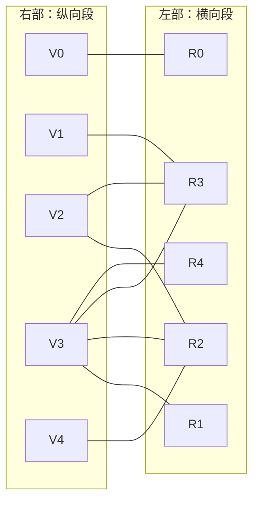

[[TOC]]

## 形式化题目

给定 $N$ 行 $M$ 列的网格，`*` 是泥泞格、`.` 是干净格。用若干宽度为 $1$、长度任意的
木板盖住所有泥格：每块木板必须沿行方向或列方向、覆盖一串**完整的连续格子**，
不能压到任何干净格，木板之间可以重叠。求最少需要多少块木板。

把网格做两次切分：

- **横向极大泥段**：同一行里一段连续的 `*`，左右两侧顶住边界或 `.`；
- **纵向极大泥段**：同一列里一段连续的 `*`，上下两侧顶住边界或 `.`。

样例 $4\times4$ 的切分结果（行、列从 $0$ 开始编号）：

| 横向段 | 位置 | | 纵向段 | 位置 |
| --- | --- | --- | --- | --- |
| R0 | $(0,0)$ | | V0 | $(0,0)$ |
| R1 | $(0,2)$ | | V1 | $(2,0)$ |
| R2 | $(1,1)\!\sim\!(1,3)$ | | V2 | $(1,1)$ |
| R3 | $(2,0)\!\sim\!(2,2)$ | | V3 | $(0,2)\!\sim\!(3,2)$ |
| R4 | $(3,2)$ | | V4 | $(1,3)$ |

行段 $5$ 个、列段 $5$ 个。每个泥格 $(r,c)$ 恰好属于一个横向段和一个纵向段。
要证的是：**最少木板数等于这个「段-交叉」二分图的最大匹配**，其中横向段构成左部、
纵向段构成右部、每个泥格在它的两段之间连一条边。

## 正解

### 思路

**第一步：朴素做法卡在哪里。**

直接搜索「每一块木板从哪开始、往哪个方向摆」是指数级的；换成枚举「哪些段放板」
也有 $2^{\text{行段}+\text{列段}}$ 种——$50\times50$ 全泥时行段列段各 $50$ 个，
约 $2^{100}$，完全不可行。朴素做法的通病是把决策单位放在了「格子/木板」上，
而真正的结构藏在**段与段的交叉**里。

**第二步：每个泥格都是一次「横板还是纵板」的二选一。**

一个泥格 $(r,c)$ 想被盖住，只有两条路：要么放一块横向木板盖住它所在的横向段
（以该段的最长形态），要么放一块纵向木板盖住它所在的纵向段。板可以重叠，
所以「横竖都放」也合法，两种选择互不排斥。

把横向段、纵向段看成顶点，泥格 $(r,c)$ 在它的横段与纵段之间连一条边——
于是「放一块横板」$=$ 选一个左部顶点，「放一块纵板」$=$ 选一个右部顶点，
而「盖住每个泥格」$=$ **每条边至少有一个端点被选中**（边的两端都不选，
就等价于这个泥格既没有横板也没有纵板管）。

这正是**最小点覆盖**（minimum vertex cover）的定义。所以

$$\text{最少木板数} \;=\; \tau(G),$$

$G$ 是行段-列段二分图，$\tau$ 是最小点覆盖的大小。注意一个细节：
一个泥格可能同时被横板和纵板盖住（重叠允许），点覆盖同样允许一条边的
两端都被选中——约束只是「至少一端」，二者完全吻合。

样例的二分图长这样（左部横向段、右部纵向段）：



样例共 $9$ 个泥格（即 $9$ 条边）。答案 $4$ 对应的木板方案是 $\{$R0, R2, R3, V3$\}$：横板 $(0,0)$、
横板 $(1,1)\!\sim\!(1,3)$、横板 $(2,0)\!\sim\!(2,2)$、纵板 $(0,2)\!\sim\!(3,2)$。
逐格检查：$(0,0)$ 由 R0、$(0,2)$ 由 V3、$(1,1)(1,2)(1,3)$ 由 R2、
$(2,0)(2,1)(2,2)$ 由 R3、$(3,2)$ 由 V3，$9$ 个泥格全部盖住，恰好 $4$ 块。
在图上这 $4$ 个顶点确实覆盖了全部 $9$ 条边。

**第三步：König 定理把点覆盖换成匹配。**

最小点覆盖在一般图上是 NP-hard 的，但二分图有 König 定理：
**最小点覆盖的大小 $=$ 最大匹配的大小**，$\tau(G)=\nu(G)$。

一半是显然的：匹配的 $\nu$ 条边端点互不相同，覆盖这些边至少要 $\nu$ 个点，
故 $\tau\ge\nu$。另一半 $\tau\le\nu$ 由构造性证明给出——从每个未匹配的左部点出发
走「未匹配边、匹配边」交替的路，把交替路上「左部未匹配点、右部匹配点」这类
特定端点取出来，恰好拼出 $\nu$ 个点的点覆盖。于是

$$\text{答案} \;=\; \tau(G) \;=\; \nu(G) \;=\; \text{二分图最大匹配}.$$

要提醒的是：**数量相等，对象不等**。一组最大匹配的边本身不一定是点覆盖
（样例的最大匹配 $\{V0\!-\!R0,\ V1\!-\!R3,\ V2\!-\!R2,\ V3\!-\!R1\}$ 只盖住 $9$ 条边里的 $4$ 条，
漏了 $V4\!-\!R2$ 等其余边），但 König 定理保证「最小点覆盖里有多少个点」这件事可以直接用
「最大匹配有多少条边」算出来，而我们只需要这个数。所以代码里只求匹配数，
不构造具体的木板方案。

样例上验证：最大匹配是 $4$——$V0\!-\!R0$、$V1\!-\!R3$、$V2\!-\!R2$、$V3\!-\!R1$，
只剩 $V4$ 想配 $R2$，而 $R2$ 已被 $V2$ 占用；$V2$ 换到 $V3$ 试过的其他邻居
也腾不出（$V3$ 的邻居 $R1,R3,R4$ 里 $R3$ 被 $V1$ 占且 $V1$ 无处可去），
增广失败，$\nu=4$，与样例答案 $4$ 一致。

**第四步：匈牙利算法求最大匹配。**

从右部（纵向段）逐点找增广路：沿未匹配边摸到一个横向段；若它还空着，直接配上；
若已被某个纵向段占用，就顺着那条匹配边下潜到那个纵向段，替它另找新横段……
这样走出一条「未匹配边、匹配边」交替的路，撞到空闲横段时把整条路翻转，
匹配数加一。`seen` 集合保证每轮里每个横段只被访问一次。若某个纵向段找不到
增广路，由 Berge 定理，当前匹配已是最大，直接跳过即可。

**实现细节。**

- 按行读整段字符串；行段编号扫描时用 `seg` 记录「正在走的段」，
  遇 `.` 归 $-1$、遇 `*` 且无段时开新段；
- 列段不需要编号表（它只当匹配的发起方），扫到段首时把整段压住的行段号
  收进邻接表即可；
- `match` 挂在横段上：被抢的是横段，下潜一步从横段直接跳到占用它的纵段；
- 增广用显式栈（帧 $=$ 纵向段、下一个待试邻居、最近想抢的横段），
  避免深递归触发 Python 递归上限。

### 代码

@include-code(./main.cpp, cpp)

@include-code(./main.py, python)

### 复杂度

- 建图：行段扫描 $O(NM)$，列段扫描并登记邻接 $O(NM)$（每个泥格登记一条边）。
- 匈牙利：右部每个纵段做一轮增广 DFS，`seen` 保证一轮内每个横段至多被访问一次，
  一轮 $O(|E|)$，总复杂度 $O(|R|\cdot|E|)$。行段、列段各 $\le 2500$、
  边数 $\le 2500$，上界 $O(N^2M^2)$；真实数据（10 组、约一半泥格）单组实测约
  $0.02$s，远低于限制。
- 空间：`row_ids`、`groups`、`match`、`seen` 均为 $O(NM)$。

## 总结

- 关键建模：横向/纵向**极大泥段**作二分图两侧顶点，每个泥格在两段之间连边；
  「盖住每个泥格」恰是「每条边至少一端被选」，答案就是最小点覆盖 $\tau$。
  允许木板重叠与点覆盖「两端都选也合法」完全吻合。
- 关键定理：二分图上 König 定理 $\tau=\nu$，答案直接就是最大匹配数。
  注意「数量相等、对象不等」——匹配的边本身不必是点覆盖，本题只要数。
- 实现要点：列段无需编号表、`match` 挂在横段上、显式栈增广、
  `seen` 用当轮局部集合。

## 图示解析

从题面到答案的主线：

```text
网格中的每个泥格 (r,c)
        │  它同时属于一个横向极大泥段和一个纵向极大泥段
        ▼
行段 R = 左部 ──边=泥格── 右部 = 列段 V     （按构造就是二分图）
        │  盖住泥格 ⟺ 每条边至少一端被选中（板可重叠 ⟺ 两端都选也合法）
        ▼
答案 = 最小点覆盖 τ(G)
        │  König 定理：二分图 τ = ν
        ▼
答案 = 最大匹配 ν(G)
        │  匈牙利：每个纵段找一条增广路，找不到就停
        ▼
输出 ν(G)
```

样例 $4\times4$ 上两条线并排看一遍：

| 最小点覆盖（$4$ 个顶点） | 对应的木板方案 | 盖住的泥格 |
| --- | --- | --- |
| R0 | 横板 $(0,0)$ | $(0,0)$ |
| R2 | 横板 $(1,1)\!\sim\!(1,3)$ | $(1,1)(1,2)(1,3)$ |
| R3 | 横板 $(2,0)\!\sim\!(2,2)$ | $(2,0)(2,1)(2,2)$ |
| V3 | 纵板 $(0,2)\!\sim\!(3,2)$ | $(0,2)(1,2)(2,2)(3,2)$ |

最大匹配（$4$ 条边）：$V0\!-\!R0$、$V1\!-\!R3$、$V2\!-\!R2$、$V3\!-\!R1$。

读表时注意两点：点覆盖里 $(1,2)(2,2)$ 两个泥格同时被 R2/R3 和 V3 盖住
（木板重叠，点覆盖允许两端都选）；而最大匹配的 $4$ 条边**不是**上面的覆盖方案
（它漏了 $V4\!-\!R2$ 这条边）——König 定理只保证两者的**数量**都是 $4$，
这也正是「只求匹配数、不求方案」的原因。
