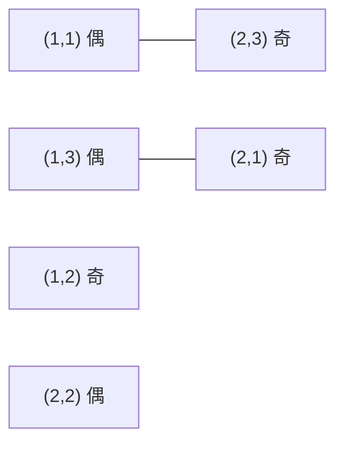

[[TOC]]

## 形式化题目

给定 $N$ 行 $M$ 列的棋盘，以及 $T$ 个禁止放置的格子。把每个**未被禁止**的格子看成一个点，
两个格子之间连一条边当且仅当它们是彼此的「马步」落点，即行列差满足

$$|x_1-x_2|+|y_1-y_2| = 3 \quad\text{且}\quad \max(|x_1-x_2|,\,|y_1-y_2|) = 2 .$$

这样得到一个无向图 $G$。记 $|V| = NM - T$ 为未被禁止的格子数，也就是图的顶点数。
要求从 $V$ 中选出最多的点，使任意两点之间都没有边。

用图论的语言说：求 $G$ 的**最大独立集**大小 $\alpha(G)$。棋子本身两两不同，棋盘上位置
也不重复，因此只数个数，不区分方案。

以题面样例 $N=2,\ M=3,\ T=0$ 为例，棋盘的二染色与攻击边如下（同一行内相邻的两格 $(r+c)$ 相差 $1$，
颜色相反；马步的两格颜色也相反，见下文的正解）。



图中有 6 个可放置格，共 2 条攻击边。它们两两不相邻，所以最大匹配是 $2$，
答案 $6-2=4$，与样例输出一致。

## 正解

### 思路

**第一步：先想朴素做法，看清它卡在哪里。**

最直接的想法是搜索：每个格子有「放 / 不放」两种状态，枚举全部 $2^{NM-T}$ 种选法，
逐个检查是否出现互相攻击的一对棋子，取合法方案里的最大个数。$NM$ 最大 $10^4$，
这个枚举量完全不可行。

退一步的「贪心」也不行：按从上到下、从左到右的顺序，能放就放，会挡住后面更优的选择。
$3\times3$ 无禁放棋盘的最优值是 $5$（四个角加中心），而这样贪心只能放到 $4$ 个
（第 $1$ 行三格加中心，此时 $(3,1)$ 被 $(2,3)$ 攻击、$(1,1)$ 攻击 $(3,2)$，第 $3$ 行放不下）。

两种朴素做法的共同瓶颈是：它们把「每个格子放不放」当成彼此独立的决策，而题目的冲突
其实是**成对**出现的——两个格子要么互相攻击，要么完全无关。这类结构应该换成图的语言，
而不是逐格决策。

**第二步：攻击图是二分图。**

马一步的行、列变化分别是 $(\pm1,\pm2)$ 或 $(\pm2,\pm1)$，两者之和是 $3$，是奇数。因此

$$(r\pm1)+(c\pm2) \equiv (r+c)+3 \equiv (r+c)+1 \pmod 2 .$$

也就是说：**马每走一步，都必然把 $r+c$ 的奇偶性翻转**。于是按 $(r+c)\bmod 2$ 把格子染成
「偶格」和「奇格」两类，任意一条攻击边一定连接一个偶格和一个奇格，同色格之间永远没有边。
把偶格集合记作 $L$、奇格集合记作 $R$，攻击图就是一个二分图。

这一步是整个解法的分水岭：一般图的最大独立集是 NP-hard 的，而二分图不是。

**第三步：把最大独立集换成最大匹配。**

二分图有 König 定理：**最大匹配的大小等于最小点覆盖的大小**，$\nu(G) = \tau(G)$。
另一方面，$S$ 是独立集当且仅当它的补集 $V \setminus S$ 是点覆盖（每条边至少要有一个端点
不在 $S$ 里），所以 $\alpha(G) + \tau(G) = |V|$。两式合起来：

$$\alpha(G) = |V| - \tau(G) = |V| - \nu(G), \qquad |V| = NM - T .$$

于是「最多放几个棋子」变成了「求攻击图的最大匹配」。

**第四步：用增广路算法求最大匹配。**

匈牙利算法依次为每个左部点（偶格）尝试找一条增广路：从它出发，沿「未匹配边」走到一个右部点；
如果这个右部点已经被占用，就沿它的「匹配边」走回另一个左部点，再继续沿未匹配边前进……
这样走出的是一条未匹配边与匹配边交替的路径。一旦撞上一个还没匹配的右部点，就把这条路上
的所有边「翻转」（匹配的变不匹配、不匹配的变匹配），匹配数增加 $1$，并且仍然是一个合法匹配。
对应地，路径上每个右部点都会换一个左部点搭档，所以新左部点也顺利配上。

若某个左部点怎么走都到不了未匹配的右部点，由 Berge 定理可知以它为起点的增广路不存在，
继续为其他点找增广路即可；全部尝试完后得到的匹配就是最大匹配。

**第五步：处理「禁放」与实现细节。**

禁放格不参与游戏，从图中删掉即可：枚举左部点时跳过它，枚举邻居时也跳过它。删点删边不会
破坏二分性，所以 König 定理依然可用。另外

- 棋盘最多 $10^4$ 个点、约 $4\times10^4$ 条边，邻接表用 CSR（`offset` + `flat`）一次生成，
  比逐点 `append` 的二维表更省时间也更好遍历；
- DFS 用显式栈实现。增广路的长度最坏是 $O(|V|)$，递归写法会触发 Python 的递归深度限制；
- 先做一遍贪心（每个左部点先抢一个空闲邻居）得到初始匹配，再只为还没配上的点找增广路。
  贪心结果一定是合法匹配，增广过程会把它补到最大，正确性和最坏复杂度都不变，
  但棋盘数据上绝大多数点会被贪心直接配上，实际增广次数很少。

答案就是 $NM - T - \nu(G)$。

### 代码

@include-code(./main.cpp, cpp)

@include-code(./main.py, python)

### 复杂度

- 建图：每个格子最多看 $8$ 条马步，$O(NM)$。
- 求最大匹配：每个左部点做一次增广 DFS，一次 DFS 每条边只访问常数次，总复杂度
  $O(|V| \cdot |E|) = O(N^2M^2)$。这是匈牙利算法的上界；$|V| \leqslant 10^4$、
  $|E| \leqslant 8|V|$，配合贪心初始匹配，实测单组数据最慢不到 $0.05$ 秒。
- 空间：`blocked`、`offset`、`flat`、`match`、`seen` 都是 $O(NM)$。

## 总结

- 关键观察：马步同时改变行、列的奇偶，所以 $(r+c)$ 的奇偶必然翻转，攻击图天然是二分图。
- 关键转化：最大独立集 $\alpha = |V| - \tau$（补集是点覆盖），再对二分图用 König 定理
  $\tau = \nu$，于是 $\alpha = |V| - \nu$，其中 $|V| = NM - T$。
- 实现要点：只把禁放格从点集里删掉；邻接表压成 CSR；增广 DFS 用显式栈；先用贪心拿初始匹配。

## 图示解析

从输入到答案的完整路线：

```text
输入 N M T 与 T 个禁放格
        │
        ▼
可放置格子 = NM − T 个点 ── 每个点连出 ≤8 条马步边
        │
        ▼  马步翻转 (r+c) 的奇偶
   ┌────────────┴────────────┐
   │                         │
 偶格 L（左部）        奇格 R（右部）        同色之间永远无边
   └────────────┬────────────┘
                ▼
        攻击图 G 是二分图
                │
                ▼  König: τ = ν，且 α + τ = |V|
        答案 α(G) = (NM − T) − 最大匹配 ν(G)
                │
                ▼
        贪心初始匹配 + 逐点增广路（匈牙利）
```

这张图把解法压缩成一条主线：**二染色 → 二分图 → König 定理 → 匈牙利算法**。
读的时候注意两点：左边「同色之间永远无边」是二染色成立的原因，也是 $L \to R$ 单向连边的
依据；最后一步的减法里，$NM - T$ 是顶点数，$\nu(G) = \tau(G)$ 是最小点覆盖的大小
（即为了消掉所有攻击边而必须放弃的格子数），两者相减就是能放下的最多棋子数。
