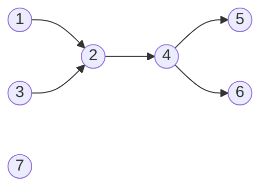

[[TOC]]

## 形式化题目

给定一张 $N$ 个点、$M$ 条边的**有向无环图**。若从 $u$ 沿有向边可以走到 $v$（$u\neq v$），
就说 $u$ 与 $v$ 可以互相望见。要求选出尽量多的点，使得选出的点**两两之间都不能互相望见**。

等价的说法：在 $u$ 能到达 $v$ 定义出的可达关系 $\prec$ 下，求这张 DAG 的**最大反链**。

## 正解

### 思路

#### 第一步：看清“两两不可达”是什么

“任意两个藏身点之间都没有路径相连”就是：选出的集合里不存在 $u\prec v$ 的数对，
也就是可达偏序下的一条**反链**。问题变成“求最大反链”。

直接枚举子集需要 $2^N$ 次判断，$N=200$ 时完全不可行；按拓扑层次贪心也不行——
最大反链未必来自同一层。需要换一个刻画。

#### 第二步：用 Dilworth 定理换成链覆盖

**Dilworth 定理**：有限偏序集中，**最大反链的大小等于覆盖全集的链的最少条数**。

至少有一个方向的直觉是清楚的：一条链上任意两点都可比较，所以一条链里最多放一个反链元素；
用 $k$ 条链覆盖了全部 $N$ 个点，就有“最大反链 $\leqslant k$”。
反方向（存在一条与链数一样大的反链）先记下，第四节会用拆点二分图上的 König 定理把它证出来，
那时我们会发现反链恰好就是 $N-\nu$ 个点，不需要把它当成黑箱。

于是问题变成：**用最少的链覆盖全部点**，这就是 **DAG 最小路径点覆盖**。

这里有一个容易被忽略的点：题面说“从 $A$ 沿着路走下去能够到达 $B$”，
所以链上相邻两点之间**只要存在路径**即可，不必有一条直接的边。
因此必须先把图**传递闭包**——求出每对“能到达”的点，再在闭包上做链覆盖。

#### 第三步：最小路径点覆盖 $= N - $ 最大匹配

把每个点 $u$ 拆成左副本 $u_L$ 和右副本 $u_R$。对每一对满足 $u$ 能到达 $v$（$u\neq v$）的点，
连一条二分边 $u_L\to v_R$。设该二分图的最大匹配为 $\nu$，则

$$\text{最小路径点覆盖}=N-\nu .$$

理由：把匹配边理解成链内的“箭头”。一条链 $L$ 个点正好有 $L-1$ 条箭头（每个非末点指向它的后继），
所有链的箭头总数 $=N-k$（$k$ 是链数）。由于链两两不相交，每个点的出箭、入箭都不超过 1，
这些箭头恰好构成一个合法匹配；反过来，任意匹配里每个点的出箭、入箭也不超过 1，
而图本身无环，沿着箭头走不可能绕回起点，于是它一定分解成若干条**点不相交的链**。
两边夹逼即得 $k=N-\nu$。想让链数 $k$ 最小，就让匹配 $\nu$ 最大。

**为什么要排除 $u=v$**：链上的“后继”必须是不同的点，允许自匹配会凭空造出一条假箭头，把答案算小。

#### 第四步：两个方向夹出答案

记 $k=N-\nu$，即上面算出的最小链覆盖数。第二步已经说明：一条链里最多放一个藏身点，
$k$ 条链覆盖全部点，所以任何合法藏身点集都 $\leqslant k$，即**答案 $\leqslant k$**。
剩下要补的是**答案 $\geqslant k$**：需要真的找出 $k$ 个两两不可达的点。

这一步用二分图的 **König 定理**（二分图中最小点覆盖 $=$ 最大匹配）就够了。
它的构造思路是：从所有未匹配的左部点出发走交替路，
把“走不到的左部点”和“走得到的右部点”合起来，就得到大小为 $\nu$ 的最小点覆盖。
这里直接引用结论：在拆点二分图里取一个大小为 $\nu$ 的最小点覆盖 $C$（$C$ 由若干左副本和右副本组成），令

$$A=\{\,u\;\big|\;u_L\notin C \ \wedge\ u_R\notin C\,\}.$$

- $|A|\geqslant N-|C|=N-\nu=k$：每个点 $u$ 最多只有两个副本，$C$ 总共才 $\nu$ 个副本，
  所以“两个副本都不在 $C$ 里”的点至少 $N-\nu$ 个。
- $A$ 是反链：若 $u,v\in A$ 且 $u$ 能到达 $v$，则拆点图里有边 $u_L\to v_R$，
  而它的两个端点都不在 $C$ 里，与 $C$ 是点覆盖矛盾。

于是我们真的找到了不少于 $k$ 个两两不可达的点，**答案 $\geqslant k$**。
两个方向合起来：

$$\text{答案}=N-\nu=\text{最小路径点覆盖}.$$

这也顺便把 Dilworth 定理的反方向补齐了，整个过程没有黑箱。
注意 $A$ 只是**存在性证明**，算法不需要真的构造它——题目只问个数。

#### 样例对照

先把样例的原始边画出来（$7$ 是孤立点）：



图中有两条带分支的路径 $1\to2\to4\to5$、$1\to2\to4\to6$，一条边 $3\to2$，
以及孤立点 $7$。注意 $1$ 与 $4$ 之间**没有直接的边**，但存在路径 $1\to2\to4$，
所以按题面它们能互相望见，不能同时被选。

把这张图“补全成可达关系”，得到下表（均不含自身）。BFS 的闭包结果与原始出边的差别，
就是本题最容易做错的地方：

| $u$ | 原始出边 | 能到达的点 |
| --- | --- | --- |
| 1 | 2 | 2, 4, 5, 6 |
| 2 | 4 | 4, 5, 6 |
| 3 | 2 | 2, 4, 5, 6 |
| 4 | 5, 6 | 5, 6 |
| 5 | — | — |
| 6 | — | — |
| 7 | — | — |

对照第 1 行：原始出边只有 $1\to 2$，但 $1$ 能到达 4、5、6。
若只用原图边建二分图，$1$ 与 $4$ 会被误判为不可比较，答案就会偏大。

在闭包二分图上取最大匹配 $\nu=4$：
$1_L\!\to\!2_R,\ 2_L\!\to\!4_R,\ 3_L\!\to\!6_R,\ 4_L\!\to\!5_R$。
把匹配边当作链内箭头，就拼出下面的链分解（最后一列是这条链贡献的箭头）：

| 链 | 点数 | 链内箭头 |
| --- | --- | --- |
| $1\to 2\to 4\to 5$ | 4 | $1\!\to\!2,\ 2\!\to\!4,\ 4\!\to\!5$ |
| $3\to 6$ | 2 | $3\!\to\!6$ |
| $7$ | 1 | 无 |

一共 3 条链，箭头总数 $3+1+0=4=\nu$，所以 $7-4=3$，与样例输出一致。
每条链里任取一个点（如 $\{1,3,7\}$）就是 3 个两两不可达的藏身点。
链中的 $1\to 4$ 在原图上并没有边，只有路径 $1\to 2\to 4$，
这正说明链是**可达连续**的。

#### 算法流程

1. 读入 $N,M$ 与 $M$ 条边（**允许重边**，$M$ 可以超过 $N(N-1)/2$，必须按 $M$ 计数读入）。
2. 对每个起点做一次 BFS，得到可达点集（不含自身）——完成传递闭包。
3. 在闭包上跑匈牙利算法求最大匹配 $\nu$。
4. 输出 $N-\nu$。

实现上按 $1\dots N$ 的顺序为每个左部点增广一次即可：处理完前 $i$ 个左部点后，
当前匹配已经是它们诱导子图上的最大匹配，所以不需要反复扫描。

### 代码

@include-code(./main.cpp, cpp)

@include-code(./main.py, python)

### 复杂度

设 $N$ 为点数、$M$ 为边数。

- **传递闭包**：对每个起点 BFS 一次，$O\bigl(N(N+M)\bigr)$。$N=200,M=30000$ 时约 $6\times10^6$ 次操作。
- **最大匹配**：匈牙利算法，每个左部点增广一次、每次搜索最多扫过 $N(N-1)$ 条闭包边，
  合计 $O(N^3)$，即最坏约 $8.0\times10^6$ 次操作。20 组官方数据实测最慢 0.022s。
- **空间**：邻接表 $O(N+M)$；闭包 $O(N^2)$ 个整数（最坏 39800 个）；
  匹配数组 $O(N)$。实测峰值内存约 15.7MB，远低于 128MB。

与标准 C++ 正解（传递闭包 + 匈牙利）同阶，没有降级成暴力。

## 总结

- 「两两不可达的最多点数」就是可达偏序下的**最大反链**；
- Dilworth 定理把它换成 **DAG 最小路径点覆盖**，而链的“连续”是指**可达**连续，
  所以先做传递闭包，而不是直接用原图边；
- 拆点建二分图后，**最小路径点覆盖 $=N-$ 最大匹配**，用匈牙利算法求解即可；
  再用 König 定理就能把“答案 $=$ 最小链覆盖”的另一个方向补齐，公式不靠猜；
- 实现上两处关键：闭包时必须排除自身（否则产生假的匹配边），
  以及链是“可达连续”而非“边连续”。

## 图示解析

从题面到答案只有一条主线，四步都是等价的改写：

```text
题面：最多选几个两两不能互望的点
        │  互望 = 存在有向路径
        ▼
DAG 可达偏序下的最大反链
        │  Dilworth 定理
        ▼
DAG 最小路径点覆盖（链 = 可达连续，需传递闭包）
        │  拆点建二分图：可达 u≺v ⇒ 边 uL→vR
        ▼
N - 二分图最大匹配（匈牙利算法）
```

读图要点：每一步都是**等价改写**而不是近似，所以最终输出的 $N-\nu$ 就是最大藏身点数；
唯一容易被漏掉的是第二到第三步之间的“传递闭包”，它把“有一条路径”变成“有一条闭包边”，
使链覆盖可以在普通的图上算法里完成。
