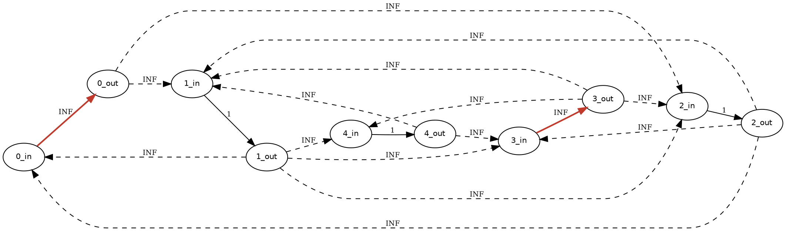
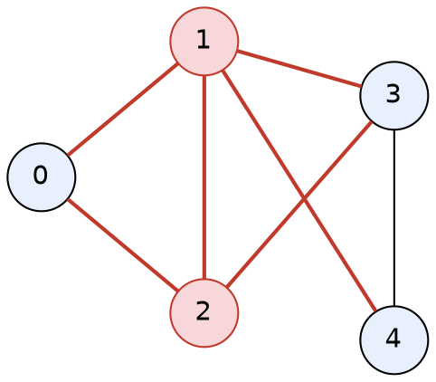

[[TOC]]

## 形式化题目

给定无向图 $G=(V,E)$，$|V| = n \le 50$。求

$$
\kappa(G)=\min\{|S|:S\subseteq V,\ G-S \text{ 不连通}\},
$$

若对任何 $S \subseteq V$ 都做不到，则输出 $n$。

这里 $G-S$ 表示"删掉 $S$ 中所有顶点及其关联边"后剩下的图，"不连通"指剩下至少两个连通块；
删到一个点都不剩、或只剩一个点，都不算不连通。

记 $\lambda(s,t)$ 为**只要求把 $s,t$ 分到不同连通块**的点最小割（$s,t$ 本身不许删），则本
题答案是

$$
\min\Bigl(\min_{s\ne t}\lambda(s,t),\ n\Bigr).
$$

边界情形直接照定义读：

| 输入 | 图的样子 | 答案 | 理由 |
| --- | --- | --- | --- |
| `0 0` | 空图 | `0` | 无点可言，谈不上连通 |
| `1 0` | 单点 | `1` $=n$ | 没有点对，删不到"不连通" |
| `2 0` | 两个孤立点 | `0` | 已经是两块 |
| `3 3` 三角形 | $K_3$ | `3` $=n$ | 删 1 个点剩 1 个点，仍算连通 |
| `5 7`（样例第 5 组） | 两个三角形 $0{-}1{-}2$ 与 $1{-}3{-}4$，再加边 $2{-}3$ | `2` | 删 $\{1,2\}$ 后剩下 $\{0\}$ 与 $\{3,4\}$ |

## 正解

### 思路

#### 1. 朴素做法与瓶颈

最老实的方法是枚举删除集合，从小到大试：

```text
for k = 0, 1, 2, ..., n:
    for 每个 |S| = k 的 S:
        if G - S 不连通: return k
return n
```

$n=50$ 时 $\sum_k \binom{50}{k} \approx 10^{15}$ 个子集，哪怕判连通只要 $O(n+m)$ 也不可能。
瓶颈不在判连通的常数，而在**把答案当成对子集空间的搜索**。
换一个角度：连通性只取决于"有没有 $s \to t$ 的路径"，
如果能对每对 $(s,t)$ 快速回答"切断所有 $s\to t$ 路径最少要删几个点"，
再对所有点对取最小就够了。（"不连通"要求剩下的图至少有两个连通块，所以 $S$ 删完至少要剩 2 个点；
下面会把 $s,t$ 排除在 $S$ 之外，正好满足这一点。）而"切断所需的最小代价"就是**最小割**。

#### 2. 从删点到最小割：拆点

最小割的经典形态割的是**边**，本题删的是**点**。标准转换叫**拆点**：把每个顶点 $v$ 拆成
$v_{in}$ 与 $v_{out}$，中间连一条 $v_{in} \to v_{out}$ 的弧，容量为 1。
原来经过 $v$ 的任何通路都必须走这条弧：某条 $s \to t$ 的通路要么经过 $v$（那就必然穿过这条拆点弧），
要么完全不经过 $v$（那它就不受这条弧的影响）。所以"割断这条弧"和"删掉 $v$"代价相同。

固定 $s,t$ 后按下面的方式建网络：

- 拆点弧 $v_{in} \to v_{out}$：普通点容量 1；枚举到点对 $(s,t)$ 时，把 $s,t$ 这两条弧临时改成
  `BIG`（表示 $s,t$ 不允许出现在割里，这正是 $\lambda(s,t)$ 的定义）；
- 原图每条无向边 $\{u,v\}$：两条**各自独立**的有向弧 $u_{out} \to v_{in}$ 与 $v_{out} \to u_{in}$，
  容量都是 `BIG`。

这张网络上 $s_{in} \to t_{out}$ 的最大流就是 $\lambda(s,t)$（最大流最小割定理 + 拆点等价性，
证明见下）。取 `BIG = 1 << 20`：一次最多删 $n \le 50$ 个点，所以 `BIG > n` 保证最小割
绝不会去割原图的边；同时它又能塞进 32 位整数。

下面的网络图就是样例第 5 组、取 $s=0,t=3$ 时的拆点结果：实线是拆点弧（容量 1，源汇为 INF），
虚线是原图的边（容量 INF）。



读图时注意三件事：每个点被一条**实线拆点弧**穿过，它是这个点的"必经之路"；所有虚线弧的容量
都是 INF，所以最小割不可能落在它们身上，只能落在实线上；$0$ 和 $3$ 的拆点弧被标红并写成 INF，
表示源点汇点不许删。任何一条有限割都对应一组被割断的实线，也就是一个可以删掉、且删了就能把
$s$ 和 $t$ 分开的顶点集合；本例里最小的那组就是 $\{1,2\}$。

#### 3. 外层必须枚举点对

一个很容易踩的坑是"随便挑一对点跑一次最大流就当答案"。$\lambda(s,t)$ 依赖点对，取错了会漏掉
真正的答案。样例第 5 组的完整割值表如下（`不可切断` 表示割值达到 INF）：

| $s$ | $t$ | 只要求分开 $s,t$ 的点最小割 | 备注 |
| --- | --- | --- | --- |
| 0 | 1 | 不可切断 | 看不到答案 |
| 0 | 2 | 不可切断 | 看不到答案 |
| 0 | 3 | **2** | 全局最优就出在这一对 |
| 0 | 4 | **2** | 全局最优就出在这一对 |
| 1 | 2 | 不可切断 | 看不到答案 |
| 1 | 3 | 不可切断 | 看不到答案 |
| 1 | 4 | 不可切断 | 看不到答案 |
| 2 | 3 | 不可切断 | 看不到答案 |
| 2 | 4 | **2** | 全局最优就出在这一对 |
| 3 | 4 | 不可切断 | 看不到答案 |

表的行是点对，第三列是这一对的点最小割。只有 $(0,3),(0,4),(2,4)$ 三对给出有限值 2，
其余点对之间有多条互不相交的通路，割不断。所以外层必须枚举全部 $\binom{n}{2}$ 对点对，
把所有 $\lambda(s,t)$ 取最小。

样例第 5 组删掉 $\{1,2\}$ 后的样子（红点是删掉的点，红边是随它一起消失的邻接边）：



删完之后剩下的图分成两块：$\{0\}$ 和 $\{3,4\}$，中间再没有任何边相连，所以图不连通，
删 2 个点是够的。另一方面 $1,2$ 之外的点都不是割点，删 1 个点图仍然连通，所以 2 就是最优。

#### 4. 正确性

**引理（拆点等价）.** 对固定 $s \ne t$，上述网络中 $s_{in} \to t_{out}$ 的最小割容量等于
$\lambda(s,t)$。

*证明.* 先看一个方向：给定删点集 $S$（$S\cap\{s,t\}=\varnothing$）使 $G-S$ 中 $s,t$ 不连通，
取 $A$ 为 $G-S$ 中含 $s$ 的那个连通块（于是 $t\notin A$，且 $A\cap S=\varnothing$）。
把网络的顶点分成两侧：

- $v \in A$：$v_{in}$ 与 $v_{out}$ 都在含 $s_{in}$ 的一侧；
- $v \in S$：$v_{in}$ 在含 $s_{in}$ 的一侧，$v_{out}$ 放到另一侧；
- $v \notin A \cup S$：$v_{in}$ 与 $v_{out}$ 都放到另一侧。

看哪些弧跨越这个划分：$v\in S$ 的拆点弧被切开，共 $|S|$ 条，每条容量 1；
若某条原图边弧 $u_{out}\to w_{in}$ 被切开，则必须 $u\in A$ 而 $w\notin A\cup S$，
也就是说 $G-S$ 中存在一条从 $A$ 连向外面的边，与 $A$ 是连通块矛盾；
$s,t$ 这两条容量 `BIG` 的拆点弧也都在同一侧（$s\in A$，$t\notin A\cup S$）。
所以这个割的容量恰好是 $|S|$，最小割 $\le \lambda(s,t)$。

再看另一个方向：任取一个容量有限的割 $(P,Q)$（$s_{in}\in P$，$t_{out}\in Q$）。因为它有限，
容量 `BIG` 的弧都不可能从 $P$ 侧指向 $Q$ 侧，于是 $P\to Q$ 的跨越弧只能是容量 1 的
**普通点**拆点弧（容量 0 的反向残量弧也不贡献容量）；把这些拆点弧对应的顶点收集起来记作
$S$，则割容量恰为 $|S|$。再令 $A=\{v\notin S: v_{in}\in P\}$，于是 $s\in A$，$A\cap S=\varnothing$，
且 $t\notin A$。
若 $G-S$ 中存在一条从 $A$ 连到 $V\setminus A\setminus S$ 的边 $\{u,w\}$，注意到 $u\in A$ 给出
$u_{in}\in P$，而 $u\notin S$ 说明拆点弧 $u_{in}\to u_{out}$ 不是 P→Q 的跨越弧，
所以 $u_{out}\in P$；另一方面 $w\notin A\cup S$ 给出 $w_{in}\in Q$。
于是 $u_{out}\to w_{in}$ 是一条 P→Q 的、容量 `BIG` 的弧，与割有限矛盾。
所以 $G-S$ 中 $A$ 与其余顶点之间没有边，$s,t$ 被分开，即 $|S|\ge \lambda(s,t)$。

两个方向合起来，最小割 = $\lambda(s,t)$。$\square$

由最大流最小割定理，代码里 `max_flow` 算出的就是 $\lambda(s,t)$；
由"图不连通 $\iff$ 存在两个点分属不同连通块"，

$$
\min_S |S| = \min_{s \ne t} \lambda(s,t),
$$

外层枚举全部点对取最小即得答案。代码里还有一步剪枝 `if best <= 1: return best`：
答案下界是 0，一旦某对点对给出 0 或 1，就不可能更小了，可以直接返回。

#### 5. 必须注意的细节

- **无向边要连两条独立的有向弧**，各带容量 `BIG`，不能写成一条"无向弧"。
  写成单向会漏掉一半通路：实测随机图中有相当比例会算错。
- **自环与重边要先清掉**。自环对连通性毫无贡献，还会在拆点网络里制造 $v_{in} \to v_{out}$ 的
  平行弧；重边会让一对点之间出现多条容量 `BIG` 的弧，破坏"边弧不会被割"的前提。
- **$\infty$ 要显著大于 $n$**。这里取 $2^{20}$，既能保证最小割不碰边弧，
  又保证残量数组里的任何值（最大就是 `BIG` 本身，回退后的反向弧也不会超过它）都能留在
  32 位有符号整数里。
- **$n=1$ 没有点对**。内层循环一次都不进，答案取初值 $n = 1$，正好符合题面。

#### 6. 实现要点

四点实现上的选择，正文里用到的名字都能在代码里找到：

- 残量网络用**链式前向星**存：`to`/`nxt`/`head` 三个数组，一次 `link(u, v)` 压入正向弧与
  它的一条残量 0 反向弧，两者边号为 `e` 与 `e ^ 1`，回退时直接异或取反边。
- 容量用 `array('i')` 存一个「模板」`base`（普通点 1、边弧 `BIG`、反向弧 0），
  每个点对只需 `array('i', base)` 拷贝一份，再把 $s,t$ 的拆点弧改成 `BIG`，比每次重建图便宜。
- `max_flow` 是**迭代版 Dinic**：BFS 分层后用一个显式栈 DFS，一次找到瓶颈后回退到第一条被榨干
  的边，而不是每单位流量都从源点重新开始；死路点直接把 `level` 置 -1（当前弧剪枝）。
- 读入用 `re.findall(rb"\d+", ...)` 把 `n`、`m` 与所有 `(x,y)` 按出现顺序抽成整数流，
  正好匹配「数对内不含空格、其余用空格分隔」的格式；`^Z` 先替换成空格。

### 代码

@include-code(./main.cpp, cpp)

@include-code(./main.py, python)

### 复杂度

- **时间复杂度**：$\binom{n}{2}$ 次最大流，网络规模 $2n$ 个节点、$2n+4m$ 条弧（含反向弧），
  即 $O\bigl(n^2 \cdot \mathrm{maxflow}(2n,\ 2n+4m)\bigr)$，与标准 C++ 正解同阶。
  又因为最大流的值不超过 $n$，每次 Dinic 的实际增广轮数是 $O(n)$ 级别。
- **空间复杂度**：$O(n+m)$，一次残量数组用 `array('i')` 存放，每组只用几 KB。

实测（Apple Silicon / CPython 3.14）：真实数据 `f.in`（10 组，$n \le 40$）0.24 s；
单组 $K_{50}$（$m=1225$）0.37 s；4 组 $n=50,m=900$ 的稠密随机图（答案约 28，
`best <= 1` 剪枝失效）合计 1.84 s；峰值内存实测不到 16 MB，远低于 128 MB。
算法本身与 C++ 同阶，最坏构造下接近本题 1000 ms 的限制，
Python 侧的常数劣势是主要风险。

## 总结

- 遇到"删最少的东西让图不连通"，第一反应应该是**最小割**，而不是枚举删除集合。
- 割的是**点**时用**拆点**：每个点拆成 $in \to out$ 的一条容量 1 弧，
  原图的边给 INF 容量，于是"删点"变成"割边"。
- 题目不指定 $s,t$ 时，答案是 $\min_{s\ne t}\lambda(s,t)$，**必须枚举所有点对**；
  样例第 5 组里 $(0,1)$ 根本割不断、答案只出现在 $(0,3)$ 这类点对上。
- 完全图、单点图这类"删不掉"的情形正好用 $\min(\cdot, n)$ 的上界处理：
  内层循环无点对可枚举时返回初值 $n$ 即可。
- 无穷大的取值要"大于 $n$，但别太大"：大于 $n$ 才能保证最小割不碰它，
  够小才能留在 32 位整数里。

## 图示解析

这张图串起本题从建模到输出答案的主线：

```text
输入：n 个点、m 条边的无向图
`- 目标：最少删几个点让图不连通（删不到就输出 n）
   |- 关键等价 1：删点集 S 让图断开 <=> 存在一对点 (s,t) 被 S 分开
   |  `- 于是答案 = min over s != t of lambda(s,t)，再与 n 取小
   `- 关键等价 2：lambda(s,t) 难算 -> 用拆点把"点割"变成"边割"
      |- 建网络：v 拆成 v_in --1--> v_out；原图边 {u,v} 变成两条 INF 有向弧
      |- 源汇的拆点弧改成 INF（不许删）
      `- 最大流最小割定理：maxflow(s_in, t_out) = lambda(s,t)
         `- 外层枚举 s < t，取最小；best <= 1 时立刻返回
            `- 输出 best（没有更小割时就是 n）
```

读图时抓两个分叉的因果：第一个分叉把"图不连通"这个全局性质拆成了点对上的局部问题，
这解释了为什么会有外层 $\binom{n}{2}$ 的枚举；第二个分叉解释了为什么不能直接对原图跑最大流
——原图割的是边，而题目要割的是点，拆点的容量 1 弧只是把"删一个点的代价"从顶点搬到了边上。
