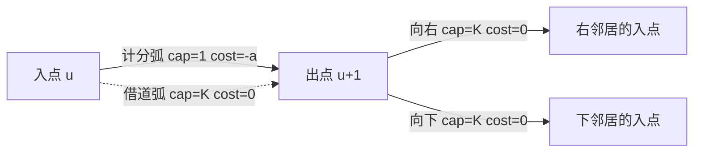

[[TOC]]

## 形式化题目

给定 $N \times N$ 的非负整数网格 $a$。选择 $K$ 条从 $(0,0)$ 到 $(N-1,N-1)$ 的**单调路径**
（每一步只能向右或向下，路径允许重复），记这些路径经过的格子并集为 $S$，
求 $\sum_{(i,j) \in S} a_{i,j}$ 的最大值。同一个格子被多条路径经过时**只计一次**。

约束：$1 \leqslant N \leqslant 50$，$0 \leqslant K \leqslant 10$，$0 \leqslant a_{i,j} \leqslant 1000$。

题面样例：$N = 3$，$K = 2$。

| 行\列 | 0 | 1 | 2 |
| --- | --- | --- | --- |
| 0 | 1 | 2 | 3 |
| 1 | 0 | 2 | 1 |
| 2 | 1 | 4 | 2 |

答案是 $15$：一条路径走 $(0,0)\to(0,1)\to(1,1)\to(2,1)\to(2,2)$，取走 $1+2+2+4+2=11$；
另一条走 $(0,0)\to(0,1)\to(0,2)\to(1,2)\to(2,2)$，只新增 $3+1=4$。
两条路线在 $(0,0),(0,1),(2,2)$ 上重合，但重合的格子不重复计分。

## 正解

### 思路

**第一步：想一个"看起来很快"的朴素做法。**

既然要选 $K$ 条路，最自然的想法是**逐条贪心**：每次在"还没被取走的权值"上求一条最大权路径，
取走它、把沿途格子清零，重复 $K$ 次。单次最大权路径是标准网格 DP

$$
f_{i,j} = a_{i,j} + \max(f_{i-1,j},\ f_{i,j-1}),
$$

一次 $O(N^2)$，总共 $O(KN^2)$，对 $N \leqslant 50$ 快得可以忽略。

**但它错。** 反例（$N=3$，$K=2$）：

| 行\列 | 0 | 1 | 2 |
| --- | --- | --- | --- |
| 0 | 0 | 6 | 1 |
| 1 | 2 | 3 | 1 |
| 2 | 0 | 0 | 7 |

最大单条路径是 $(0,0)\to(0,1)\to(1,1)\to(1,2)\to(2,2)$，值 $0+6+3+1+7=17$。
清零之后剩下的格子最多只值 $2$，贪心合计 $19$。
但换一组路线——
$(0,0)\to(1,0)\to(1,1)\to(2,1)\to(2,2)$ 与 $(0,0)\to(0,1)\to(0,2)\to(1,2)\to(2,2)$——
并集覆盖 $8$ 个格子，合计 $20$。贪心输在"第一条路把中间的好格子独占掉了"。

**第二步：定位瓶颈——$K$ 条路径必须联合决策。**

贪心的本质是把 $K$ 条路径拆成 $K$ 次互不知情的独立决策。要修正就必须联合决策。有两条路：

1. **把 $K$ 个位置塞进 DP 状态**，让 $K$ 条路径并排推进。$K=2$ 的经典方格取数就是这么做的
   （四维 DP，两人同时走）。但状态数是 $O(N^{2K})$，$K=10$ 时是天文数字，直接出局。
2. **把"选 $K$ 条路径"当成一个整体结构来优化。** 观察题目的计分规则：
   "第一次经过拿分、之后经过免费"——这不是路径之间互相干扰的复杂耦合，
   而是一条**容量规则**：每个格子的"计分机会"只有 1 次。

第 2 条指向的模型就是网络流：把每个格子的计分机会做成一条**容量 1** 的弧，
再补一条容量 $K$、费用 $0$ 的旁路弧。于是每条路径走到一个格子时，
会自动"第一次付钱拿分、之后走免费旁路"，$K$ 条路径的联合最优就等价于
**$K$ 个单位流的最小费用**。

**第三步：拆点建图。**

每个格子 $(i,j)$ 拆成两个点：**入点** $u = 2(iN+j)$ 与**出点** $u+1$。



这张图画的是单个格子的内部结构与它向外的两条移动弧：**实线是计分弧**（容量 1，费用取负），
**虚线是借道弧**（容量 $K$，费用 0），下面两条弧表示只能向右或向下走。
注意计分弧与借道弧是**平行的两条弧**，共享同一对入点/出点——
这正是"第一次经过走上面那条、后续经过走下面那条"的实现方式。

完整建图规则：

| 弧 | 容量 | 费用 | 含义 |
| --- | --- | --- | --- |
| 入点 $\to$ 出点（计分弧） | $1$ | $-a_{i,j}$ | 第一次经过该格子，拿走 $a_{i,j}$ |
| 入点 $\to$ 出点（借道弧） | $K$ | $0$ | 再次经过，只借道不计分 |
| 出点 $\to$ 右邻居入点 | $K$ | $0$ | 一步向右 |
| 出点 $\to$ 下邻居入点 | $K$ | $0$ | 一步向下 |

源点取左上角入点 $0$（所有路径都从这里出发），汇点取右下角出点 $2N^2-1$。
计分弧费用取负，是因为我们要求**最小**费用流，取反后就等价于最大收益。

**为什么这样建模是精确的？** 每个格子的计分弧容量是 1，所以无论有多少条路径经过它，
只有一条能拿到 $a_{i,j}$，其余都必须走费用 0 的借道弧——"只计一次"恰好被容量约束表达了。
反过来，任意一个流量为 $K$ 的整数流都能分解成 $K$ 条 $s \to t$ 路径，而每条路径的走向
（入点 $\to$ 出点 $\to$ 右/下邻居入点）天然就是一条"只右/下"的单调路线。
两个方向的解可以互相转换且目标值一致，所以费用流的最优值就是本题答案。

**第四步：负费用弧与势能。**

最小费用流每轮要沿费用最小的增广路推流，$K$ 轮即可。本题不能直接跑 Dijkstra：
计分弧的费用 $-a_{i,j}$ 是负的。解决办法是 **Johnson 势能重标号**：
给每个点一个势 $h[v]$，把弧 $u \to v$ 的费用换成约化费用

$$
c'(u,v) = c(u,v) + h[u] - h[v].
$$

只要所有**残量弧**的约化费用都非负，Dijkstra 就能用，且沿约化最短路增广等价于沿原费用最短路增广。

初始势**不能取 $0$**（取 $0$ 时计分弧约化费用仍是 $-a_{i,j}$）。
正确做法是令 $h$ 为源点到各点的最短距离：它满足 $h[v] \leqslant h[u] + c(u,v)$，
于是约化费用非负。好消息是这一步在本图里是 $O(V+E)$ 的——
拆点后**点的编号 $0,1,2,\dots,2N^2-1$ 本身就是这张 DAG 的拓扑序**
（出点 $u+1$ 只会指向编号更大的入点），按编号从小到大扫一遍残量正向弧做一次松弛即可。

样例的初始势（第一行入点、第二行出点）：

| 格子 | $(0,0)$ | $(0,1)$ | $(0,2)$ | $(1,0)$ | $(1,1)$ | $(1,2)$ | $(2,0)$ | $(2,1)$ | $(2,2)$ |
| --- | --- | --- | --- | --- | --- | --- | --- | --- | --- |
| $h(\text{入点})$ | 0 | -1 | -3 | -1 | -3 | -6 | -1 | -5 | -9 |
| $h(\text{出点})$ | -1 | -3 | -6 | -1 | -5 | -7 | -2 | -9 | -11 |

最后一格出点的势是 $-11$，正好是最长单条路径的负权（$1+2+2+4+2$），
这与"第一条增广路就是最大权路径"一致。此后每轮按 $h[v] \leftarrow h[v] + \mathrm{dist}[v]$ 维护
（$\mathrm{dist}$ 是本次算出的**约化**距离），
约化费用保持非负，$K$ 轮都能安心用 Dijkstra。

**第五步：边界。**

- $K = 0$：一条路线都不安排，答案就是 $0$，直接特判输出。
- $a_{i,j} = 0$：计分弧拿到也没有收益，建图时直接跳过，省一条边。
- 借道弧容量取 $K$ 而不是 $K-1$：多出来的容量永远用不到，却省掉了 $K=1$ 时的边界讨论。

**思路与代码的对应。** `main.py` 只分四层，和上面的推导一一对应：
`link(u, v, c, w)` 负责加一条正向弧与它的反向弧（反向弧编号 `e ^ 1`）；
`dag_potential(...)` 是上文"初始势 = 源点最短路"那一步，按点编号从小到大扫一遍残量正向弧；
`min_cost_flow(...)` 里 `K` 轮 Dijkstra + 势能更新 + 沿 `prev` 回溯推流；
`max_gain(grid, k)` 负责拆点建图，`solve()` 只做读入、$K=0$ 特判和输出。

### 代码

@include-code(./main.cpp, cpp)

@include-code(./main.py, python)

### 复杂度

- 时间复杂度：建图 $O(N^2)$，初始势 $O(N^2)$，每次 Dijkstra $O(N^2 \log N)$，共 $K$ 轮，
  合计 $O(KN^2 \log N)$。$N=50, K=10$ 时点数 $2N^2 = 5000$、弧数约 $2\times10^4$，
  实测单点约 60ms。
- 空间复杂度：弧数组与邻接表 $O(N^2)$，每轮 Dijkstra 的距离数组与堆 $O(N^2)$，合计 $O(N^2)$。

对比：朴素贪心是 $O(KN^2)$ 但结果错误；$K$ 维联合 DP 是 $O(N^{2K})$ 不可行。
费用流把 $K$ 从**状态维度**搬到了**流量**上，只多付 $K$ 倍的增广开销，这是本题唯一可行的多项式做法。

## 总结

本题的关键是**把"每格只计一次分"翻译成"容量 1 的弧"**。

- 朴素贪心（逐条取最大权路径）在样例规模上很快，但它是短视的：第一条路径可能独占掉
  对后续路径更有价值的格子。上面 $N=3,K=2$ 的反例里贪心 $19$、最优 $20$。
- 把 $K$ 条路径并排塞进 DP 状态是 $O(N^{2K})$，$K=10$ 时不可行。
- 换个角度看计分规则——"第一次经过拿分、之后经过免费"本来就是一条容量规则，
  于是拆点建图：计分弧容量 1 费用 $-a$，借道弧容量 $K$ 费用 $0$，移动弧容量 $K$ 费用 $0$，
  跑 $K$ 轮最小费用增广，答案取负。
- 计分弧费用为负，Dijkstra 必须配势能；由于拆点后的点编号天然是 DAG 拓扑序，
  初始势可以用一遍 $O(V+E)$ 的最短路递推求出，比 SPFA 更稳。

## 图示解析

下面这张图串起从"路径并集"到"费用流答案"的主线：

```text
输入 N, K, 网格 a
`- 朴素贪心：每条路径独立取最大权
   `- 反例：第一条路独占好格子，合计 19 < 最优 20
      `- 瓶颈：K 条路径必须联合决策
         |- 塞进 DP 状态  -> O(N^(2K)) 不可行
         `- 改成流量模型  -> 每格"计分机会"容量为 1
            `- 拆点：入点 --cap1,-a--> 出点 --capK,--0--> 右/下邻居
               `- 初始势 = 源点最短路（点编号即拓扑序）
                  `- K 轮 Dijkstra 增广，取费用相反数 = 答案
```

先看"瓶颈"那一层：它解释了为什么必须改用流量模型，而不是把 DP 维数继续加大。
再看"拆点"那一层：容量 1 的计分弧与容量 $K$ 的借道弧是平行的，
这正是"同一格只算一次"的完整实现。最后一行说明 $K$ 只影响增广轮数，不影响图的规模。

在样例上，第一轮增广走 $(0,0)\to(0,1)\to(1,1)\to(2,1)\to(2,2)$ 拿到 $11$，
第二轮走 $(0,0)\to(0,1)\to(0,2)\to(1,2)\to(2,2)$，其中 $(0,0),(0,1),(2,2)$ 已走过、改走借道弧，
新增 $3+1=4$，合计 $15$，与题面输出一致。
