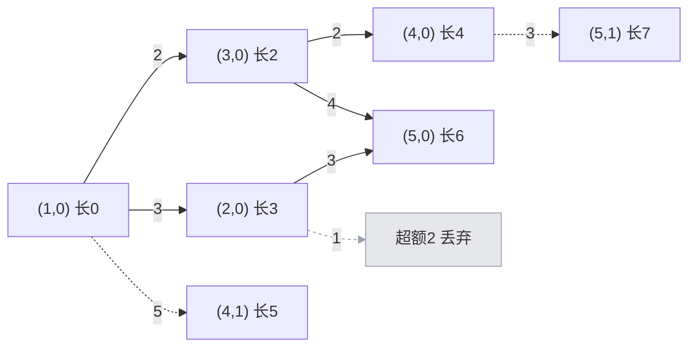

[[TOC]]

## 形式化题目

给定有向带权图 $G=(V,E)$，$|V| = N \leqslant 1000$、$|E| = M \leqslant 10000$，边权 $L \geqslant 1$。
一个城市的线路可以有多条平行边，**平行边算不同线路**。给定 $S \ne F$，保证 $S$ 到 $F$ 有路。

记 $d = \operatorname{dist}(S,F)$ 为 $S \to F$ 的最短路径长度。要求计数

$$
\Bigl|\{\,P : P \text{ 是 } S \to F \text{ 的路径},\ |P| = d\,\}\Bigr|
\;+\;
\Bigl|\{\,P : P \text{ 是 } S \to F \text{ 的路径},\ |P| = d + 1\,\}\Bigr|,
$$

其中 $|P|$ 是 $P$ 上所有边权之和。答案 $\leqslant 10^9$。

因为 $L \geqslant 1$，长度为 $\leqslant d+1$ 的走法里不可能插入权 $\geqslant 2$ 的环
（非自环的环至少 2 条边、权至少 2，自环权 $\geqslant 2$ 同理），
所以只需额外考虑“绕一次权为 1 的自环”这一种非简单走法；
本题的测试数据中不存在自环，两种理解结果相同。

## 正解

### 思路

#### 1. 朴素做法与瓶颈

最直接的做法是 DFS 枚举 $S$ 出发的所有路径，长度一旦超过 $d+1$ 就回溯（因为边权为正），
统计落在 $d$ 与 $d+1$ 的条数：

```text
dfs(u, 长度):
    若 u == F: 记录长度; 返回
    枚举 u 的每条出边 (u -> v, w):
        若 长度 + w <= d + 1: dfs(v, 长度 + w)
```

剪枝是对的，但复杂度是**路径条数**而不是 $N$ 或 $M$。考虑一条链
$1 \to 2 \to \dots \to N$，把每条边都换成 $c$ 条平行边：
从 $1$ 到 $N$ 的线路数是 $c^{N-1}$，DFS 必须展开全部 $c^{N-1}$ 条分支。

题面保证"答案不超过 $10^9$"只是说**合法路径条数**有上界，
DFS 在搜索途中仍然会走遍所有分支，依然是指数级。
瓶颈在于枚举法把"当前长度"当成搜索参数，同一个 $(u, \text{长度})$ 会被反复展开；
正确的方向是**把长度压进状态，让每个状态只算一次**。

#### 2. 关键观察：超额只有 0 或 1

设 $\mathrm{base}[v]$ 为 $S \to v$ 的最短路长度（$\mathrm{base}[S] = 0$），
$\operatorname{dist}(v,F)$ 为 $v \to F$ 的最短路长度。
对一条从 $S$ 出发、走到 $v$、长度为 $\ell_v$ 的路径，把

$$
\mathrm{over}_v \;=\; \ell_v - \mathrm{base}[v]
$$

叫做它在 $v$ 处的**超额**。超额一定是非负的（$\mathrm{base}$ 是最短路）。

若整条路径 $P$ 的总长 $|P| \leqslant \mathrm{base}[F] + 1$，把两件事拼起来：

- $P$ 在 $v$ 之后那一段是从 $v$ 到 $F$ 的一条真实路径，所以
  $\operatorname{dist}(v,F) \leqslant |P| - \ell_v$，即 $|P| - 1 \geqslant \ell_v + \operatorname{dist}(v,F) - 1$；
- 从 $S$ 走最短路到 $v$、再走最短路到 $F$ 是一条真实的 $S \to F$ 路径，所以
  $\mathrm{base}[v] + \operatorname{dist}(v,F) \geqslant \mathrm{base}[F]$。

两式对同一个 $|P|$ 夹逼：

$$
\mathrm{base}[v] + \operatorname{dist}(v,F) \;\geqslant\; \mathrm{base}[F] \;\geqslant\; |P| - 1
\;\geqslant\; \ell_v + \operatorname{dist}(v,F) - 1 .
$$

约掉 $\operatorname{dist}(v,F)$ 得 $\mathrm{base}[v] \geqslant \ell_v - 1$，即 $\ell_v - \mathrm{base}[v] \leqslant 1$。于是

$$
\boxed{\ \mathrm{over}_v \in \{0,\ 1\}\ }
$$

也就是说：**沿途每个点的超额只可能是 0 或 1**，三层以上的信息一律不需要。

> 这个推导只用到 $L \geqslant 1$，并没有用到“路径不重复经过城市”，
> 所以它同样覆盖“绕了一次权为 1 的自环”这种走法。也就是说无论题目把“路线”理解为简单路径
> 还是允许重复的走法，只要长度在 $d+1$ 以内，状态模型都完整地数到。
> 而本题的测试数据里没有自环，两种理解结果一致。

#### 3. 建模：点拆成两层状态

把每个城市 $v$ 拆成两个状态 $(v, 0)$ 和 $(v, 1)$，$k$ 就是超额。
走一条边 $u \xrightarrow{w} v$ 时，新超额由

$$
\mathrm{over} \;=\; \bigl(\mathrm{base}[u] + k + w\bigr) - \mathrm{base}[v]
$$

决定；$\mathrm{over} > 1$ 的转移直接丢弃。

下图是样例第 1 组的状态模型：实线是「超额不增」的转移（$0 \to 0$），
虚线是「超额 $0 \to 1$」的转移，灰色的 $2 \to 3$ 因超额 2 被丢弃。



观察重点：从 $(4,0)$ 出发走 $4 \to 5$（$w=3$，$\mathrm{base}[5]=6$）得到长度 7，
超额 $7-6=1$，进入 $(5,1)$；同一时刻从 $(4,1)$ 出发长度 8，超额 2，被丢弃——
「只有两层」这条约束在这里体现了剪枝作用。

#### 4. 计数：一次 Dijkstra 就够

令 $\mathrm{ways}[X]$ 表示状态 $X$ 的线路条数，初始 $\mathrm{ways}[(S,0)] = 1$（空路径）。

关键性质：状态 $(v,k)$ 的**总长恒为 $\mathrm{base}[v] + k$**，与具体路径无关。
所以一个状态第一次被到达时，它的长度就已经定死；之后被别的路径到达只是**加条数**。
又因为每条边权 $w \geqslant 1$，转移一定让总长严格增加，状态图是 DAG。
于是把状态按总长**升序**处理（堆里存 `(总长, 状态)` 即可），
弹出 $X$ 时它的全部前驱都已处理完，$\mathrm{ways}[X]$ 已是最终值，可以安全地分发给后继。

代码用 `node = 2*v + k` 把状态编码成整数；`ways[nxt] == 0` 表示首次到达该状态，
此时才把 `(nd, nxt)` 入堆，避免同一个状态重复入堆（这是常数优化，不影响正确性）。

最后回到原问题：$(F,0)$ 的总长是 $\mathrm{base}[F] + 0 = d$，$(F,1)$ 的总长是 $d+1$，
而分层建模保证了长度 $\leqslant d+1$ 的路径**不多不少**正好落在这些状态里，
所以答案就是 $\mathrm{ways}[(F,0)] + \mathrm{ways}[(F,1)]$。

#### 5. 样例追踪表

下表把样例第 1 组的状态弹出过程摊开（$N=5$，$S=1$，$F=5$，$d=6$）。
列依次是：弹出顺序、状态、该状态的总长、到达它的线路数、它向后继分发的条数。

| 弹出顺序 | 状态 $(v,k)$ | 总长 $\mathrm{base}[v]+k$ | 该状态线路数 | 转移结果 |
| ---: | --- | ---: | ---: | --- |
| 1 | $(1,0)$ | 0 | 1 | $1 \to 2$ ⇒ $(2,0)$ 长 3；$1 \to 3$ ⇒ $(3,0)$ 长 2；$1 \to 4$ ⇒ $(4,1)$ 长 5 |
| 2 | $(3,0)$ | 2 | 1 | $3 \to 4$ ⇒ $(4,0)$ 长 4；$3 \to 5$ ⇒ $(5,0)$ 长 6 |
| 3 | $(2,0)$ | 3 | 1 | $2 \to 3$ 超额 2 丢弃；$2 \to 5$ ⇒ $(5,0)$ 长 6 |
| 4 | $(4,0)$ | 4 | 1 | $4 \to 5$ ⇒ $(5,1)$ 长 7 |
| 5 | $(4,1)$ | 5 | 1 | $4 \to 5$ 超额 2 丢弃 |
| 6 | $(5,0)$ | 6 | 2 | — |
| 7 | $(5,1)$ | 7 | 1 | — |

终点两条状态的条数相加：$2 + 1 = 3$，与样例输出一致。
其中 $1 \to 2 \to 5$ 与 $1 \to 3 \to 5$ 贡献两条最短路，
$1 \to 3 \to 4 \to 5$ 贡献唯一一条次短路。

### 代码

@include-code(./main.py, python)

### 复杂度

- 第一遍 Dijkstra 求 $\mathrm{base}$：$O(M \log N)$；
- 第二遍分层 Dijkstra：$2N$ 个状态、$2M$ 条转移，$O(M \log N)$。

每组数据 $O(M \log N)$，$T$ 组为 $O(T \cdot M \log N)$；空间 $O(N + M)$。
对照朴素 DFS 的 $O(\text{路径条数})$，最坏指数级。

## 总结

- **超额夹逼**：关心 $S \to F$ 长度 $\leqslant d+1$ 的路径时，沿途每个点相对最短路的超额只能取 $0$ 或 $1$，
  因为 $\mathrm{base}[v] + \operatorname{dist}(v,F) \geqslant d \geqslant \ell_v + \operatorname{dist}(v,F) - 1$。
- **状态自带长度**：$(v,k)$ 的长度恒为 $\mathrm{base}[v] + k$，所以一次按长度升序的 Dijkstra 就能定死每个状态的条数，
  不需要迭代松弛。
- **平行边即线路**：邻接表原样保留重复边即可，不要用集合或矩阵去重。

## 图示解析

这张图串起本题从建模到得到答案的主线：

```text
有向带权图 + S, F
`- 先求 base[v] = S 到 v 的最短路
   `- 观察：长度 <= d+1 的路径，每点超额 over = 长度 - base[v] 只能是 0 或 1
      `- 建模：点 v 拆成状态 (v,0) 和 (v,1)
         `- 转移：over = base[u] + k + w - base[v]，over > 1 丢弃
            `- 计数：按总长升序弹出状态，ways 累加给后继
               `- 答案 = ways[(F,0)] + ways[(F,1)]
```

先看每个节点代表的推理结论：最短路是第一层、次短路是第二层；
再顺着分支检查"超额 > 1 就丢弃"这一条如何保证状态数只有 $2N$，
最后确认答案由两条终点状态的条数相加得到。
图中只保留正文已经证明过的关系，不替代上面的样例推演和正确性说明。
