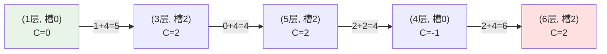

[[TOC]]

## 形式化题目

给出一个 $1 \sim N$ 的楼层序列和 $M$ 个严格递增的整数 $C_1 < C_2 < \cdots < C_M$，其中至少一个 $C_i = 0$。电梯处于状态 $(f, i)$：当前在第 $f$ 层，手柄停在槽 $i$。

一次操作可以选择：

- 把手柄扳到相邻槽 $i \pm 1$，耗时 $1$ 秒（楼层不变）；
- 扳动到槽 $i$ 之后再按动电梯：沿槽 $i$ 移动 $|C_i|$ 层（$C_i > 0$ 上行、$C_i < 0$ 下行），耗时 $2 \cdot |C_i|$ 秒；目标楼层必须仍在 $[1, N]$ 内，否则该移动不合法。

初始状态是 $(1, i_0)$，其中 $C_{i_0} = 0$。求到达第 $N$ 层（手柄停在哪个槽都行）的最少总耗时；无法到达输出 $-1$。

数据范围：$1 \leqslant N \leqslant 1000$，$2 \leqslant M \leqslant 20$，$-N < C_1 < C_2 < \cdots < C_M < N$。

输入样例 `6 3` 与 `-1 0 2` 的最优路线如下（括号内是 `(楼层, 槽位)`）：

$$(1, 0) \xrightarrow{\text{扳槽 1s}} (1, 2) \xrightarrow{\text{上行 4s}} (3, 2) \xrightarrow{\text{上行 4s}} (5, 2) \xrightarrow{\text{扳槽 2s}} (5, 0) \xrightarrow{\text{下行 2s}} (4, 0) \xrightarrow{\text{扳槽 2s}} (4, 2) \xrightarrow{\text{上行 4s}} (6, 2)$$

总耗时 $1 + 4 + 4 + 2 + 2 + 2 + 4 = 19$，与样例输出一致。

## 正解

### 思路

**为什么这是最短路问题。**「最快到达」的每一步都只有固定代价（扳槽 $1$ 秒、每层 $2$ 秒），且先走的决策不会让后面的操作变贵——任何一条合法操作序列的总耗时就是各步代价之和。这正是图上单源最短路的结构：节点是「世界的一个瞬间」，边是「一次操作」。

**状态必须带槽位，只记楼层是错的。**到达第 $f$ 层时手柄停在哪一档，直接决定下一步还要花几秒扳槽、以及能沿哪条 $C_i$ 移动。例如到达第 $4$ 层时手柄在槽 $0$（$C_0=-1$）和在槽 $2$（$C_2=2$），后续可选动作完全不同。所以最短路的最小状态是二元组 $(f, i)$，共 $N \cdot M \leqslant 2 \times 10^4$ 个节点。

**边怎么连。**从状态 $(f, i)$ 出发只有两类操作，对应两类边：

| 操作 | 新状态 | 边权 |
| --- | --- | --- |
| 扳到槽 $j$（可直接跳到任意 $j$，但代价按逐格扳动计） | $(f, j)$ | $\lvert i - j \rvert$ |
| 沿槽 $j$ 移动电梯 | $(f + C_j,\ j)$（需 $1 \leqslant f + C_j \leqslant N$） | $2 \cdot \lvert C_j \rvert$ |

两点说明：

- 「扳到槽 $j$」不必按相邻槽一格一格建模。从 $i$ 扳到 $j$ 必须经过中间每个槽、每格 $1$ 秒，总代价就是 $\lvert i - j \rvert$，直接连一条边是等价的压缩。中间槽位只是「路过」，停留时间为零，不会产生额外决策。
- 「扳槽」和「移动电梯」合并成一条边 $(f, i) \to (f + C_j, j)$，权为 $\lvert i-j \rvert + 2\lvert C_j \rvert$，与先扳后走完全等价（先扳到 $j$ 再走，中间状态 $(f, j)$ 的最短路一定会被这条合并边覆盖）。本题解采用合并边，每层楼只需枚举 $M$ 条出边。

**边权非负，用 Dijkstra。**所有边权都 $\geqslant 0$，且源点是 $(1, i_0)$（$C_{i_0}=0$）。用堆优化的 Dijkstra 求单源最短路，答案为 $\min_i \, dist[N][i]$；若所有 $dist[N][i]$ 都是 $\infty$ 则输出 $-1$。

下面按样例把这张状态图画出来（只画最优路径经过的节点，边上的数字是这条合并边的权值）：

观察这张图：绿色起点是电梯的初始状态（$1$ 层、停在 $C=0$ 的槽）；红色终点只要「楼层是 $N$」，不关心停在哪个槽。每条边都同时改变了槽位和楼层——这正是合并边的形态；如果想经过中间槽，比如从槽 $0$ 直接到槽 $2$，代价 $2$ 就等于逐格扳动两格的 $1+1$ 秒。

**实现细节。**

- 距离表用 $dist[f][i]$，$f \in [1, N]$，$i \in [0, M)$；初始槽 $i_0$ 是 $C$ 中值为 $0$ 的下标。
- Dijkstra 弹出节点时若 $f = N$ 可以直接返回：第一次被弹出说明该距离已确定，是到 $N$ 层的最短时间（到 $N$ 层任意槽都算终点）。
- 到不了的判定：堆空仍未弹出 $N$ 层，输出 $-1$。注意样例 1 中 $C_1 = -1$ 会让电梯掉到 $0$ 层，凡是会滑出 $[1, N]$ 的移动都要跳过。

### 代码

@include-code(./main.cpp, cpp)

@include-code(./main.py, python)

### 复杂度

- 节点数 $V = N \cdot M \leqslant 2 \times 10^4$，每个节点出边 $M \leqslant 20$ 条，边数 $E = N \cdot M^2 \leqslant 4 \times 10^5$。
- 堆优化 Dijkstra 的时间复杂度为 $O(E \log V) = O(N M^2 \log(NM))$，约 $10^7$ 级别；空间复杂度 $O(NM)$。在 $N \leqslant 1000$、$M \leqslant 20$ 的数据范围内非常宽裕。

## 总结

- 本题的关键一步是把「电梯的瞬间」建模成图节点：状态 $(f, i)$ 里的槽位 $i$ 不能丢，否则「扳槽代价」无从计算。
- 两类操作（逐格扳槽、沿 $C_i$ 移动）可以各自连边，也可以合并成一条 $\lvert i-j \rvert + 2\lvert C_j \rvert$ 的边；两种建模等价，边数相差一倍。
- 边权全部非负，直接套堆优化 Dijkstra；「越界不合法」就是图上不存在这条边，堆跑空即 $-1$。
