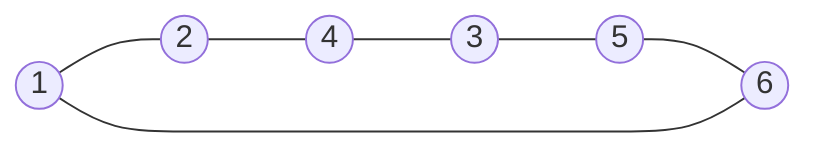

[[TOC]]

## 形式化题目

给定一张无向图 $G=(V,E)$：金属环是顶点，$|V| = n$，编号 $1, 2, \dots, n$；绳索是边，每条边长度相同。同一条绳索的两个端点不同，允许重边。

选两个不同的顶点 $L, R$ 分别向两边拉到最远。当 $L$ 到 $R$ 存在多个绳索数相等的连接方法时，只有其中一条被算作拉紧，不得合并统计。

记 $\operatorname{dist}(u,v)$ 为从 $u$ 到 $v$ 最少要经过的绳索数（$u, v$ 不连通时不存在）。求

$$
\max_{\substack{u \neq v \\ u \sim v}} \operatorname{dist}(u, v),
$$

即把每条绳索看成单位长度时图的直径；没有任何连通点对时答案为 $0$。

## 正解

### 思路

**先弄清"拉紧"到底数的是哪些绳索。**

每条绳索长度都相同，设长度为 $\ell$。把 $L$ 和 $R$ 往两边拉，能拉开的距离不可能超过 $\operatorname{dist}(L,R) \cdot \ell$——因为 $L$ 与 $R$ 之间至少要跨过 $\operatorname{dist}(L,R)$ 条绳索。当拉开到这个距离时，$L$ 与 $R$ 之间的那条最短路径上的绳索全部被拉成直线，**恰好 $\operatorname{dist}(L,R)$ 条绳索被拉紧**。

也就是说，一对环的得分就是它们之间的**最少绳索数**，而不是任何几何摆放里可能绷直的绳索总数。题面注释把这条口径写得很死："如果像样例那样 1-2-4-3-5-6-1 构成了一个环，我们认为拉 1 和 3 时只能拉紧一边（1-2-4-3 或 3-5-6-1）而不算全部拉紧"，以及"当两个环之间有几个绳索数相等的连接方法时，只算其中一条连接方法拉紧"。换句话说，**"只算一条"是题面的规定**：即使多条等长路径在某个摆放里都能绷直，也只取其中一条的长度计数。

样例的六元环正好说明这个差别。环上的边是 $1\!-\!2\!-\!4\!-\!3\!-\!5\!-\!6\!-\!1$，取 $L=1$、$R=3$：



从 1 到 3 有两条步数相同的走法：$1 \to 2 \to 4 \to 3$ 和 $1 \to 6 \to 5 \to 3$，都经过 3 条绳索。如果把它们并起来数，这个六元环的 6 条绳索全都会被算上；但题面规定只算一条，所以 $L=1, R=3$ 的得分是 $3$，与样例输出一致。这也解释了 $d(1,3) = 3$ 是取**较短弧长**的结果：环上一对点有两条弧，最少绳索数就是较短的那条。

**于是问题变成求图的直径。**

因为绳索等长（边权全为 1），"最少绳索数"就是无权图里的最短路长度。答案就是所有连通点对的最短路最大值。$L$ 与 $R$ 不连通时一条绳索也拉不紧，贡献 $0$，不参与取最大。

**为什么用 Floyd。**

要求的是**任意两点之间**的距离，$n \leqslant 100$，$O(n^3)$ 的 Floyd 一次就能得到完整的距离矩阵：

$$
\text{dist}[i][j] \leftarrow \min\bigl(\text{dist}[i][j],\ \text{dist}[i][k] + \text{dist}[k][j]\bigr).
$$

第 $k$ 轮结束时，`dist[i][j]` 表示"只允许把编号 $< k$ 的顶点当中转点"时 $i \to j$ 的最少边数；$k$ 走完 $0 \dots n-1$ 就放开了所有中转点。$100^3 = 10^6$ 次松弛在毫秒级完成。

距离矩阵与答案（样例，行列都是环编号）：

| $\text{dist}$ | 1 | 2 | 3 | 4 | 5 | 6 |
| :-: | :-: | :-: | :-: | :-: | :-: | :-: |
| **1** | 0 | 1 | **3** | 2 | 2 | 1 |
| **2** | 1 | 0 | 2 | 1 | 3 | 2 |
| **3** | **3** | 2 | 0 | 1 | 1 | 2 |
| **4** | 2 | 1 | 1 | 0 | 2 | 3 |
| **5** | 2 | 3 | 1 | 2 | 0 | 1 |
| **6** | 1 | 2 | 2 | 3 | 1 | 0 |

观察两点：矩阵关于主对角线**对称**（因为绳索是无向的，$d(u,v) = d(v,u)$，所以最后只需枚举 $u < v$）；最大值 $3$ 出现在 $(1,3)$、$(2,5)$、$(4,6)$ 三对上，正是环上相隔半圈的点对，也就是答案。

**最后的细节。** 输出前只对连通点对取最大：

```python
max((dist[u][v] for u, v in combinations(range(n), 2) if dist[u][v] < INF), default=0)
```

`combinations(range(n), 2)` 直接给出所有 $u < v$ 的下标对，`if dist[u][v] < INF` 跳过不连通点对，`default=0` 兜住"整张图一条绳索都没有"的情形。

实现上把两件事分开：`all_pairs_shortest_paths` 只回答"任意两个环之间最少要经过几条绳索"，`solve` 负责读入、调用、取最大并输出。

### 代码

@include-code(./main.py, python)

### 复杂度

- 时间：建图 $O(n^2 + m)$，Floyd $O(n^3)$，取最大 $O(n^2)$，总计 $O(n^3)$。$n = 100$ 时约 $10^6$ 次松弛，实测单点约 $0.02$ s。
- 空间：距离矩阵 $O(n^2)$，绳索列表 $O(m) = O(n^2)$，总计 $O(n^2)$。

## 总结

本题没有几何计算，全部难度集中在**把题意翻译成图论语言**：

1. 绳索等长 ⇒ 两个环能拉开的距离正比于"最少要经过几条绳索"，被拉紧的绳索恰好构成一条**最短路径**，得分 = $\operatorname{dist}(L, R)$；
2. 题面规定等长的多条连接方法只算一条，所以答案**不是**这些路径的并集大小（样例的六元环若取并集会得到 6 而不是 3）；
3. 于是答案就是所有连通点对最短路的**最大值**，即单位边权图的直径，$O(n^3)$ 的 Floyd 一次算完所有点对。

要点提醒：重边只需在邻接矩阵里写一次 1（多余的绳索永远拉不紧）；不连通的点对不能参与取最大；$n \leqslant 100$ 使 $O(n^3)$ 富余，若 $n$ 放大到 $10^4$ 就该改用 $n$ 次 BFS，而不是继续用 Floyd。同样的算法在 C++ 里就是 `dist[a][b] = dist[b][a] = 1;` 加三重 `for` 松弛，Python 版的差别只是把最内层循环写成 `zip` 加列表推导。
