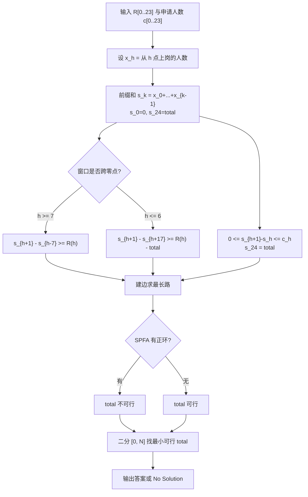

[[TOC]]

## 形式化题目

管理员给出 24 个小时的最低在岗人数 $R(0),\dots,R(23)$：第 $h$ 小时（$h$ 点到 $h+1$ 点）至少要有 $R(h)$ 人在岗。
另有 $N$ 个申请人，第 $i$ 个人只能从 $t_i$ 点开始上班，并且一旦开始就**连续工作满 8 小时**
（区间 $[t_i, t_i+8)$ 模 24 小时环绕）。同一时刻可以有多个申请人。

要求选出一个子集并安排上班，使每小时在岗人数都不低于需求，并**最小化选中的人数**；
无解输出 `No Solution`。

等价地，记 $c_h$ 为起始时刻恰为 $h$ 的申请人数，$x_h$ 为其中实际录取的人数，
则 $0 \leqslant x_h \leqslant c_h$，第 $h$ 小时在岗人数为

$$\sum_{k=0}^{7} x_{(h-k) \bmod 24} \;\geqslant\; R(h), \qquad \text{最小化} \sum_{h=0}^{23} x_h .$$

**样例示意。** 样例中 $R(0)=R(2)=R(6)=R(23)=1$，申请人起始时刻为 $\{0,1,10,22,23\}$。
只录取起始时刻 $t=23$ 的一人，看他覆盖哪些小时：

| $h$ | 0 | 1 | 2 | 3 | 4 | 5 | 6 | 7 | 8 | … | 22 | 23 |
| --- | --- | --- | --- | --- | --- | --- | --- | --- | --- | --- | --- | --- |
| $R(h)$ | 1 | 0 | 1 | 0 | 0 | 0 | 1 | 0 | 0 | … | 0 | 1 |
| 是否覆盖 | ✓ | ✓ | ✓ | ✓ | ✓ | ✓ | ✓ | – | – | … | – | ✓ |

`t=23` 的班次覆盖 $23,0,1,2,3,4,5,6$ 这 8 个小时（第 7 小时他已经下班），
恰好避开所有 $R(h)=0$ 的小时、命中全部 4 个 $R(h)=1$ 的小时，所以一个人就够，答案为 $1$。

## 正解

### 思路

**朴素做法为什么不行。** 最直接的想法是枚举所有 $2^N$ 个申请人子集，检查是否满足 24 条需求，
取最小大小。$N \leqslant 1000$，指数级，不可行。退一步只枚举每小时的录取人数 $x_h$，
可行域仍是 24 维的多面体，没有简单的枚举或贪心能保证最优。

**瓶颈在于约束被拆散了。** 每条需求管的是「8 个连续小时的人数之和」，每个 $x_h$ 同时出现在 8 条需求里。
逐个 $x_h$ 决策时，无法知道它对所有包含自己的窗口贡献了多少。所以需要一种能**同时**表达
全部 24 条窗口约束的结构——这正是**差分约束**擅长的：把每条约束写成两个变量之差的形式。

**第 1 步：用前缀和把「窗口和」变成「两点之差」。** 记

$$s_k = x_0 + x_1 + \cdots + x_{k-1}, \qquad s_0 = 0,$$

则 $s_k$ 是前 $k$ 小时录取人数的前缀和，$0 \leqslant s_{k+1} - s_k = x_k \leqslant c_k$。

对于第 $h$ 小时，覆盖它的 8 个小时班次起始于 $h-7, h-6, \dots, h$（模 24）。
当 $h \geqslant 7$ 时这些起始点都在 $[0, h]$ 内，窗口和正好是

$$x_{h-7} + \cdots + x_h = s_{h+1} - s_{h-7} \;\geqslant\; R(h),$$

一条标准的两点差约束。

**第 2 步：跨零点的窗口要绕回上一轮。** 当 $h \leqslant 6$ 时，起始点 $h-7,\dots,-1$ 实际是上一轮的
$h+17,\dots,23$，它们的和是 $s_{24} - s_{h+17}$。于是

$$x_{h-7} + \cdots + x_h = \underbrace{(s_{h+1} - s_0)}_{0 \sim h \text{ 段}} + \underbrace{(s_{24} - s_{h+17})}_{h+17 \sim 23 \text{ 段}} \;\geqslant\; R(h).$$

这里出现了一个未知量 $s_{24}$——它恰好就是**总雇佣人数**。把它记为 `total`。

**第 3 步：把 `total` 当作已知参数。** 若假设 `total` 已知，上面的式子变成
$s_{h+1} - s_{h+17} \geqslant R(h) - \text{total}$，右边是常量，仍是一条两点差约束。
再加上把 $s_{24}$ 钉死的两条反向边，整个系统就只剩「已知常量」了：

| 约束来源 | 不等式 | 建边 $u \to v$，权 $w$ |
| --- | --- | --- |
| 人数非负 | $s_{h+1} - s_h \geqslant 0$ | $h \to h+1$，权 $0$ |
| 人数不超申请人 | $s_h - s_{h+1} \geqslant -c_h$ | $h+1 \to h$，权 $-c_h$ |
| 不跨零点的需求（$h \geqslant 7$） | $s_{h+1} - s_{h-7} \geqslant R(h)$ | $h-7 \to h+1$，权 $R(h)$ |
| 跨零点的需求（$h \leqslant 6$） | $s_{h+1} - s_{h+17} \geqslant R(h) - \text{total}$ | $h+17 \to h+1$，权 $R(h) - \text{total}$ |
| 固定总人数 | $s_{24} - s_0 \geqslant \text{total}$ | $0 \to 24$，权 $\text{total}$ |
| 固定总人数 | $s_0 - s_{24} \geqslant -\text{total}$ | $24 \to 0$，权 $-\text{total}$ |

**第 4 步：差分约束判正环。** 系统里所有约束都是 $s_v \geqslant s_u + w$ 的形状，
按「$u \to v$ 权 $w$」建图求**最长路**：若存在正环（沿环累加得到 $s_v > s_v$），约束互相矛盾，
`total` 不可行；若无正环，取每个点的最长路长度作为 $s_v$ 就得到一组可行解，
`total` 可行。实现上用 SPFA 松弛，某点被松弛满「点数」次即说明有正环。

**第 5 步：外层二分。** 可行性对 `total` 单调：若 $t$ 人可行，在 $N$ 个申请人里再多录取一个
（$t < N$），需求只有下界，只会更容易满足，故 $t+1$ 也可行。于是在 $[0, N]$ 上二分最小可行值。
两个边界都要注意：`total = 0` 表示一个人都不招，需求全为 0 时才可行；二分全部失败即无解。

把上面的判定打包成 `shift_ok(total)`，外层二分就是 `min_cashiers`。细节上，
第 3 步的两段循环分别对应两个分支：`range(SHIFT, HOURS + 1)` 处理 $h \geqslant 7$，
`range(1, SHIFT)` 处理 $h \leqslant 6$；循环变量是 $h+1$，不是 $h$。

### 代码

@include-code(./main.py, python)

### 复杂度

一天固定 24 小时、25 个图节点、约 74 条边，所以一次可行性判定是 $O(1)$（相对输入规模），
SPFA 的最坏 $O(VE)$ 在此是常数。外层二分 $O(\log N)$ 次，单组数据 $O(\log N)$，
全部 $T$ 组 $O(T \log N)$；空间是 `O(1)` 级别的建图开销加输出缓冲。
实测 13 组、最大 $N = 1000$ 共耗时 0.02s、峰值内存约 15MB，远低于 1000ms / 128MB 的限制。

## 总结

- **滑动窗口和 → 前缀和之差**：`x_{a}+...+x_b = s_{b+1}-s_a`，这是把需求翻译成差分约束的关键一步。
- **跨零点要绕回上一轮**：$h \leqslant 6$ 时窗口有一段落在 $s_{h+17}$~$s_{24}$ 之间，会引入未知量 $s_{24}$。
- **未知的总人数用二分消除**：把 $s_{24}=\text{total}$ 当参数带进约束，可行性对 `total` 单调，
  于是二分最小可行值。
- **正环 ⇔ 无解**：$s_v \geqslant s_u + w$ 型系统用最长路 SPFA 判正环，比直接求解简单得多。
- 一天只有 24 小时，图极小，所以 Python 完全跑得动；难点在建模而不在常数。

## 图示解析

下面这张图给出从原始输入到「二分 + 差分约束」的建模路线，以及每步用到的量。



观察重点：图中 `D` 的分岔是本题唯一的建模陷阱——跨零点的窗口必须绕回上一轮的
$s_{h+17}$，并把未知的 `total` 移成右边的常量；`H` 分支把「总人数」钉死，
否则系统会用「不招满 `total` 人」的松弛解骗过判定；`I` 把可行性问题转成图上的判环问题，
使整个判定只在一个 25 点的图上完成。二分（`L`）之所以能放在最外层，
是因为人数越多需求越容易满足。

第二张图对比两种窗口的起点分布，说明为什么要分成两段循环：

```
第 h 小时在岗的 8 个班次起点（模 24）：

h >= 7（不跨零点）：
              起点 h-7 .. h 全在同一轮 [0,23]
   s_k 轴： ... s_{h-7} ──────────── s_{h+1} ...
                 └──── 差 = 窗口和 ────┘

h <= 6（跨零点）：
   起点 h-7..-1 实际是上一轮的 h+17..23
   s_k 轴： s_0 ... s_{h+1}          s_{h+17} ... s_{24}
             └ 0~h 段 ┘              └ h+17~23 段 ┘
            窗口和 = (s_{h+1}-s_0) + (s_{24}-s_{h+17})
```

观察重点：跨零点时窗口被切成「本轮开头」和「上一轮结尾」两块，第二块用
$s_{24}-s_{h+17}$ 表示，因此约束右边必须减去 `total`。
