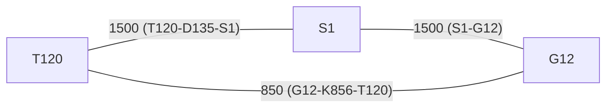
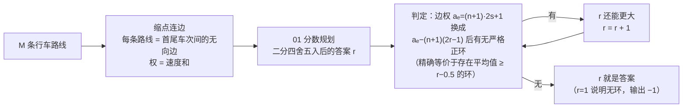

[[TOC]]

## 形式化题目

有五种车次，速度只由开头的字母决定：S 为 1000，G 为 500，D 为 300，T 为 200，K 为 150。一条**行车路线**由若干车次用 `-` 连接而成，它的**速度和**是各车次速度之和（例如 `T120-D135-S1` 的速度和为 200+300+1000=1500，与编号大小无关）。

给出 $M$ 条行车路线。若路线 A 的末尾车次与路线 B 的开头车次相同，A、B 就能首尾相接；若干条路线依次相接回到起点则构成一个**高铁环**，环的值是

$$\frac{\text{环上各条路线的速度和之和}}{\text{环上路线的条数}}\text{。}$$

求所有高铁环的值的最大值，**四舍五入到最接近的整数**输出；若不存在任何环，输出 $-1$。

数据范围：$0 < M \leqslant 50000$，每条路线车次个数不超过 20，保证结果不超过 $2^{31}-1$。

**样例解释**：三条路线 `T120-D135-S1`（和 1500）、`S1-G12`（和 1500）、`G12-K856-T120`（和 850）。`T120` 同时出现在第一条的开头与第三条的末尾，`S1`、`G12` 分别把三条路线串起来，构成环，环的值为 $(1500+1500+850)/3 = 1283.33\ldots$，四舍五入得 $1283$。

## 正解

### 思路

**第一步：把路线缩成一条边。** 一条路线能被接到哪里、又能接谁，完全由它的**末尾车次**和**开头车次**决定，中间车次只贡献速度和。因此把每个车次看成一个点，每条行车路线看成首尾两点之间的一条**无向边**：边权为该路线的速度和 $s$，走这条边就代表"用掉这一条路线"。样例对应的图如下：

于是"一个高铁环"就是这张图中的一个环，"环的值"就是**环上边权的平均值**：$\dfrac{\sum_{e \in C} s_e}{|C|}$（注意分母是路线条数，不是车次个数）。"用到的路线可以重复"正对应"图上的边可以重复走"，图本身天然支持这一点。

**第二步：朴素做法与瓶颈。** 最直接的想法是枚举每个环算平均值——环可能极长、数量指数级，完全不可行。这是经典的**01 分数规划**模型：最大化"权值和 ÷ 个数"。

**第三步：01 分数规划转判定。** 设某个环 $C$ 的平均值为 $avg(C) = \dfrac{\sum s_e}{|C|}$，则

$$avg(C) \geqslant \frac{w}{2} \iff \sum_{e \in C} \bigl(2 s_e - w\bigr) \geqslant 0\text{。}$$

把每条边的权换成 $2 s_e - w$ 后，"存在平均值 $\geqslant \frac{w}{2}$ 的环"就等价于"图中存在**正环**"（权值和 $> 0$ 的回路；把所有边权取相反数，也就是判负环）。$w$ 是整数，权重和、平均值都是有理数，标准的 01 分数规划套路：**二分答案**，每次判定用**SPFA 判（负）环**。

**第四步：处理"四舍五入"这个坑。** 最优平均值为 $x$ 时，四舍五入的结果是 $\lfloor x + 0.5 \rfloor$。设答案为整数 $r$，则 $x$ 四舍五入后 $\geqslant r$ 当且仅当 $x \geqslant r - 0.5$，而

$$x \geqslant r - \frac{1}{2} \iff \sum_{e \in C} \bigl(2 s_e - (2r - 1)\bigr) \geqslant 0\text{。}$$

所以**不需要对 $\frac{w}{2}$ 做浮点二分**：直接在整数 $r$ 上二分，判定条件为整数不等式 $\sum_{e \in C} \bigl(2 s_e - (2r-1)\bigr) \geqslant 0$，全程无浮点误差。找到最大的、判定成立的 $r_{\max}$ 即答案。速度和的最大值为 $20 \times 1000 = 20000$，平均值不超过 $20000$，二分上界取 $20001$ 即可（下界取 $1$：任何环的平均速度和都是正的，$r=1$ 的判定恒成立）。

**第五步：把“$\geqslant 0$ 的环”精确化成 SPFA 能判的“严格正环”。** SPFA 的计数法只能找**严格**正环（权值和 $> 0$ 的回路），而这里需要判的是 $\geqslant 0$。好在 $\sum_{e \in C}\bigl(2 s_e - (2r-1)\bigr)$ 是整数，且环的边数 $|C| \leqslant n$，所以两边同乘 $n+1$ 再加 $|C|$ 不改变结论：

$$\sum_{e \in C}\bigl(2 s_e - (2r-1)\bigr) \geqslant 0 \iff (n+1)\sum_{e \in C}\bigl(2 s_e - (2r-1)\bigr) + |C| > 0\text{，即}\sum_{e \in C} a_e - (n+1)(2r-1) > 0\text{，}$$

其中 $a_e = (n+1)\cdot 2 s_e + 1$ 是建图时就存好的边权。于是判定变成：把每条边权换成 $a_e - (n+1)(2r-1)$ 后**判严格正环**——最优平均值恰好为 $k+0.5$ 的边界情形也能被正确舍入，没有任何精度或边界隐患。

**第六步：判正环的实现。** 图可能不连通，所以把所有点的初始距离设为 $0$（等价于建一个连向所有点的超级源点），跑 SPFA 最长路；一旦某个点的最长路已经用掉 $n$ 条边（前驱链上点必然重复），说明存在严格正环。**若无任何正环**，说明图里根本没有环，此时输出 $-1$；为了让 $-1$ 只在“真的没有环”时出现，二分下界取 $1$——只要图中还有环，其速度和必为正、平均值必大于 $0.5$，$r=1$ 的判定必然成立，因此二分结束后 $r_{\max}=1$ 恰好对应“无环”。

### 代码

@include-code(./main.py, python)

### 复杂度

- 建图 $O(M)$，点数 $n \leqslant M$、边数 $M \leqslant 50000$。
- SPFA 判正环单次最坏 $O(n \cdot M)$，二分约 $\log_2 20000 \approx 15$ 轮，总复杂度 $O(\log V \cdot n \cdot M)$——与 C++ 标准解法同阶。加了 SLF 优化后，本题实际数据上 Python 也能在限内跑完。
- 空间 $O(n + M)$。

## 总结

- **建模**：行车路线 → 首尾车次之间的无向边（权 = 速度和），高铁环 → 图中的环，注意"环的值"的分母是**路线条数**，与一条路线里有几个车次无关。
- **算法**：01 分数规划 + SPFA 判正环，$O(\log V \cdot n \cdot M)$。
- **两个易错点**：
  1. **四舍五入**——不要对平均值做浮点二分，改为直接二分答案 $r$、判“平均值 $\geqslant r - 0.5$”；$\sum(2s-(2r-1))$ 是整数，同乘 $n+1$ 再加环长即可把 “$\geqslant 0$”精确化为 SPFA 能判的“严格正环”，避开所有边界与精度问题。
  2. **无环输出 $-1$**——把二分下界压到 $1$，让"判定成立的最大 $r$"为 $1$ 时恰好对应无环。
- **Python 实现要点**：SPFA 主循环里把 `dist[u]`、`adj[u]` 提到局部变量，手动内层循环代替 `enumerate`，这是 Python 判环能否过时限的关键。

## 图示解析

### 整体解法路线

### 二分判定在样例上的取值

以样例（三条路线构成环，平均 $1283.33\ldots$）为例，列出二分过程中判定 $avg \geqslant r-0.5$ 的结果：

| 二分到的 $r$ | 判定阈值 $r-0.5$ | 边权 $2s-(2r-1)$ 后存在正环？ | 结论 |
| --- | --- | --- | --- |
| $10001$ | $10000.5$ | 否（边权全为 $2s-20001<0$） | 答案更小，往左 |
| $5001$ | $5000.5$ | 否 | 答案更小，往左 |
| $2501$ | $2500.5$ | 否 | 答案更小，往左 |
| $1251$ | $1250.5$ | 是（环均值 $1283.33 \geqslant 1250.5$） | 答案更大，往右 |
| $1284$ | $1283.5$ | 否（$1283.33 < 1283.5$） | 答案更小，往左 |
| $1283$ | $1282.5$ | 是（$1283.33 \geqslant 1282.5$） | 收敛 |

二分收敛到最大的可行 $r = 1283$，正是四舍五入后的正确答案；观察中间行：$r=1284$ 的阈值 $1283.5$ 恰好被 $1283.33$ 卡掉——这就是"四舍五入等于判定 $r-0.5$"的具体体现。
