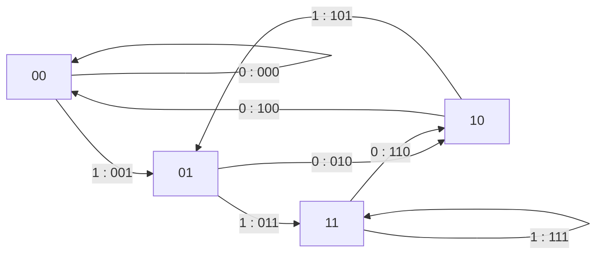

[[TOC]]

## 形式化题目

给定整数 $k$（$2 \leqslant k \leqslant 11$）。构造一个首尾相接的 01 环串 $s$，设其长度为 $m$，从环上每个位置出发顺时针读 $k$ 位，共得到 $m$ 个长度为 $k$ 的 01 串。要求这 $m$ 个串互不相同。显然长度为 $k$ 的 01 串只有 $2^k$ 个，所以 $m \leqslant 2^k$。求 $m$ 的最大值，并给出取到最大值时字典序最小的环串。

例如 $k=3$ 时，最优答案是 `00010111`：从 8 个位置出发读 3 位，得到 $000,001,010,101,011,111,110,100$，恰好是全部 8 个长度为 3 的 01 串。

## 正解

### 思路

**第一步：把环看成"窗口序列"。** 设环串为 $s_0 s_1 \cdots s_{m-1}$（$s_{m} = s_0$）。从位置 $i$ 出发读 $k$ 位得到的串，就是以 $i$ 开头、长度为 $k$ 的滑动窗口。相邻两个窗口只差进出各一位：窗口 $i$ 是 $(s_i,\dots,s_{i+k-1})$，窗口 $i+1$ 是 $(s_{i+1},\dots,s_{i+k})$。于是整条环对应一个窗口序列 $w_0 \to w_1 \to \cdots \to w_{m-1} \to w_0$，其中每次转移"扔掉最左位、在末尾追加一位"。

**第二步：把窗口序列建模成图上的回路。** 把每个长度为 $k-1$ 的 01 串看成一个节点（共 $2^{k-1}$ 个），把每个长度为 $k$ 的串看成一条有向边：边从它的前 $k-1$ 位出发，指向它的后 $k-1$ 位，边上的"新位"就是第 $k$ 位。这样"窗口每次滑动一位"恰好对应"沿着一条边走到下一个节点"。环上 $m$ 个窗口互不相同且首尾相接，等价于这条边序列构成一条**欧拉回路**——每条"长度为 $k$ 的串"这条边恰好走一次。

**第三步：判断 $M$ 的最大值。** 这个图中每个节点 $v$ 恰好有两条出边（追加 0 或 1）和两条入边，且从任何节点出发都能到达任何节点（每次转移可以在任意时刻把后缀"洗"成任意串），所以欧拉回路存在，$M$ 的最大值就是边数 $2^k$。这也是经典结论：**$k$ 阶 01 de Bruijn 序列长度为 $2^k$**。

以 $k=3$ 为例，图共有 $4$ 个节点（$00,01,10,11$）和 $8$ 条边，边上的标注是追加的新位（即对应的长度 3 串）：

每个节点恰好两条出边、两条入边；8 条边就是全部 8 个长度为 3 的 01 串，走完所有边一次回到起点，环串就是沿途追加的位。

| 步 | 当前窗口（前 2 位=节点） | 新追加位 | 下一个窗口 | 途经的长度 3 串 |
| --- | --- | --- | --- | --- |
| 1 | `00` | 0 | `00` | `000` |
| 2 | `00` | 1 | `01` | `001` |
| 3 | `01` | 0 | `10` | `010` |
| 4 | `01` | 1 | `11` | `011` |
| 5 | `10` | 1 | `01` | `101` |
| 6 | `11` | 1 | `11` | `111` |
| 7 | `11` | 0 | `10` | `110` |
| 8 | `10` | 0 | `00` | `100` |

样例 `00010111` 的 8 步滑动过程（首尾相接）：

| 步 | 当前窗口（前 2 位=节点） | 新追加位 | 下一个窗口 | 途经的长度 3 串 |
| --- | --- | --- | --- | --- |
| 1 | `00` | 0 | `00` | `000` |
| 2 | `00` | 1 | `01` | `001` |
| 3 | `01` | 0 | `10` | `010` |
| 4 | `01` | 1 | `11` | `011` |
| 5 | `10` | 1 | `01` | `101` |
| 6 | `11` | 1 | `11` | `111` |
| 7 | `11` | 0 | `10` | `110` |
| 8 | `10` | 0 | `00` | `100` |

观察上表：走到的长度 3 串恰好把 8 个串各出现一次，第 8 步回到起点 `00`，这条窗口序列就是上图的一条欧拉回路。

**第四步：用 Hierholzer 算法求回路并保证字典序最小。** 从全零节点 $0$ 出发（即初始窗口为 $k-1$ 个 `0`），每次**优先走编号较小的出边**（即先尝试追加 `0`）。用非递归 Hierholzer：维护一个栈，栈顶还有没用过的出边就走出去并标记该边用过，出边用尽就弹栈记录节点；所有节点按弹出顺序的**逆序**拼起来就是回路方向上的节点访问次序。

为什么这样得到字典序最小？两条经典保证叠加：

1. 回路从起点 $0$ 开始，每一步在两条出边中先尝试 `0` 边，得到的是"贪心字典序"的回路遍历方向——后出栈的节点在回路中更靠前，等于从起点开始总先试 0 边。
2. de Bruijn 图每个点出度恰好为 2，且从任一点出发的欧拉回路中，先走小编号边的贪心不会"堵死"回路（回溯阶段的逆后序拼接自动补齐未走完的分支）。

**第五步：还原环串。** 回路上相邻节点之间隔着一条边，边带来的新位就是环串里一个新字符。把回路写成 $u_0 \to u_1 \to \cdots \to u_{2^k-1} \to u_0$，其中 $u_0 = 0$（全零窗口），那么环串开头 $k-1$ 位是 $u_0$ 的二进制（即 $k-1$ 个 `0`），之后每一步追加 $u_{i}$ 的最低位即可。因为环是循环的，截取前 $2^k$ 位输出。

### 代码

@include-code(./main.cpp, cpp)

@include-code(./main.py, python)

### 复杂度

- 时间复杂度：图中节点数 $2^{k-1}$、边数 $2^k$，Hierholzer 算法每条边走一次、每个点进出栈一次，为 $O(2^k)$。
- 空间复杂度：$O(2^k)$，即边标记数组和栈、回路的长度。

$k \leqslant 11$ 时 $2^k = 2048$，远在时限内。

## 总结

- 本题把"环上滑动窗口各不相同"翻译成图论模型：**长度 $k-1$ 的串是节点、长度 $k$ 的串是边**，环串对应图上一条欧拉回路。
- 每个节点恰有两条出边、两条入边且图连通，所以欧拉回路必然存在，最大 $M = 2^k$。
- Hierholzer 算法用"栈 + 逆后序"在 $O(E)$ 时间内求出回路；从全零节点出发、每步优先走 `0` 边并逆后序还原，得到字典序最小的环串。
- 关键实现细节：节点编号 $v$ 的两条出边是 $2v$（追加 `0`）和 $2v+1$（追加 `1`），到达的新节点是 $2v+b \bmod 2^{k-1}$；环串末尾无需真正接回开头，输出时按循环串截取前 $2^k$ 位即可。
