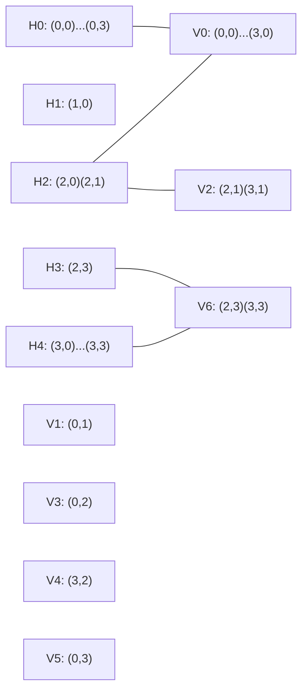

[[TOC]]

## 形式化题目

给定 $m \times n$ 网格，每格是墙壁 `#`、草地 `*` 或空地 `o` 之一。机器人只能放在空地上，
每个机器人沿上、下、左、右四个方向发射激光；激光被墙壁挡住，**不被草地挡住**，
也被别的机器人挡住。

两个机器人 $(r_1,c_1)$、$(r_2,c_2)$ **冲突**，当且仅当 $r_1 = r_2$ 且两格之间没有墙壁，
或 $c_1 = c_2$ 且两格之间没有墙壁。

要求选出尽可能多的空地格放机器人，使选出的格子两两不冲突。答案即最大数量。

样例 1 的网格（$4 \times 4$）：

```text
    o  *  *  *
    *  #  #  #
    o  o  #  o
    *  *  *  o
```

其中 `*` 不挡光这一条最容易看错。样例 1 里第 0 行第 0 列是 `o`、第 2 行第 0 列也是 `o`，
两格在同一列且中间只有草地 $(1,0)$：草地挡不住激光，所以它们只要都放机器人就会互射。

## 正解

### 思路

**第一步：冲突是"二维"的，但可以拆成两类。**

机器人只沿四个正方向发射激光，所以它能打到的格子必然与自己在同一行或同一列。
于是"两个机器人互相打到"只可能是两件事之一：同行且中间无墙，同列且中间无墙。

固定一行来看：把这一行用墙壁 `#` 切开，得到若干**横向极大段**：一段内任意两格之间
没有墙壁，段与段之间隔着至少一面墙。**草地 `*` 不算切割点**，因为它不挡光，
所以 `o*o` 的两个空地格必须落在同一个横向段里。用同样的方法对每列切出**纵向极大段**。

> 两个机器人冲突 $\iff$ 它们落在同一个横向段，或落在同一个纵向段。

**第二步：贪心是不可行的。**

最自然的想法是逐格扫描、能放就放（放了就把所在的行段与列段标记为已占用）。
这个做法在下面的 $3\times3$ 地图上只能拿到 2，而最优是 3：

```text
    o  o  o
    o  o  o
    o  o  *
```

行优先贪心先放 $(0,0)$，整段第 0 行与第 0 列随之作废，接着放 $(1,1)$，
剩下的 $(1,2),(2,0),(2,1)$ 全被挡住。最优方案是 $(0,2),(1,1),(2,0)$：它们在一条反对角
线上，两两不同行段也不同列段。关键差别在于，放一个机器人会同时废掉一整行段与一整列段，
收益是全局相关的，一步选错必须能"撤销"。枚举所有空地子集也不行：$50\times50$ 全空地时
有 $2^{2500}$ 种选法；而按"格子为点、冲突为边"建图后求最大独立集，一般图上是 NP-hard 的，
不能直接套用——必须利用"冲突图可以由行、列两侧的段描述"这一特殊结构。

**第三步：换个角度——把段当成资源。**

不去数"选哪些格子"，而是数"占用了哪些段"。每放一个机器人，它就占用了自己所在的那一个
横向段和那一个纵向段；两个机器人不冲突，等价于**它们占用的横向段互不相同、纵向段也互不相同**。

这句话正好是一个二分图匹配。建图 $G$：

- 左部顶点：每个横向极大段一个；
- 右部顶点：每个纵向极大段一个；
- 每个空地格 $(r,c)$ 连一条边 $H(r,c) \to V(r,c)$（它恰好属于唯一一个横向段和唯一一个纵向段）。

因为机器人只能站在空地上，所以只有空地格会产生边。现在：

$$\text{合法摆放} \;\longleftrightarrow\; \text{匹配},\qquad \text{最多机器人} \;\longleftrightarrow\; \text{最大匹配}.$$

一条边对应一个机器人、两个端点对应它占用的两个段，"不共享端点"就是"不冲突"。
样例 1 切分后的段与二分图如下（左部 `H` 是横向段，右部 `V` 是纵向段）。

先看横向切分（箭头前是格子内容，箭头后是该格所属的 `H`）：

| 行 \ 列 | 0 | 1 | 2 | 3 |
| --- | --- | --- | --- | --- |
| 0 | `o` → H0 | `*` → H0 | `*` → H0 | `*` → H0 |
| 1 | `*` → H1 | `#` | `#` | `#` |
| 2 | `o` → H2 | `o` → H2 | `#` | `o` → H3 |
| 3 | `*` → H4 | `*` → H4 | `*` → H4 | `o` → H4 |

再看纵向切分：

| 行 \ 列 | 0 | 1 | 2 | 3 |
| --- | --- | --- | --- | --- |
| 0 | `o` → V0 | `*` → V1 | `*` → V3 | `*` → V5 |
| 1 | `*` → V0 | `#` | `#` | `#` |
| 2 | `o` → V0 | `o` → V2 | `#` | `o` → V6 |
| 3 | `*` → V0 | `*` → V2 | `*` → V4 | `o` → V6 |

两张表对照着看：V1、V3、V4、V5 覆盖的全是草地（例如 V4 只有 $(3,2)$ 一格 `*`），
它们不产生任何边；只有 5 个空地格分别落在 5 组段里。这 5 条边列在下表，
也正是二分图的全部边：

| 空地格 | 横向段 | 纵向段 |
| --- | --- | --- |
| $(0,0)$ | H0 | V0 |
| $(2,0)$ | H2 | V0 |
| $(2,1)$ | H2 | V2 |
| $(2,3)$ | H3 | V6 |
| $(3,3)$ | H4 | V6 |

由此得到的二分图（$H$ 与 $V$ 之间的实线就是一条边）：



H1、V1、V3、V4、V5 是没有边的孤立点，放不放机器人都不影响别人。注意 V0 被两条边
（$(0,0)$ 与 $(2,0)$）共用：这两个格子在同一列且中间只有草地，所以不能同时选；
V6 同理被 $(2,3)$ 与 $(3,3)$ 共用。可选边只有 5 条，把它们放进匹配后右部只能占用
V0、V2、V6 三个顶点，所以最多 3 个机器人——取 H0–V0、H2–V2、H3–V6，对应
$(0,0)$、$(2,1)$、$(2,3)$ 三格，正好是样例输出的 3。第二组样例同理，切分后横向段 6 个、
纵向段 6 个，最大匹配是 5，与样例输出的 5 一致。

**第四步：用增广路求最大匹配。**

有了模型，剩下的就是二分图最大匹配。匹配理论的基本结论是 **Berge 增广路定理**：

> 匹配 $M$ 最大 $\iff$ 图中不存在 $M$ 的增广路（两端点都未匹配的交错路）。

所以算法反复做一件事：找一条增广路，把路上的匹配边与非匹配边整体互换，匹配数就 $+1$；
找不到增广路时当前匹配就是最大的。这恰好补上了贪心缺的"撤销"能力——增广路可以一次改掉
一串已有匹配。

本题用 Hopcroft–Karp：

1. **BFS 分层**：从所有未匹配左部点同时出发，交替走"未匹配边 → 匹配边"。走到右部点 $v$ 后，
   下一步只能沿 $v$ 的匹配边到 `match_r[v]`，没有分支，所以层号只需记在左部点上。
   第一次碰到空闲右部点时的层号就是最短增广路的长度。
2. **批量增广**：只沿 $dist[w] = dist[u] + 1$ 的分层方向往下走，并且只接受长度恰好最短的路。
   长度相同的增广路彼此不共享端点，所以一轮能一次增广多条，轮数不超过 $O(\sqrt V)$。

因为每轮 BFS 与增广都是 $O(E)$、轮数 $O(\sqrt V)$，总复杂度 $O(E\sqrt V)$，
严格优于逐点匈牙利算法的 $O(VE)$。

**第五步：实现要点。**

- 段编号只由墙壁 `#` 重置：逐行扫描时遇 `#` 把段号设回 $-1$，遇 `*` 和 `o` 都延续段号。
- 草地不出现在二分图里：纵向段扫描时只对 `o` 格 `append` 一条边。
- 增广路的深度最坏可达 $O(V)$，所以用显式栈加 `path` 列表代替递归，
  不必设递归深度。
- 输出格式是 `Case :id`（冒号后紧跟数字，与题面样例一致），每组两行。

### 代码

@include-code(./main.py, python)

### 复杂度

- 时间复杂度：$O(E\sqrt V)$，其中 $E$ 是空地格数（$\leqslant mn \leqslant 2500$）、
  $V$ 是段数之和（$\leqslant 2500$）。构建段表与邻接表各 $O(mn)$；
  Hopcroft–Karp 每轮 $O(E)$、轮数 $O(\sqrt V)$。$m=n=50$ 时最坏约 $10^5$ 量级，
  实测 11 组数据共 0.03s（限制 1000ms）。
- 空间复杂度：$O(mn)$。段编号表、邻接表、`match_l` / `match_r` / `dist` 都是网格规模，
  实测峰值约 16MB（限制 128MB）。

## 总结

这道题的核心是**换一个决策单位**。直接决定"哪些格子放机器人"会得到一个 NP-hard 的
最大独立集问题；改成决定"占用哪些行段、哪些列段"，冲突就变成了"端点不能重复"，
问题立刻落进二分图最大匹配。

推导链条是三步：先看清冲突必然是"同行同段"或"同列同段"（草地不切断段）；
再把每个空地格表示成一条连接其行段与列段的边，合法摆放就是匹配；最后用 Hopcroft–Karp
求最大匹配。两条容易踩的坑是：把草地误当成墙壁（会导致 `o*o` 少算冲突），
以及以为逐格贪心可行（上面的 $3 \times 3$ 反例）。

## 图示解析

从输入到答案的主线：

```text
输入: m x n 网格 (# 墙 / * 草 / o 空地)
`- 冲突刻画: 激光只走四个正方向, 只有墙挡光
   |- 同行: 用 # 切出「横向极大段」H   <- 草地不切断
   `- 同列: 用 # 切出「纵向极大段」V
      `- 两个机器人冲突 <=> 同一 H 或同一 V
         `- 建二分图: 左部 = H, 右部 = V, 每个 o 格连一条边
            `- 机器人 <-> 边; 不冲突 <-> 边不共享端点 <-> 匹配
               `- 答案 = 最大匹配
                  `- Hopcroft-Karp
                     |- BFS 分层: 记 dist 于左侧, 找最短增广路长度
                     `- 沿分层方向批量增广; 无增广路则停机(增广路定理)
```

顺着读：第一步把"激光"翻译成"段"（墙是唯一的切割者），第二步把"段"翻译成"二分图的顶点"，
第三步把"机器人"翻译成"边"。三种翻译做完，题目就只剩下一个标准的最大匹配，
后面的 BFS 分层与批量增广都是匹配算法的常规部分。整条链上没有任何一步依赖"局部最优"，
所以贪心的反例在这里不会出现。
