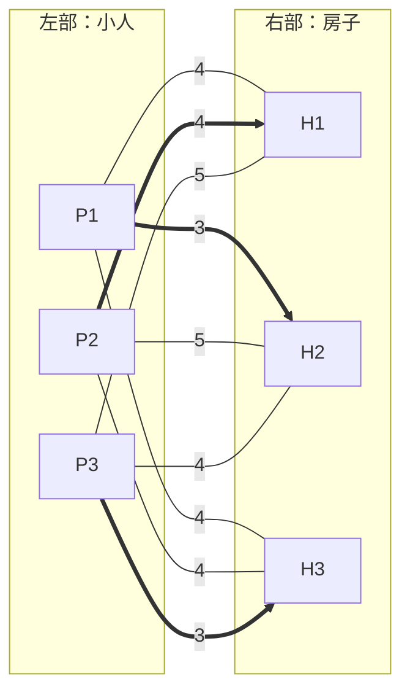

[[TOC]]

## 形式化题目

给一个 $N \times M$ 的网格，其中有 $n$ 个小人（`m`）和 $n$ 间房子（`H`），其余格子是空地（`.`）。小人每单位时间可以上、下、左、右移动一格，每走一步花费 1 美金，直到进入某间房子为止；每间房子只能容纳一个小人。求让所有小人都进屋的最少总花费。

网格中没有障碍物，小人也可以踩在房门格上再选择进入，所以一个小人从 $(r_1, c_1)$ 走到 $(r_2, c_2)$ 的最少步数就是曼哈顿距离 $|r_1 - r_2| + |c_1 - c_2|$。于是问题等价于：左侧 $n$ 个小人、右侧 $n$ 间房子的完全二分图，边权为两点间曼哈顿距离，求一个**最小权完美匹配**的总权值。

以样例 2 为例，3 个小人 $P_1(0,4), P_2(4,0), P_3(4,1)$ 与 3 间房子 $H_1(0,0), H_2(0,1), H_3(4,4)$ 的权值矩阵（单位：步）：

| 小人 \ 房子 | $H_1(0,0)$ | $H_2(0,1)$ | $H_3(4,4)$ |
| --- | --- | --- | --- |
| $P_1(0,4)$ | 4 | 3 | 4 |
| $P_2(4,0)$ | 4 | 5 | 4 |
| $P_3(4,1)$ | 5 | 4 | 3 |

表格每格是对应小人走到对应房子的最少步数。从表中挑 $n$ 个不同行、不同列的格子使和最小：取 $P_1 \to H_2$（3）、$P_2 \to H_1$（4）、$P_3 \to H_3$（3），总和 $3 + 4 + 3 = 10$，正是样例输出。

## 正解

### 思路

朴素做法是枚举小人与房子的全部对应方式：把 $n$ 间房子的一个全排列依次分给 $n$ 个小人，总花费为 $\sum_i \mathrm{cost}(i, \pi(i))$，在 $n!$ 个排列里取最小。$n$ 最大为 100 时 $100!$ 完全不可接受，瓶颈在于「逐个决定谁配谁」的指数级枚举。

观察每次配对的代价只由「哪个小人、哪间房子」决定，与其他人如何配对无关——这正是**二分图最小权完美匹配**的结构：左部 $n$ 个小人、右部 $n$ 间房子，边 $(i, j)$ 的权为曼哈顿距离，要找 $n$ 条两两不共享端点的边使权值和最小。求它用匈牙利算法（KM）：

为每个小人 $i$ 和房子 $j$ 维护顶标 $pot\_l[i], pot\_r[j]$，始终保持可行性

$$pot\_l[i] + pot\_r[j] \leqslant cost(i, j)$$

取等号的边构成「相等子图」。把所有顶标加起来：$\sum_i pot\_l[i] + \sum_j pot\_r[j}$ 是任何完美匹配总权值的下界，而只要相等子图里存在完美匹配，它的每条边都顶着等式取到下界，总权恰好触到这个下界，因而全局最优。

算法逐轮把小人挂入交错树：从当前小人 $i$ 出发，只沿相等边在交错树上扩展——树上的房子沿匹配边回退到小人，小人再用相等边连到树外房子。若碰到空房，就找到了一条增广路，翻转匹配、进入下一轮。若树外没有空房可达，则对树上点整体改顶标：左部点 $+ \delta$、右部点 $-\delta$，其中 $\delta$ 是「树上小人连到树外房子」的最小松弛量 $cost - pot\_l - pot\_r$。这样一加一减，树内相等边原样保留，树外房子的松弛量同步减 $\delta$，至少一条边松弛归零进入相等子图让交错树继续生长，而所有边的可行性都保持不破。$n$ 轮后得到完美匹配。

用上文样例 2 的权值矩阵示意匹配过程（边上的数字为权值，加粗为最终匹配）：

KM 每轮在交错树上做 $O(n)$ 的松弛扫描，共 $n$ 轮、每轮最多扩展 $n$ 个房子，总复杂度 $O(n^3)$。

### 代码

@include-code(./main.cpp, cpp)

@include-code(./main.py, python)

### 复杂度

时间复杂度 $O(n^3)$：外层枚举 $n$ 个小人，内层交错树每扩展一个房子扫描一遍 $n$ 个树外房子。$n \leqslant 100$ 时约 $10^6$ 次基本操作。空间复杂度 $O(n^2)$，用于存权值矩阵（$100 \times 100$，可忽略）。

## 总结

把「最少步数」算成曼哈顿距离后，题目就是标准的二分图最小权完美匹配：朴素的全排列枚举是 $O(n!)$，瓶颈在于指数级的配对枚举；KM 用顶标维持下界、用相等子图上的增广路逐轮确定匹配边，把复杂度降到 $O(n^3)$。读入时注意多组数据以 `0 0` 结束，权值矩阵由小人、房子坐标列表用推导式一次算出。
