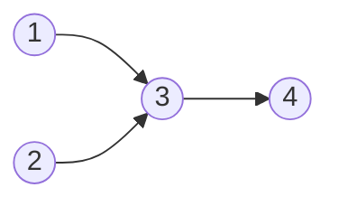

[[TOC]]

## 形式化题目

给定一张 $N$ 个点、$M$ 条边的**有向无环图** $G=(V,E)$。要求选出若干条**有向路径**，满足：

- 路径之间**两两没有公共点**（每个交叉口只被一个士兵走过一次）；
- 所有路径的点集**并起来覆盖全部 $N$ 个点**。

求所需路径条数的最小值，这个量称为 DAG 的**最小路径点覆盖**。

注意路径的连续性指的是**边上连续**：士兵只能沿一条真实存在的道路 $u\to v$ 从 $u$ 走到 $v$，
所以路径上相邻两点之间必须有一条**直接边**，而不是“存在一条路径”即可。

## 正解

### 思路

#### 第一步：朴素做法为什么不可行

把每个点指派为“某条路径的起点”或“接在某个前驱后面”。最直接的枚举是：每个点从 $N$ 个前驱
（或“不接”）里选一个，共约 $N^N$ 种方案；即使用状压 DP，状态也是“已被覆盖的点集”，
需要 $O(2^N \cdot N)$。$N=120$ 时两者都完全不可行。

瓶颈很清楚：链的起点集合和终点集合事先不知道，于是只能连链的划分一起枚举。

#### 第二步：只看“接边”，不看链

换个角度数数。设一共用了 $k$ 条路径，把每条路径内部相邻两点的连接叫做一条**接边**。
一条含 $L$ 个点的路径恰好有 $L-1$ 条接边，所以所有路径的接边总数为

$$\nu = \sum (L_i-1) = N - k .$$

这个恒等式说明：只要数出接边数，路径条数就被确定了：$k = N-\nu$。
要让 $k$ 最小，只需让接边数 $\nu$ 最大——这样就绕开了“枚举链”这件事。

同时，一组接边要真的能拼成不相交的路径，必须满足：

- 每个点**至多有一个后继**（不能同时接两个点在自己后面）；
- 每个点**至多有一个前驱**（不能被两个点同时接在后面）。

#### 第三步：把“接边”翻译成二分图匹配

把每个点 $u$ 拆成两个副本：

- 左副本 $u_L$：负责 $u$ 的**出边**；
- 右副本 $u_R$：负责 $u$ 的**入边**。

对原图的每条有向边 $u\to v$，在二分图里连一条边 $u_L \to v_R$。
那么一条接边“$u$ 的后继是 $v$”就对应选中二分边 $u_L\to v_R$：

- “每个点至多一个后继”= 每个**左副本**最多出现在一条被选中的边里；
- “每个点至多一个前驱”= 每个**右副本**最多出现在一条被选中的边里。

这正是**匹配**的定义。所以“能接出的最多边数”就是这张二分图的**最大匹配** $\nu$。

还剩最后一个担心：匹配边可能连成一个**环**。比如 $a\to b\to c\to a$ 会选中三条边，
每点度数都合法，却拼不出链。此时题面的**无环**条件就用上了：
沿着匹配箭头一直走，等价于在原图中沿有向边走一条路，原图无环，所以永远走不回起点。
因此任意匹配都自动分解成若干条**点不相交的有向路径**，不会出现环。

两个方向合起来：任意一组合法路径拆出接边就得到一个同大小的匹配，
而任意一个匹配又能拼回一组合法路径，所以**最大接边数恰好等于最大匹配 $\nu$**。
于是最终的公式是

$$\text{答案} = N - \nu, \qquad \nu = \text{拆点二分图的最大匹配数}.$$

#### 第四步：样例 1 对照

样例 1 是 $N=4$，边为 $3\to4,\ 1\to3,\ 2\to3$，图长这样：



图中 $3$ 同时被 $1$ 和 $2$ 指向。$1\to3$ 与 $2\to3$ 争夺同一个入点 $3$，
不可能同时成为接边，所以最多只能接出 $3\to4$ 和 $1\to3$ 两条边，$\nu=2$。
“入点冲突导致有人接不上”就是路径条数增加的直接原因。

拆点建图后，$u_L$ 连向所有出边终点的右副本，匈牙利算法的匹配结果如下表。
表中每一行是一条候选接边 $u\to v$：左列写出它对应的二分边，中间是它在原图中的含义，
右列说明匈牙利算法最终是否选中了它。

| 二分边（候选接边） | 含义 | 是否进入最大匹配 |
| --- | --- | --- |
| $1_L\to 3_R$ | $1$ 的后面接 $3$ | 是 |
| $3_L\to 4_R$ | $3$ 的后面接 $4$ | 是 |
| $2_L\to 3_R$ | $2$ 的后面接 $3$ | 否，$3$ 已被 $1$ 占用 |

被选中的两条边恰好各占用一个不同的左副本（$1_L,3_L$）和右副本（$3_R,4_R$），
说明它们构成合法匹配；而 $2_L\to 3_R$ 与 $1_L\to 3_R$ 共用右副本 $3_R$，
是唯一被挤掉的候选，因此 $2$ 只能自己起一条新路径。

把匹配边当作链内箭头，就还原出覆盖全部 4 个点的路径。
下表每行是一条路径：中间列出路径上的点，右列是该路径贡献的接边，
“点数 $-1$”应当等于接边数。

| 路径 | 点数 | 链内接边 |
| --- | --- | --- |
| $1\to 3\to 4$ | 3 | $1\to3,\ 3\to4$ |
| $2$（单独起一条路径，它指向的 $3$ 已被占用） | 1 | 无 |

接边总数 $2+0 = 2 = \nu$，所以答案 $=4-2=2$，与样例输出一致。
注意 $2$ 并非孤立点（它有出边 $2\to3$），它单独成路只是因为入点 $3$ 被 $1$ 占用后它的出边当不上接边；
这正说明“入点冲突”就是链数增加的原因。

#### 算法流程

1. 读入 $N,M$ 与 $M$ 条有向边；对每条边 $u\to v$，在 `adj[u]` 里加入 $v$。
2. 用匈牙利算法对 $u=1\dots N$ 依次寻找增广路，得到最大匹配 $\nu$。
3. 输出 $N-\nu$。

实现上按编号顺序为每个左副本增广一次即可：处理完前 $i$ 个左副本后，
当前匹配已经是它们诱导子图上的最大匹配，不需要反复扫描。

### 代码

@include-code(./main.py, python)

### 复杂度

设点数为 $N$、边数为 $M$。

- **最大匹配**：匈牙利算法，每个左副本增广一次，每次 DFS 最多扫过全部 $M$ 条边，
  时间 $O(NM)$。本题 $N\le 120$，官方数据 $M\le 200$，实测最慢 0.019s。
- **空间**：邻接表 $O(N+M)$，匹配数组与访问标记各 $O(N)$，实测峰值约 14.7MB，
  远低于 128MB 限制。

与标准 C++ 正解（拆点 + 匈牙利）同阶，没有降级为暴力。

## 总结

- 每个交叉口恰好走一次、士兵沿街道连续前进，等价于**用点不相交的有向路径覆盖全部点**，
  即 **DAG 最小路径点覆盖**；
- 关键恒等式：$k$ 条路径的接边总数恒为 $N-k$。于是**最小化路径条数 ⇔ 最大化接边数**，
  问题从“枚举链的划分”变成“选尽量多的接边”；
- 把点 $u$ 拆成 $u_L,u_R$，边 $u\to v$ 变成二分边 $u_L\to v_R$，
  “每点至多一个前驱、至多一个后继”就是匹配的度数约束，所以最大接边数 = **最大匹配** $\nu$；
- 原图**无环**保证匹配不会连成环，链分解一定成立；
- 答案 $=N-\nu$，用匈牙利算法在 $O(NM)$ 内求出；
- 与 `roj/3206` 的区别：那题把“存在一条路径”也算连通，必须先做传递闭包；
  本题士兵必须走**直接边**，直接用原图建二分图即可。

## 图示解析

整道题只有一条主线，三次等价改写：

```text
题面：最少几个士兵，走遍所有点且每点只走一次
        │  士兵沿有向边连续前进，路径两两不相交
        ▼
DAG 最小路径点覆盖：用最少的点不相交有向路径覆盖全部点
        │  k 条路径的接边总数恒为 N-k
        │  ⇒ 最小化 k  等价于  最大化接边数 ν
        ▼
拆点二分图：边 u→v 变成 u_L→v_R
        │  "每点至多一个前驱/后继" = 匹配的度数约束
        ▼
最大匹配 ν（匈牙利算法）⇒ 答案 = N - ν
```

读图要点：每一步都是**等价改写**而不是近似，所以最终输出的 $N-\nu$ 就是最少士兵数。
第二到第三步之间的恒等式 $N-k=\nu$ 是整道题的枢纽——它把“求最少路径条数”这个整体问题，
拆成了可以逐边独立判断的匹配问题；而无环性则保证了匹配一定能被还原成合法的路径。