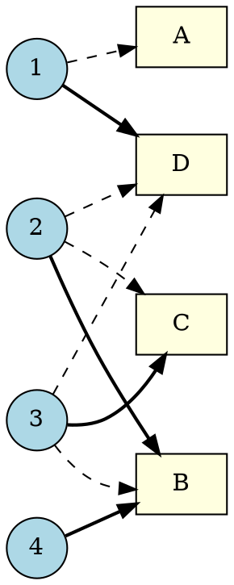

[[TOC]]

## 形式化题目

平面上有 $n$ 个矩形（幻灯片）$R_1, \dots, R_n$ 和 $n$ 个点（编号数字）$p_1, \dots, p_n$。一个分配是编号到幻灯片的双射 $f$，满足 $p_i \in R_{f(i)}$（点在矩形闭区域内）。对每张幻灯片 $s$，若所有分配中分给它的编号都相同（记为 $i$），则输出配对 $(s, i)$；若没有任何幻灯片能被这样唯一确定，输出 `none`。

## 正解

### 思路

**第一步：把"唯一确定"翻译成图论语言。** 把编号 $1..n$ 和幻灯片 $A, B, C, \dots$ 看作二分图的两侧，若点 $p_i$ 落在矩形 $R_s$ 内，就在编号 $i$ 与幻灯片 $s$ 之间连一条边。一个合法分配恰好是这张图的一个**完美匹配**；幻灯片 $s$ 的编号被唯一确定，意思是"配对 $(i, s)$ 出现在每一个完美匹配中"——这样的边叫**必须边**。

必须边有一个好刻画的等价定义：

$$
(i, s) \text{ 是必须边} \iff \text{删掉边 } (i, s) \text{ 后图中不存在完美匹配}
$$

理由很直接：若删掉后仍存在完美匹配，那它就是一条不含 $(i,s)$ 的完美匹配，与"每个都含"矛盾；反过来，若每个完美匹配都含 $(i,s)$，删掉它自然一个都不剩。

**第二步：朴素枚举为什么不行，必须边检测为什么快。** 暴力做法是枚举全部 $n!$ 个双射再统计，$n = 26$ 时 $26! \approx 4 \times 10^{26}$，完全不可行。但注意必须边有个关键性质：**只有当前匹配里的边才可能是必须边**。任取一个完美匹配 $M$，对 $M$ 之外的一条边 $(i, s)$（$i$ 在 $M$ 里配给了别的幻灯片 $s'$），把 $i$ 改配到 $s$、把原配给 $s$ 的编号还给 $s'$ 就得到一个不含 $(i,s)$ 的完美匹配——所以非匹配边永远"可被避开"。于是只需要检验 $n$ 条匹配边。

**第三步：删掉一条匹配边后怎么判断还能不能完美匹配。** 删掉匹配边 $(i, s)$ 后，原匹配里 $i$ 和 $s$ 都空了出来。整个图是否还有完美匹配，等价于：能否从编号 $i$ 出发，沿"非匹配边 → 匹配边 → 非匹配边 → …"交替前进（首条非匹配边不许直接走被删的 $(i,s)$），最后用一条非匹配边进入幻灯片 $s$，把路上所有匹配边换向。这条路径就是匈牙利算法里的**交错路**：

- 找得到：按交错路换边，得到避开 $(i,s)$ 的新完美匹配，$(i, s)$ **不是**必须边；
- 找不到：每个完美匹配都必须含 $(i, s)$，它是必须边，登记配对。

下面是样例 1（$n=4$）的二分图，实线是求出的匹配（同时都是必须边），虚线是会干扰判断的非匹配边：

以编号 1（实线配在 D）为例：删掉 $(1, D)$ 后，从 1 出发只有虚线边 $(1, A)$ 可走；$A$ 目前没有编号占用，无法沿匹配边换向，更走不回 $D$——交错路不存在，$(1, D)$ 是必须边，所以输出 `(A,4)`。再看一条虚线边为什么不用检验：比如 $(2, C)$，把 2 改配到 $C$、3 改配到 $B$ 就避开它了。

**第四步：输出。** 必须边两两不冲突：$(i,s)$ 与 $(j,s)$ 都是必须边会推出 $i = j$（否则存在同时含两条的匹配，矛盾），$(i,s)$ 与 $(i,t)$ 同理。所以按编号逐个判定后，得到的配对天然合法，按幻灯片字母序输出即可；一条必须边都没有时输出 `none`。注意题意是**输出所有能唯一确定的幻灯片**，部分幻灯片确定不了不影响其余的输出（这也是本题最容易误解的地方）。

### 代码

@include-code(./main.cpp, cpp)

@include-code(./main.py, python)

### 复杂度

设 $n$ 为幻灯片数，$|E| \leqslant n^2$ 为二分图边数。

- 建图与匈牙利求完美匹配：$O(n \cdot |E|) = O(n^3)$；
- 必须边判定：对 $n$ 条匹配边各做一次 $O(|E|)$ 的交错路 BFS，合计 $O(n^3)$。

总复杂度 $O(n^3)$，$n \leqslant 26$ 时远低于时限（全部 11 组测试数据 Python 实测约 0.02s），与 C++ 正解同阶。

## 总结

- 合法分配 = 二分图完美匹配，"幻灯片编号唯一确定" = 配对边是**必须边**（出现在每个完美匹配中）。
- 必须边检测只需两步：先匈牙利求出一个完美匹配，再对每条匹配边删边跑一次交错路 BFS——能绕回则非必须，绕不回则必须。
- 两个易错点：① 非匹配边不可能是必须边，不必枚举全部 $n^2$ 条边；② 输出的是"所有能唯一确定的幻灯片"，部分确定时输出确定的部分，一个都确定不了才输出 `none`。
