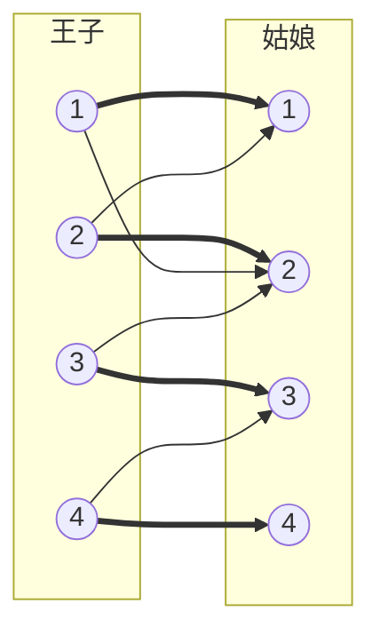
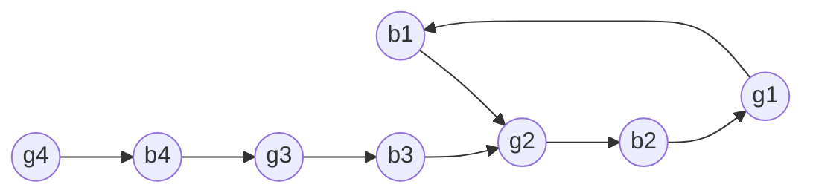

[[TOC]]

## 形式化题目

有 $N$ 个王子与 $N$ 个姑娘，王子 $i$ 喜欢的姑娘集合记为 $L_i$（$|L_i| = K_i$）。
给定一个**已保证合法**的配对方案 $S$：$S(i)$ 表示第 $i$ 个王子当前配对的姑娘，$S$ 是双射。

对每个王子 $i$，求所有满足下面条件的姑娘 $j$：

1. $j \in L_i$；
2. 存在一个**包含** $(i,j)$ 的完美匹配——也就是把 $i$ 配给 $j$ 之后，
   剩下的 $N-1$ 个王子仍能各自配上自己喜欢的、互不重复的姑娘。

把它画成二分图 $G=(U,V,E)$（$U$ 为王子，$V$ 为姑娘，$E$ 为喜欢关系），
$S$ 就是 $G$ 的一个完美匹配。要回答的是：

> 每条边 $(u,v) \in E$ 是否属于**某个**完美匹配？

这类边称为完美匹配的**可行边**。注意问的是"存在性"，不是"在 $S$ 中"，所以答案通常远多于 $S$。

以样例（$N=4$，初配为 $1\to1,2\to2,3\to3,4\to4$）为例，喜欢关系与初配如下图。



粗箭头是初配 $S$ 的 4 条匹配边，细箭头是其余的喜欢关系。
读者可以观察到：$1$ 与 $2$ 各自喜欢对方的对象，于是 $(1,1),(2,2),(1,2),(2,1)$ 构成一个 4 点交替环；
而 $3$ 想要的姑娘 $2$、$4$ 想要的姑娘 $3$ 都已被占用，且没有形成回环，所以它们只能维持原配。

## 正解

### 思路

#### 第一步：朴素做法为什么不行

最直接的做法是逐条边判定：把 $(u,v)$ 定下来，删掉 $u$、$v$ 以及它们关联的边，
在剩下的 $N-1$ 对点之间跑一次二分图最大匹配，若匹配数达到 $N-1$ 就说明 $(u,v)$ 可行。

这个做法完全正确，但代价太大。设 $M=\sum_i K_i$ 为喜欢关系的总条数，
一次匈牙利是 $O(NM)$，总复杂度 $O(M \cdot NM)$——$M$ 最大 $2\times 10^5$、$N=2000$ 时不可能。

真正浪费的地方在于：我们把同一张图重跑了 $M$ 遍，每次都不使用上一次的结果。
而题面额外送了我们一个**已知的完美匹配 $S$**，新的完美匹配相对 $S$ 只会做"局部改动"，
这个局部结构可以被一次性刻画清楚，完全不必逐边枚举。

#### 第二步：新的完美匹配 = 把若干交替环翻面

设 $S'$ 是另一个完美匹配，考虑对称差 $S \oplus S'$。有两条关键事实：

- **每个点度数至多 2**：完美匹配中每个点度数恰为 1，$S$ 用一次、$S'$ 用一次。
  于是 $S \oplus S'$ 的连通分量只能是环或路径；
  而路径的端点只能被 $S,S'$ 中的一个覆盖，可两者都覆盖了全部点，矛盾。
  所以**每个分量都是环**，并且环上 $S$ 的边与 $S'$ 的边**严格交替**。
- **交替环可以整体翻面**：在交替环 $C$ 上把 $S$ 的边换成非 $S$ 的边，得到的
  $S \oplus C$ 仍然是完美匹配——环上每个点依然恰好关联一条匹配边，环外的点不受影响。

两件事合起来，就得到了可行边的刻画：

$$
(u,v) \text{ 可行} \iff (u,v) \in S \quad\text{或}\quad (u,v) \text{ 落在某个关于 } S \text{ 的交替环上}.
$$

- "$\Leftarrow$"：翻面后得到的完美匹配含 $(u,v)$。
- "$\Rightarrow$"：若存在含 $(u,v)$ 的完美匹配 $S'$，则 $S \oplus S'$ 分解为交替环，
  而 $(u,v) \in S' \setminus S$，它所在的分量就是包含它的那个交替环。

于是问题从"$M$ 次匹配"变成了"找环"。

#### 第三步：把交替环变成有向图的强连通

交替环在无向图里不好直接找，但它天生带方向：沿着环走，一定是
"非匹配边（王子→姑娘）"和"匹配边（姑娘→王子）"交替出现。那就照这个方向给边定向，
建一张有 $2N$ 个点的有向图 $D$（王子点 $0$ 到 $N-1$，姑娘点 $N$ 到 $2N-1$）：

- 对每条**非匹配边** $(u,v) \in E \setminus S$：连有向边 $u \to v$（王子 → 姑娘）；
- 对每条**匹配边** $(u,v) \in S$：连有向边 $v \to u$（姑娘 → 王子）。

这样一来：

- $D$ 中任意一条有向路天然就是一条交替路（方向强制了交替）；
- 交替环 $\iff$ $D$ 中的有向环 $\iff$ 环上任意两点**强连通**。

所以对一条非匹配边 $(u,v) \in E \setminus S$，只要看从 $v$ 能不能走回 $u$：

$$
(u,v) \text{ 可行} \iff \mathrm{scc}(u) = \mathrm{scc}(v).
$$

这一步的两边都站得住：

- **可行 $\Rightarrow$ 同 SCC**：若存在含 $(u,v)$ 的完美匹配 $S'$，则 $(u,v)$ 所在的交替环
  按上面的定向恰好是一条有向环，所以 $u,v$ 互相可达。
- **同 SCC $\Rightarrow$ 可行**：$u \to v$ 本身就是一条边，再加上 $v \rightsquigarrow u$ 的有向路，
  得到一条以 $u\to v$ 开头的有向闭走；取其中最短的一条，它不会重复顶点
  （否则重复点之间的那段可以删掉，得到更短的），因而是一个包含 $u \to v$ 的简单有向环，
  也就是包含 $(u,v)$ 的交替环，翻面后即得含 $(u,v)$ 的完美匹配。

匹配边 $(u,v) \in S$ 本身就是 $S$ 的一部分，永远可行，**不需要**任何条件——
这一点很关键，因为匹配边两端的 SCC 完全可能不同
（下面的样例中，王子 $3$ 与姑娘 $3$ 就分属两个不同的 SCC）。

把样例的交替有向图画出来（初配为 $1\to1,2\to2,3\to3,4\to4$）：



互相可达的是 $\{b_1,g_1,b_2,g_2\}$ 这 4 个点，它们构成一个 SCC，对应那个 4 点交替环；
而 $b_3 \to g_2$ 虽然连进了这个大 SCC，$g_3 \to b_3$ 却是**单向**的（$b_3$ 回不到 $g_3$），
$b_4 \to g_3$ 同理。于是只有 $b_1,b_2$ 的非匹配边额外可行。

据此逐边判定，样例的每条边结果如下表。表中写出每条边两端各自所在的 SCC，
两端相同（或该边是匹配边）才可行。

| 边 | 类型 | 王子点所在 SCC | 姑娘点所在 SCC | 可行 |
| --- | --- | --- | --- | --- |
| $1\to1$ | 匹配边 | $\{b_1,g_1,b_2,g_2\}$ | $\{b_1,g_1,b_2,g_2\}$ | 是（本来就在 $S$ 中） |
| $1\to2$ | 非匹配边 | $\{b_1,g_1,b_2,g_2\}$ | 同左 | 是（交替环 $1\text{-}1\text{-}2\text{-}2$） |
| $2\to1$ | 非匹配边 | $\{b_1,g_1,b_2,g_2\}$ | 同左 | 是（同一个交替环） |
| $2\to2$ | 匹配边 | $\{b_1,g_1,b_2,g_2\}$ | 同左 | 是 |
| $3\to2$ | 非匹配边 | $\{b_3\}$ | $\{b_1,g_1,b_2,g_2\}$ | **否**：$g_2$ 在大 SCC 里，但 $b_3$ 不在，两端不同 SCC |
| $3\to3$ | 匹配边 | $\{b_3\}$ | $\{g_3\}$ | 是（匹配边无条件可行） |
| $4\to3$ | 非匹配边 | $\{b_4\}$ | $\{g_3\}$ | 否：两端不同 SCC |
| $4\to4$ | 匹配边 | $\{b_4\}$ | $\{g_4\}$ | 是 |

表里的第 5 行最值得注意：它是本题最容易写错的地方。
$b_3 \to g_2$ 确实指向了那个大 SCC 内部的点，但判据要求的是**两个端点同属一个 SCC**；
$b_3$ 自己不在大 SCC 里，$g_2$ 也回不到它，所以这条边不可行——
王子 $3$ 只能娶初配的姑娘 $3$，这正是样例输出的 `1 3`。
反过来第 6、8 行说明匹配边绝不能去查 SCC：$b_3$ 与 $g_3$、$b_4$ 与 $g_4$ 都不同属一个 SCC，
但它们是初配边，必须留在答案里。

把每行可行的边按王子整理，就得到样例输出：王子 $1$ 可以是 $\{1,2\}$、王子 $2$ 可以是 $\{1,2\}$、
王子 $3$ 是 $\{3\}$、王子 $4$ 是 $\{4\}$，即

```text
2 1 2
2 1 2
1 3
1 4
```

其中王子 $3$ 只列出 1 个姑娘，正是因为 $(3,2)$ 那条看上去"很好"的边不可行。

#### 算法流程

1. 读入喜欢清单，把姑娘编号统一减一；
2. 由初配 $S$ 建反向映射 `taken_by[姑娘] = 王子`；
3. 按上面的规则建有向图 $D$；
4. 跑一次 Tarjan 求 SCC，得到 `comp[]`；
5. 对每个王子，答案是"初配对象"加上"所有满足 `comp[王子] == comp[姑娘]` 的喜欢对象"，排序输出。

### 代码

@include-code(./main.py, python)

### 复杂度

设 $N$ 为王子数，$M=\sum_i K_i$ 为喜欢关系的总条数。

- **建图**：每个王子贡献 $K_i-1$ 条非匹配边，每个姑娘贡献 1 条匹配边，共 $O(M)$；
- **求 SCC**：$D$ 有 $2N$ 个点、$O(M)$ 条边，Tarjan 线性，$O(N+M)$；
- **枚举输出**：每份清单扫一遍再排序，最坏 $O(M\log M)$；
- 合计 $O(N + M\log M)$。

与朴素做法 $O(M\cdot NM)$ 相比，正解把"每条边重跑一次匹配"换成了"整张图只求一次 SCC"，
这与本题标准 C++ 正解（初配 + 交替有向图 + SCC）同阶，没有降级为暴力。

空间上，邻接表与 Tarjan 的若干数组都是 $O(N+M)$；实测峰值 31.6MB，
最大耗时 0.06s（$N=2000$、$M\approx 10^5$ 的数据），远低于 1000ms / 128MB 的限制。

实现上有一处与复杂度无关但影响正确性的细节：$D$ 有 $2N=4000$ 个点，
最坏情况会出现很长的链，所以 `scc_ids` 用显式栈迭代实现，不依赖递归深度，
也不需要调整 `sys.setrecursionlimit`。

## 总结

- 王子"能娶谁"= 二分图完美匹配的**可行边**：存在含这条边的完美匹配；
- 题面白送的初配 $S$ 是解题的核心工具：任何另一个完美匹配 $S'$ 与 $S$ 的对称差
  分解为**交替环**，在交替环上翻面就得到新的完美匹配；
- 于是 $(u,v)$ 可行 $\iff$ $(u,v) \in S$，或 $(u,v)$ 落在某个交替环上；
- 把非匹配边定向为王子→姑娘、匹配边定向为姑娘→王子，得到交替有向图 $D$，
  交替环就变成有向环，"落在同一个交替环上"就变成"**强连通**"；
- 一次 Tarjan 求出全部 SCC，每条非匹配边 $O(1)$ 判定，总复杂度 $O(N + M\log M)$；
- 两个易错点：**匹配边无条件可行**（不必两端同 SCC），
  而非匹配边必须**两端**都在同一 SCC（只要求目标点在大 SCC 里是错的）。

## 图示解析

整道题的推理主线只有三次改写：

```text
题面：每个王子能娶谁？
`- 任选一名喜欢的姑娘后，其余人仍能配齐  =  含该边的完美匹配存在
   `- 二分图完美匹配的可行边问题
      |- 已知初配方案 S，任何其他完美匹配 S'
      |   与 S 的对称差 = 若干交替环，环上翻面即得新匹配
      |- 结论：(u,v) 可行  ⇔  (u,v) ∈ S  或  (u,v) 在某个交替环上
      |  `- 环难找？给边定向：
      |       非匹配边 王子→姑娘，匹配边 姑娘→王子
      |       `- 交替环 = 有向环；同环 = 强连通
      `- 一次 Tarjan 求 SCC
         `- 非匹配边看两端是否同 SCC；匹配边直接可行
```

先看第一层改写：它把"逐个尝试配对"变成了"判断一条边的可行性"，
这是后面能统一处理的前提。第二层是整题的枢纽——**对称差分解为交替环**，
它说明新方案只是在旧方案上"翻若干个环"，于是完全不必重新匹配。
第三层把环的寻找翻译成强连通判定，让所有边共享同一次 SCC 计算；
最后一步用规则 `(u,v) ∈ S 或 scc(u)=scc(v)` 直接给出每行答案。
