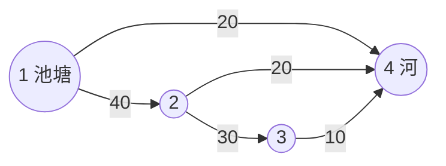

[[TOC]]

## 形式化题目

给定一张有向图 $G=(V,E)$，$|V| = M$、$|E| = N$，每条弧 $(S_i,E_i)$ 带非负容量 $C_i$
（$C_i$ 允许为 $0$）。指定源点 $s = 1$、汇点 $t = M$。

求一个满足下面两个约束的流 $f : E \to \mathbb{Z}_{\geqslant 0}$ 的最大值：

$$
0 \leqslant f(u,v) \leqslant c(u,v), \qquad
\sum_{u} f(u,v) = \sum_{w} f(v,w) \quad (v \neq s,\ t).
$$

也就是求从 $1$ 号点到 $M$ 号点的**最大流**。图中可能存在重边、自环与环，
更不保证 $S_i < E_i$，所以它不是 DAG，不能靠拓扑序上的 DP 解决。

以样例为例，5 条沟渠构成的流网络如下（箭头上的数字是容量）。

读者可以观察到三件事：$1$ 的两条出边容量之和是 $60$，但**进入** $4$ 的三条边容量之和只有
$20+20+10 = 50$，答案正是 $50$ —— 说明答案受"每一条弧各自的上限"同时约束，是多条路共享容量的结果，
不是某一条最宽路的瓶颈。另外 $1\to2\to4$ 与 $1\to2\to3\to4$ 都要穿过 $1\to2$ 这条容量 $40$ 的沟渠，
它们必须分这 $40$ 的额度。

## 正解

### 思路

#### 第一步：为什么"找一条最宽的路"不对

最朴素的想法是：找一条从 $1$ 到 $M$ 的路，让它的瓶颈尽量大，把这条路的流量当作答案。
但样例直接否定了它：只用 $1 \to 4$ 只能得到 $20$；
$1\to2\to4$、$1\to2\to3\to4$ 与它并不互斥，三条路可以**同时**送水，
各自的瓶颈 $20,20,10$ 加起来才是 $50$。

所以答案不是一条路，而是一组互相共享容量、又都不超限的"流量分配"。这正是**流**的定义：
每条弧上有流量 $f(u,v)$，除源汇外每个点流入等于流出，且 $0 \leqslant f(u,v) \leqslant c(u,v)$。

#### 第二步：贪心推路径为什么必须能"撤销"

第二个想法是：反复找一条"还有剩余容量的路"，沿路把瓶颈流量推满并累加，直到找不到为止。

这个方向是对的，但**只推正向**会卡住。看一个最小反例：容量为
$s\to a=1$、$s\to b=1$、$a\to b=1$、$a\to t=1$、$b\to t=1$。
如果第一步推了 $s \to a \to b \to t$（瓶颈 $1$），则 $a \to t$、$s \to b$ 都空着，
可流只有 $1$；而最优是 $s\to a\to t$ 与 $s\to b\to t$ 两条，共 $2$。
要救回来，必须能把 $a \to b$ 上已经推的那单位水退回去。

做法是维护**残量网络** $G_f$：每条弧 $u \to v$ 除了正向剩余容量 $c(u,v) - f(u,v)$，
再追加一条反向弧 $v \to u$，容量等于已推送的 $f(u,v)$。
反向弧上推流量不代表水真的倒流，它的含义是**减少**原来那条正向弧的流量。
把"撤销"变成"走一条反向弧"之后，算法就统一成了"在 $G_f$ 里找路"。

#### 第三步：用增广路定理给出终止条件

设 $f$ 是当前可行流，若 $G_f$ 里还有 $s \to t$ 的路（称为**增广路**），
沿着它每条弧都增加 $\delta = \min c_f$，就得到一个流量多 $\delta$ 的可行流
（每条约中间点进、出各变 $\delta$，净流入不变；每条原弧要么加不超容量、要么减不为负）。

反过来，若 $G_f$ 里没有增广路，取 $S$ = 从 $s$ 在 $G_f$ 中可达的点集：
任何从 $S$ 指向 $\bar S$ 的原图弧若还没满流，它的剩余容量就会让 $\bar S$ 里的端点也可达，矛盾，
所以这些弧全部满流；同理 $\bar S \to S$ 的原图弧流量必须为 $0$，否则反向剩余容量同样会让 $\bar S$ 可达到达。
两者合起来说明跨割的净流量 $|f| = \sum_{u\in S, v \notin S} c(u,v)$ 恰等于这个割的容量；
而任何流的值都不超过任何割的容量，所以 $f$ 已经是最大流。

> **增广路定理**：$f$ 是最大流 $\iff$ $G_f$ 中不存在 $s \to t$ 的路。

这条定理就是"不断增广、直到无路可走"这一族算法（Ford–Fulkerson 思路）的正确性依据。

#### 第四步：Dinic —— 把"每轮一条路"变成"每轮一层阻塞流"

朴素的每次只增广一条路，轮数可能和答案大小成正比（这里 $C_i$ 可达 $10^7$，完全不可行）。
Dinic 把找路这件事批量化：

1. **BFS 分层**：在 $G_f$ 上只沿 `cap > 0` 的弧走，记 `level[v]` 为 $s$ 到 $v$ 的最少弧数；
   若 `level[t] < 0`，由增广路定理当前流即最大流，返回。
2. **DFS 推阻塞流**：只保留满足 `level[v] == level[u] + 1` 的弧，
   在这张分层图上反复找 $s \to t$ 路并推满，直到图中再也没有这样的路
   （此时推到的流量叫**阻塞流**）。
3. 回到第 1 步。

分层带来两个好处：

- **路径不会绕圈**：每条弧层号严格 `+1`，路长被限制在 $M-1$ 以内；
- **轮数有界**：一轮结束意味着分层图上所有短的路都被堵死，
  新的最短增广路必须变长，因此 `level[t]` 每轮严格增大，外层最多 $O(M)$ 轮，与 $C_i$ 的大小无关。

#### 第五步：当前弧与回溯优化

- DFS 中如果某条出弧被判定走不通（容量为 $0$ 或层号不接），它在**本轮**永远不会再走通，
  用一个指针 `it[u]` 记住扫到哪，下次从它继续，不再从头扫出边。
- 递归写法在 Python 中既有栈深风险又慢，代码里用**显式栈** `path`（元素是 `(点, 出边号)`）模拟：
  - 走到汇点后沿 `path` 扣正弧、加反弧，然后**退回到第一条被榨干的弧**继续，
    而不是退回源点重来；
  - 走到死路时把该点的 `level` 置 `-1`（本轮永久废弃）并弹栈回溯。

下面这张表是用代码里的算法在**样例**上逐轮打印的真实过程，用来把上面的抽象步骤落到具体数字。

| 轮次 | BFS 得到的 `level` | 本轮增广的路径 | 瓶颈 $\delta$ | 累计流量 |
| --- | --- | --- | --- | --- |
| 1 | `1:0, 2:1, 3:2, 4:1` | $1 \to 4$ | 20 | 20 |
| 2 | `1:0, 2:1, 3:2, 4:2` | $1 \to 2 \to 4$ | 20 | 40 |
| 3 | `1:0, 2:1, 3:2, 4:3` | $1 \to 2 \to 3 \to 4$ | 10 | 50 |

表格每行是一轮：第一列是轮次，第二列是该轮 BFS 得到的分层结果（只列可达点，`level` 就是它离源点的弧数），
第三列是该轮被推的增广路，第四、五列分别是这条路的瓶颈与累加后的总流量。观察重点：

- 第 1 轮选中的是**最短**的 $1\to4$（层差 $1$），而不是路长更大的 $1\to2\to3\to4$；
  Dinic 每轮只在意"最短"这一件事。
- 第 2 轮汇点的层号从 $1$ 变成 $2$，直观展示了"最短增广路长度单调递增"，
  这正是外层最多 $O(M)$ 轮的来源。
- 第 3 轮之后 $1$ 的两条出弧全部满流、汇点不可达，算法返回 $50$；
  此时进入 $4$ 的三条弧容量和 $20+20+10=50$ 被恰好用满，答案不可能更大。

### 代码

@include-code(./main.cpp, cpp)

@include-code(./main.py, python)

### 复杂度

记 $V = M$、$E = N$：

- BFS 分层一次是 $O(V+E)$，外层最多 $O(V)$ 轮（最短增广路长度每轮严格增大，上限 $V-1$）；
- 每轮找阻塞流：当前弧 `it[u]` 保证每条弧最多被推进或作废一次，
  而每次成功增广都榨干至少一条弧（所以一轮里增广次数不超过 $E$），每次增广回溯不超过 $V$ 条弧，
  于是单轮是 $O(VE)$。

因此总复杂度为 $O(V^2 E)$，即一般图 Dinic 的经典上界。
本题 $V, E \leqslant 200$，$V^2E$ 约 $8\times10^6$ 量级的弧操作上界；
实测 10 组真实数据（含 $M=200$、$N=200$ 的点）每组不超过 $0.02$ 秒、峰值内存约 $15$ MB
（题面限制 1000 ms / 128 MB），因此没有 TLE / MLE 风险。

空间上只用链式前向星的 $2E$ 条弧与长度 $O(V)$ 的 `level`、`it` 数组，即 $O(V+E)$。

## 总结

- 沟渠的方向就是弧的方向、速率就是容量，问题直接等价于**单源单汇最大流**，
  不需要任何额外建模（不同于二分图匹配题要加源汇点）。
- 关键转弯有两处：一是意识到答案不是一条路，必须允许流量在多条路之间共享；
  二是允许"撤销"，用反向弧把撤销变成又一次普通的增广。
- **增广路定理**给出了简洁的终止条件；**Dinic** 用 BFS 分层把每轮从"一条路"升级为"一张分层图上的阻塞流"，
  使轮数只与点数有关而与容量无关；**当前弧 + 显式栈回溯**是让它跑得动 Python 的常数优化。
- 边界情况（$N=0$、容量全 $0$、源无出弧、重边、自环、环）都被同一套流程自然覆盖，代码里没有任何特判。
