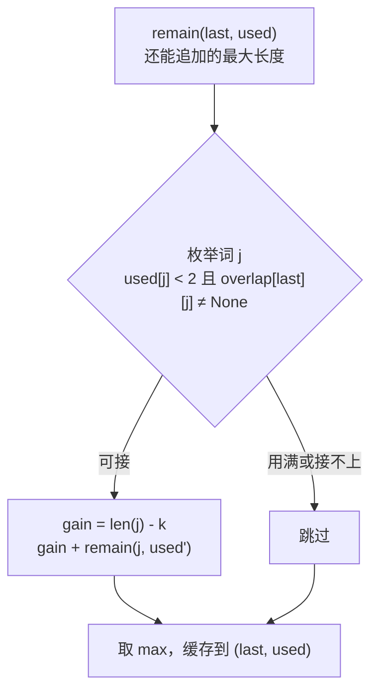

[[TOC]]

## 形式化题目

给定 $n$ 个单词（$n \leqslant 20$）和一个首字母，要求把若干单词拼成一条"龙"：

- **首词**必须以给定字母开头；
- **相邻两词必须重叠合并**：后一个词的前缀与前一个词的后缀相同的部分只计一次，例如 `beast` 与 `astonish` 接成 `beastonish`；
- **禁止包含关系**：重叠不能覆盖任一整个单词，例如 `at` 与 `atide` 的唯一重叠恰好是整个 `at`，两词不能相连；
- 每个单词**最多出现两次**；保证合法的龙一定存在。

求拼出的龙的最大长度。样例输入 5 个单词 `at / touch / cheat / choose / tact` 与首字母 `a`，输出 23，龙为 `atoucheatactactouchoose`。

## 正解

### 思路

**朴素做法**：枚举所有单词序列（每词至多两次、首词对首字母），逐对检查重叠并求长度取最大。序列总数是指数级的，而且大量序列共享同一段"尾巴"——从某个状态出发能接出的最优后缀被反复重算。

**瓶颈**在于重复子问题：后续能接多长只取决于**最后一个词**和**各词已用次数**，与前面怎么走到这里无关。于是把搜索状态定义为 `(最后词, used 元组)`，用记忆化消掉重复。

**连接规则的关键观察**：一对单词 $(a, b)$ 能否相连只取决于"是否存在合法重叠"，与选哪个重叠长度无关；而总长度 $=$ 各词长度和 $-$ 各连接的重叠长度，所以每对都取**最小合法重叠**（$1 \leqslant k < \min(|a|, |b|)$ 且 $a$ 的后 $k$ 位 $= b$ 的前 $k$ 位）新增字符最多。$k < \min$ 恰好排除整词包含：`at` 接 `atide` 时唯一能对上的 $k = 2 = |{\rm at}|$，不满足上界，故不可接；两词完全相同时唯一重叠是整词，同样不可接。找不到任何 $k \geqslant 1$ 的匹配则两词不能相连（不允许零重叠直接拼接）。

样例龙的逐次拼接如下，展示每次取的最小重叠与新增字符：

| 步骤 | 当前龙尾 | 接入词 | 重叠 $k$ | 新增 | 龙长度 |
| :--: | :-- | :-- | :--: | :-- | :--: |
| 1 | — | `at` | — | `at` | 2 |
| 2 | `at` | `touch` | 1 (`t`) | `ouch` | 6 |
| 3 | `touch` | `cheat` | 2 (`ch`) | `eat` | 9 |
| 4 | `cheat` | `tact` | 1 (`t`) | `act` | 12 |
| 5 | `tact` | `tact` | 1 (`t`) | `act` | 15 |
| 6 | `tact` | `touch` | 1 (`t`) | `ouch` | 19 |
| 7 | `touch` | `choose` | 2 (`ch`) | `oose` | 23 |

注意步骤 5：`tact` 接 `tact` 的最大重叠是整个 `tact`（包含关系，禁止），次大重叠 3、2 都对不上，最小可行重叠只剩 $k = 1$；步骤 6、7 中 `touch` 恰好用了两次，`tact` 也用了两次，均未超过上限。

搜索的状态依赖如下：每个状态向所有"用不满两次且接得上"的后继扩展，返回值取最大，相同状态只算一次：

递归基是没有任何后继可接时返回 0；龙头单独处理——枚举每个以首字母开头的词做首词，整词长度计入，再调用 `remain`。正确性来自两点：逐对取最小重叠是局部最优（可行性与 $k$ 无关、$k$ 越小总长越大）；记忆化键 `(last, used)` 完整刻画了未来，路径无关。

### 代码

@include-code(./main.py, python)

### 复杂度

- 时间：预处理重叠表 $O(n^2 L^2)$（$L$ 为词长）；记忆化状态至多 $n \cdot 3^n$ 个（最后词 × 每词用 0/1/2 次），每状态枚举 $n$ 个后继，合计 $O(n^2 \cdot 3^n)$，实际数据远小于上界。
- 空间：$O(n^2 L)$ 重叠表 + $O(n \cdot 3^n)$ 记忆化缓存，递归深度不超过 $2n$。

## 总结

把"拼接游戏"拆成两半：**预处理**回答"这对词接不接得上、接上多花几个字符"（最小合法重叠，顺带用 $k < \min$ 排除包含关系），**记忆化搜索**回答"从这个状态还能接多长"。可行性与重叠长度解耦是核心观察——可行性逐对判定，长度逐对取最小重叠，两者互不干扰，于是指数级的路径枚举被压缩成 $n \cdot 3^n$ 个状态的 DP。9 组真实数据（含重复词、大小写混合、长词陷阱 `dzzzzzzzzzzr`）全部与参考输出一致。
