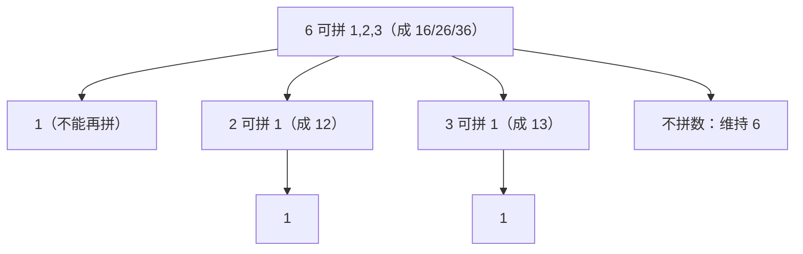

[[TOC]]

## 形式化题目

给定自然数 $n$。定义一个生成规则：当前数 $x$ 可以在它的左边**拼接**一个自然数 $y$，要求 $y \leqslant \dfrac{x}{2}$（$y$ 也可以是 $0$，即"不作任何处理"、维持 $x$ 不变），拼接得到的新数还能按同样规则继续向左拼接，直到不能再拼为止。例如 $x=6$ 时可以拼成 $16, 26, 36$，$36$ 还能继续拼成 $136$。

问：整个过程中（包括 $n$ 本身）一共能得到多少个**不同的数**。$1 \leqslant n \leqslant 1000$。样例：$n=6$ 时能得到 $6, 16, 26, 36, 126, 136$，答案为 $6$。

## 正解

### 思路

先写出朴素做法。把每个数的生成过程想成一棵"向左拼接"的树：$n$ 的每个孩子是某个 $y \leqslant n/2$ 拼出的新数，它又有自己的孩子。逐个模拟生成再去重，规模一大就会爆炸，需要找到数量之间的递推关系。

**关键观察**：设 $f(n)$ 表示从 $n$ 出发（含 $n$ 本身）能得到的**不同数的个数**。在 $n$ 左边拼上某个 $m\ \left(1 \leqslant m \leqslant \dfrac{n}{2}\right)$ 得到新数后，后续所有操作都拼在更左边、永远以 $n$ 结尾，所以 $n$ 能生成的数（除 $n$ 自己）恰好是：对每个 $m$，把"从 $m$ 出发能生成的每个数 $g$"拼接成 $g$ 连 $n$（如 $n=6$、$m=2$ 时 $g=2$ 给出 $26$，$g=12$ 给出 $126$）。

这个"$g \mapsto g$ 连 $n$"是**单射**：拼接结果的位数等于 $g$ 的位数加 $n$ 的位数，位数可以反解出来，去掉末尾就还原出 $g$。不同 $g$ 对应不同结果，不会重复计数。于是

直接照定义转移就是 $f(n) = 1 + \sum\limits_{m=1}^{\lfloor n/2 \rfloor} f(m)$，朴素实现是双重循环 $O(n^2)$。注意求和部分是 $f(1), f(2), \dots, f(\lfloor n/2 \rfloor)$ 的**连续前缀和**，所以随 $f$ 一起维护前缀和 $s$，把转移降为 $O(1)$：

$$f(n) = 1 + s_{\lfloor n/2 \rfloor}, \qquad s_n = s_{n-1} + f(n)$$

从 $n=1$ 递推到 $1000$，最后 $O(1)$ 查表回答。以 $n=6$ 为例画出生成关系：

图中 $n=6$ 的完整产物为 $\{6, 16, 26, 36, 126, 136\}$，恰好 $6$ 个，与样例吻合；两个 $1$ 在树里出现两次，但每个 $m$ 只通过各自的拼接结果（$16$ 或 $26$ 或 $36$ 的后缀）贡献，单射保证互不重叠。

### 代码

@include-code(./main.py, python)

### 复杂度

预处理 $O(N)$（$N = 1000$），单次询问 $O(1)$，空间 $O(N)$。最大答案 $1981471878$ 超过 16 位有符号整数范围，C++ 需用 `int` 以上的类型（如 `long long`）承接；Python 整数无此顾虑。

## 总结

- 本题是 NOIP2001 普及组的经典计数题，核心是把"左边拼接"的生成过程翻译成自相似的递推：$n$ 拼上 $m\ (\leqslant n/2)$ 之后的产物与从 $m$ 出发的产物一一对应（位数可反解，单射）。
- 状态 $f(n)$ 一维、转移是前缀和，一次线性扫描同时得到 $f$ 与 $s$，避免了 $O(n^2)$ 的朴素求和。
- 教训：计数问题先证明"子问题的产物与原问题子结构一一对应"，再谈优化；求和式出现连续区间时优先想前缀和。
