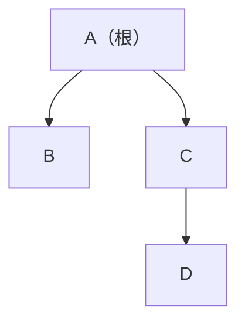

[[TOC]]

## 形式化题目

给定一棵二叉树的**中序遍历**与**后序遍历**（结点为互不相同的大写字母，序列长度 $\leqslant 8$），求它的**先序遍历**。

三种遍历对同一棵子树的定义：

| 遍历 | 顺序 |
| --- | --- |
| 先序 | 根、左、右 |
| 中序 | 左、根、右 |
| 后序 | 左、右、根 |

样例：中序 `BADC`、后序 `BDCA`，输出 `ABCD`。还原出的树如下：

观察重点：后序最后一字符 `A` 是根；在中序里 `A` 左边只剩 `B`（左子树），右边是 `DC`（右子树）；右子树里后序 `DC` 的末位 `C` 是根，`D` 是它的左孩子。

## 正解

### 思路

朴素想法是先按中序 + 后序把整棵树的每个结点显式建出来，再跑一遍先序遍历。其实不必建树——三种遍历的对应关系完全由"子树结点集合"决定，可以直接在字符串切片上递归，边递归边拼出先序。

关键观察有两条，且对每个子树都成立（这是能递归的原因）：

1. **后序的最后一个字符是子树的根**（后序是"左、右、根"）。
2. **中序里根的位置把序列切成左右两半**：根左边全是左子树结点，右边全是右子树结点；下标 $i$ 恰好等于左子树的大小。

由 $i$ 同时切后序：左子树占 `post[:i]`，右子树占剩下的（去掉末尾的根）。于是递归式为：

$$\text{pre}(in, post) = \text{root} + \text{pre}(in[:i],\ post[:i]) + \text{pre}(in[i+1:],\ post[i+1:])$$

其中 `root = post[-1]`，`i = in.index(root)`，拼接顺序"根 + 左 + 右"就是先序的定义。空子串（空子树）直接返回空串。

样例的递归推演：

| 层 | 中序 | 后序 | 根 | 左子树（中序, 后序） | 右子树（中序, 后序） |
| --- | --- | --- | --- | --- | --- |
| 1 | BADC | BDCA | A | (B, B) | (DC, DC) |
| 2 左 | B | B | B | — | — |
| 2 右 | DC | DC | C | (D, D) | —（空） |

逐层取根拼接得 `A + B + C + D = ABCD`，与样例输出一致。

### 代码

@include-code(./main.py, python)

### 复杂度

- 时间：每个结点在递归中被访问常数次，每次定位根是 $O(n)$ 的 `index` 加切片拷贝，合计 $O(n^2)$；$n \leqslant 8$ 时完全可忽略。
- 空间：递归深度 $O(n)$，切片总开销 $O(n^2)$。

## 总结

中序 + 后序（或中序 + 先序）唯一确定一棵二叉树，还原的抓手就是两句话：**后序/先序末位（首位）定根，中序按根切左右**。本题利用下标 $i$ 同时切开中序与后序，在切片上递归并按"根 + 左 + 右"拼接，省去了显式建树的结点结构，代码只有一个递归函数。题目规模 $n \leqslant 8$，退化链的递归深度也只有 8，Python 无 TLE/MLE 风险。
