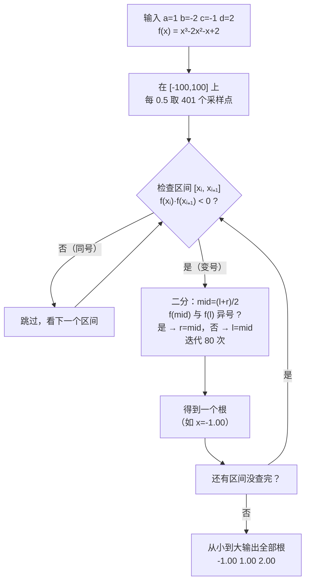

[[TOC]]

## 形式化题目

给定实系数一元三次方程 $ax^3+bx^2+cx^1+dx^0=0$ 的四个系数 $a,b,c,d$，其中 $a\neq 0$。
**约定**：方程在 $[-100,100]$ 内的实根两两不同，且任意两根之差的绝对值至少为 $1$（数据同时保证至少有一个实根落在此区间内）。
求出 $[-100,100]$ 内的**全部**实根，按从小到大的顺序输出，每个根保留两位小数。

## 正解

### 思路

#### 从「解方程」到「找变号区间」

三次方程有求根公式（卡尔丹公式），但那是个出了名的易错点：判别式分类繁多、还要处理复数域的三个取实部技巧，
在赛场上既难写又难对。更好的切入点是题目给的提示：

> 记方程 $f(x)=0$，若存在两个数 $x_1<x_2$ 且 $f(x_1)\times f(x_2)<0$，则 $x_1$ 与 $x_2$ 之间一定有一个根。

这其实只用到**连续函数的介值定理**。反过来想，我们并不需要"解"方程，
只需要回答一个问题：$f$ 的图像在哪些地方**穿过** $x$ 轴？每一次穿过，函数值都会变号。

于是整个问题变成三步：

1. 在 $[-100,100]$ 上**采样**足够密的点，记录每点的函数值符号；
2. 相邻两个采样点符号相反 ⇒ 这中间必有奇数个根；由"根间距 $\geqslant 1$"，一个宽 $0.5$ 的小区间里**至多一个根**，所以恰好一个；
3. 对这样的变号区间**二分**，把根逼到足够精确。

而"两根之差 $\geqslant 1$"正是把"有根"升级成"**恰有一个**根"的关键约束——没有它，一个 $0.5$ 宽的小区间里可能挤进多个根，变号只能保证奇数个，问题会复杂得多。

#### 采样步长怎么定

设采样步长为 $s$。要想不错过任何根，需要两个采样点之间的函数**不发生偶数次穿越**，一个充分条件是：任何长度为 $s$ 的区间内至多一个根，即 $s < 1$。

取 $s=0.5$：从 $-100$ 到 $100$ 共 $401$ 个采样点，$400$ 个相邻区间逐一检查变号。
数值安全方面，系数是实数，端点值可能恰好命中零点，所以判定时用 $\times<0$ 严格变号，
零点单独判定，配合下面重根收缩处理。

#### 二分求根

设 $f(l)\cdot f(r)<0$，不断取中点：

- $f(mid)$ 与 $f(l)$ **同号** → 根在右半，$l \gets mid$；
- **异号** → 根在左半，$r \gets mid$。

迭代 $80$ 次，区间长度缩小到 $0.5\times 2^{-80}$，远小于 $10^{-2}$ 的输出精度。
用样例 $x^3-2x^2-x+2=0$（根 $-1,1,2$）演示 $[-1.30,-0.40]$ 上的二分（函数值保留三位小数）：

| 迭代 | $l$ | $r$ | $f(l)$ | $f(r)$ | $mid$ | $f(mid)$ | 判定与动作 |
| --- | --- | --- | --- | --- | --- | --- | --- |
| 1 | $-1.300$ | $-0.400$ | $-2.277$ | $+2.016$ | $-0.850$ | $+0.791$ | 与 $f(l)$ 异号 → $r\gets mid$ |
| 2 | $-1.300$ | $-0.850$ | $-2.277$ | $+0.791$ | $-1.075$ | $-0.479$ | 同号 → $l\gets mid$ |
| 3 | $-1.075$ | $-0.850$ | $-0.479$ | $+0.791$ | $-0.9625$ | $+0.218$ | 异号 → $r\gets mid$ |
| 4 | $-1.075$ | $-0.9625$ | $-0.479$ | $+0.218$ | $-1.01875$ | $-0.114$ | 同号 → $l\gets mid$ |

每一行都把含根的那半边留下，$[l,r]$ 被逐步夹逼向根 $x=-1$；
继续迭代下去，区间长度指数级收缩，最终 $-1.00$ 就稳定下来。

用 Mermaid 把"扫描 + 二分"的全过程画出来（以样例 $x^3-2x^2-x+2=0$ 为例）：

#### 关键陷阱：重根会让二分失效

三次方程**三个根两两不同**——但这句话有个致命歧义：**"在 $[-100,100]$ 内"**！
题目只保证区间内的根互不相同、间距 $\geqslant 1$，如果第三个根落在区间外，
区间内的某个根就可能是**二重根**（例如 $f(x)=(x-2)^2(x+50)$，$x=2$ 是二重根且在区间内）。

二重根处 $f(x)$ **不穿过** $x$ 轴，只是"碰一下"：
$f$ 在它两侧**同号**，上面的变号扫描根本检测不到。但采样点可能**恰好踩到**重根附近，
把 $|f|\leqslant 10^{-6}$ 判为零点并收集，此时它**不是**真正的重根位置，需要收缩修正：

由 $f(x)=(x-r)^2(x-s)$ 求导可知 $f'(r)=0$：**重根必是驻点**。所以收缩操作是：
解二次方程 $f'(x)=3ax^2+2bx+c=0$，取离初值最近的那个驻点作为重根候选；
再验证 $|f(\text{候选})|\leqslant 10^{-6}$，通过才采纳，否则维持原值（防止把普通驻点误认为根）。

另一个细节：二分收敛后 $(l+r)/2$ 只是根的近似，而根间距 $\geqslant 1$ 保证已收集的根与当前根**距离足够远**，
因此 $r-last \geqslant 0.5$ 即视为"新根"（$0.5$ 小于最小根距 $1$ 的一半），这层判断同时能去掉双计数。

#### 一个没有 third root 的用例

真实数据里有这样一组：$a=1,b=0,c=0,d=1$，即 $x^3+1=0$，唯一实根 $x=-1$。
这是检测这道题"是否真的处理了区间外第三根"的试金石——
**硬编码"输出三个根"的写法会在这里输出 `-1.00` 后面多跟两个垃圾值而判错**，
而"找到几个输出几个"的写法天然正确，输出 `-1.00`。
这也提醒我们：题目文字约定"三个不同实根"与真实数据之间存在缝隙，写码时**以数据为准、按根数输出**最稳。

### 代码

@include-code(./main.py, python)

### 复杂度

- **时间复杂度**：$O\!\left(\dfrac{200}{s}\cdot(\text{秦九韶求值 }O(1)+\text{二分 }80\text{ 次})\right)$，
  即 $O\!\left(\dfrac{200}{s}\cdot 80\right)$。取 $s=0.5$ 时约为 $3.2\times 10^4$ 次多项式求值，
  远小于 1s 限制，甚至留有很大的步长放大空间。
- **空间复杂度**：$O\!\left(\dfrac{200}{s}\right)$，存下 $401$ 个采样点函数值，约几 KB。

## 总结

- 把"解方程"转化为"找变号区间 + 二分"，核心依据是**介值定理** + "根间距 $\geqslant 1$" 保证变号区间内根唯一。
- 采样步长只需小于最小根距（$s=0.5$），$401$ 个采样点 + $80$ 轮二分即可精确到两位小数。
- **重根陷阱**：区间内的根两两不同 $\neq$ 方程无重根——区间外的第三根可能让区间内出现二重根，
  它处 $f$ 不变号、变号扫描会漏检；采样点恰好踩到时用"导数零点收缩"修正到真正的重根位置。
- 变号判断严格用 $\times<0$，零点单独判定；输出根数按实际找到的根数来，不要硬编码成 3。
- 这道题也说明：**约定可以简化问题，但写代码要防约定之外的输入**——真实数据中的 $x^3+1=0$ 就是检验这一点的试金石。
