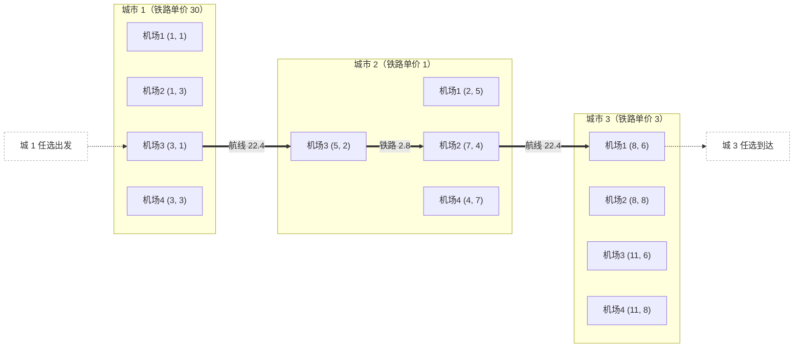

[[TOC]]

## 形式化题目

有 $S$ 座城市，每座城市恰有 $4$ 个机场，位于一个矩形的 $4$ 个顶点上，但输入只给出每座城市任意 $3$ 个顶点的坐标。第 $i$ 座城市内**任意两个**机场之间都有一条笔直的高速铁路，单位里程价格为 $T_i$；**任意两个不同城市**的机场之间都有一条航线，单位里程价格统一为 $t$。一段路程的花费等于它的欧氏距离乘以该段的单位价格。给定起点城市 $A$ 与终点城市 $B$，求从 $A$ 的任意机场出发、到达 $B$ 的任意机场的最小总花费。

以样例为例：$S = 3$，$t = 10$，$A = 1$，$B = 3$。三座城市各补出第 4 个机场后，最优路线是「城 1 机场 3 $(3,1)$ —航线 $22.36$→ 城 2 机场 3 $(5,2)$ —铁路 $2.83$→ 城 2 机场 2 $(7,4)$ —航线 $22.36$→ 城 3 机场 1 $(8,6)$」，总花费 $47.549\cdots$，输出 `47.5`：

```text
输入
1
3 10 1 3
1 1 1 3 3 1 30
2 5 7 4 5 2 1
8 6 8 8 11 6 3

输出
47.5
```

## 正解

### 思路

先看朴素想法为什么不行。最直接的建模是「把一座城市压成一个点」：但一条航段的花费取决于从哪个机场起飞、在哪个机场降落，降落机场又决定城内铁路要走多远才能接上下一段——城市粒度的状态丢掉了「从哪个机场进出」，答案会算错。若把状态细化到机场，却按「枚举中转城市序列 + 每段贪心选最便宜机场」来做，中转序列有指数多种；而且相邻两段共用同一个中转机场，两段的机场选择互相耦合，贪心也不成立。

两个朴素做法共同的瓶颈是：**路线任意，且相邻两段的机场衔接互相耦合**。这恰好是最短路模型的适用场景——把「衔接」显式地写成边，让算法去枚举所有可能的衔接方式。

于是推导分三步。

**第一步：补出第 4 个机场。** 矩形按环序为 $P_1P_2P_3P_4$，设缺失点为 $d$，则它的对顶点 $c$ 一定在已知三点中；$c$ 的两条邻边通向的恰好是另外两个已知点 $a, b$，且 $c$ 处成直角。由对角线互相平分 $a + b = c + d$ 得

$$d = a + b - c.$$

实现时只需在三个已知点里找点积为 $0$ 的那个直角顶点。样例三城的补点结果如下（表格列出已知三点、直角顶点与第四点）：

| 城市 | 已知三点 | 直角顶点 $c$ | 另两点 $a, b$ | 第四点 $a+b-c$ |
| --- | --- | --- | --- | --- |
| 1 | (1, 1)、(1, 3)、(3, 1) | (1, 1) | (1, 3)、(3, 1) | (3, 3) |
| 2 | (2, 5)、(7, 4)、(5, 2) | (5, 2) | (2, 5)、(7, 4) | (4, 7) |
| 3 | (8, 6)、(8, 8)、(11, 6) | (8, 6) | (8, 8)、(11, 6) | (11, 8) |

**第二步：把机场建成图上的点。** 粒度必须细到「(城市, 机场编号)」，全图共 $4S$ 个点。按题意连两类无向边：

- 同城边：每座城市 $\binom{4}{2} = 6$ 条铁路，边权 = 欧氏距离 $\times\ T_i$；
- 异城边：每对城市 $4 \times 4 = 16$ 条航线，边权 = 欧氏距离 $\times\ t$。

这样任何一条合法路线都对应图上一条路径，反之亦然，边权全部为正。

**第三步：多源 Dijkstra。** 「出发机场任选」等价于把 $A$ 城 4 个机场的距离初值都设为 $0$ 一起入堆；「到达机场任选」等价于优先队列**第一次弹出 $B$ 城的任一机场**时其距离就是答案（首次弹出的点已被最短路覆盖），直接返回即可，不必跑完全部点。三步分别对应 `main.py` 的 `rect_fourth`（补点）、`build_graph`（建图）与 `min_fare`（多源 Dijkstra）。

回到样例：城 1 铁路单价 30 太贵，最优路线完全不走城 1 的铁路，而是从 $(3,1)$ 飞进单价只有 1 的城 2，用城内铁路把位置从 $(5,2)$ 换到 $(7,4)$，再飞进城 3 的 $(8,6)$，合计 $22.36 + 2.83 + 22.36 \approx 47.55$。若从城 1 最近的机场 $(3,3)$ 直飞城 3 最近的 $(8,6)$，要 $\sqrt{34}\times 10 \approx 58.3$——「借便宜的城市铁路换位再飞」正是本题的最优结构。实现上中间过程全程用双精度累加，只在输出时 `f"{fare:.1f}"` 四舍五入到一位小数，避免中途舍入误差。

### 代码

@include-code(./main.py, python)

### 复杂度

- **时间**：补点 $O(S)$；建图共 $6S + 16\binom{S}{2} = O(S^2)$ 条边；堆优化 Dijkstra 为 $O(E\log V) = O(S^2\log S)$。$S \leqslant 100$ 时 $V = 400$、$E \leqslant 79\,800$，实测每组约 0.02s。
- **空间**：邻接表 $O(V + E) = O(S^2)$，实测峰值约 16MB。

## 总结

把「机场」而不是「城市」作为状态粒度：先用直角顶点补出矩形的第 4 个机场，再按「同城铁路、异城航线」两类边把题面直接翻译成一张正权无向图，最后用多源 Dijkstra（起点端 4 点初值 0、首次弹出终点城市即返回）求出最小花费。核心是识别出「相邻两段的机场衔接」必须交给最短路枚举，而不是贪心。

## 图示解析

这张图串起样例从补点、建模到得到答案的主线（异城航线两两全连，图中只画出最优路线用到的三段）：



先看每个子图是一个城市的 4 个机场（含补出来的第 4 个），再顺着粗边看路线：城 1 铁路单价 30 太贵，所以不在城 1 走铁路，而是从机场 3 直接飞进城 2，用单价 1 的铁路换到更好的起飞位，再飞进城 3 的机场 1。三段花费 $22.36 + 2.83 + 22.36 \approx 47.55$，而城 1 直飞城 3 最省也要 $\sqrt{34} \times 10 \approx 58.3$，说明「借便宜的城市铁路换位再飞」才是答案的来源。
