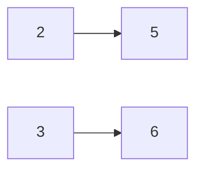

[[TOC]]

## 形式化题目

给定一个十进制整数 $n$（$n < 10^{30}$，最多 30 位）和 $k$（$k \leqslant 15$）条变换规则，每条规则形如"一位数 $x$ 变为一位数 $y$"（$y \neq 0$）。

变换操作为：选取 $n$ 的任意一位，若该位数字为 $x$ 且存在规则链 $x \to \cdots \to y$，则可把这一位改成 $y$。每一位的变换互相独立，变换可以进行任意次（包括 0 次）。

求经过变换能产生的不同整数个数（含 $n$ 本身），只需输出个数。

### 样例推演

以 $n = 234$、规则 $2 \to 5$、$3 \to 6$ 为例。把 10 个数字看成图上结点，规则就是有向边：

每个数字只指向自己或规则目标，于是每一位的可选数字集合为：

| 位置 | 原数字 | 可变成的数字 | 选择数 |
| --- | --- | --- | --- |
| 百位 | 2 | {2, 5} | 2 |
| 十位 | 3 | {3, 6} | 2 |
| 个位 | 4 | {4} | 1 |

各位独立选择，由乘法原理共 $2 \times 2 \times 1 = 4$ 种：$234, 534, 264, 564$，与样例一致。

## 正解

### 思路

先想朴素做法：对每一位暴力枚举"这一位最终能是什么数字"。难点在于"任意次变换"——规则可能成链甚至成环，比如 $2 \to 5$、$5 \to 2$ 时，数字 2 能变成 $\{2, 5\}$ 中的任何一个。手动沿规则一层层扩展容易漏解。

关键转化：把 10 个数字 $0 \sim 9$ 看成有向图的 10 个结点，每条规则 $x \to y$ 是一条有向边。那么"数字 $d$ 经任意次变换能变成的数字集合"就是图上从 $d$ 出发可达的点集（含 $d$ 自己，因为允许变换 0 次），即**有向图的传递闭包**。

结点只有 10 个，直接用 Floyd-Warshall 求传递闭包：

- 用一个整数 $g[d]$ 作位集，第 $e$ 位为 1 表示 $d$ 能变到 $e$。初始 $g[d]$ 只含 $d$ 自己（允许不变换）。
- 读入规则时合并边：$g[x] \mathrel{|}= 2^y$。
- 松弛：若 $i$ 能到 $m$（$g[i]$ 含位 $m$）且 $m$ 能到 $e$（$g[m]$ 含位 $e$），则 $i$ 能到 $e$，即 `g[i] |= g[m]`。

求出闭包后，$n$ 的每一位数字 $d$ 恰有 $\mathrm{popcount}(g[d])$ 种取值。各位变换互不影响，一位的取值组合起来就是一个完整方案，由**乘法原理**：

$$\text{答案} = \prod_{\text{每一位 } d} \mathrm{popcount}(g[d])$$

$n$ 有 30 位、每位最多 10 种，答案可达 $10^{30}$ 量级，远超 64 位整数，需要大整数运算——Python 的整数天然支持，直接连乘即可。

### 代码

@include-code(./main.py, python)

### 复杂度

- 传递闭包：Floyd 三重循环共 $10^3 = 1000$ 次位运算，位集是单个整数，每次按位或是 $O(1)$ 字操作。
- 乘积：至多 30 次大整数乘法，可忽略。
- 总复杂度 $O(k + 10^3 + |n|)$，时间与内存都远低于本题 $1\text{s} / 32\text{MB}$ 的限制。

## 总结

本题的完整思维链是：**变换次数任意 → 图上可达性 → 传递闭包 → 逐位独立 → 乘法原理 → 大整数**。把"字符串上做变换"翻译成"10 个点的有向图可达性"是唯一需要跨出的步子；之后 10 点 Floyd 用位集写只需几行，而 Python 的大整数让 $10^{30}$ 量级的答案不再是障碍。需要注意的实现细节：可达集合必须含自身（允许 0 次变换），读入按空白切分以兼容不同行尾风格。
