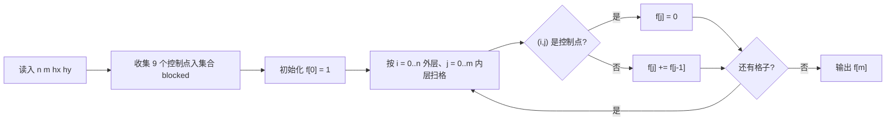

[[TOC]]

## 形式化题目

给定起点 $A(0,0)$ 与终点 $B(n,m)$（$0 \leqslant n, m \leqslant 20$），以及棋盘上一个点 $C(h_x, h_y)$。卒只能**向下或向右**走一步；称点 $C$ 以及从 $C$ 出发按"马走日"跳跃一步能到达的所有点为**控制点**。求从 $A$ 走到 $B$、途中不经过任何控制点的路径条数。

结果可能超过 32 位整数的表示范围。

## 暴力解法

### 思路

从 $(0,0)$ 出发做 DFS：每一步尝试"向下"和"向右"两个方向，走到 $(n,m)$ 就把答案加 1。走之前先判断目标格是不是控制点，是就直接剪掉这条分支。

因为每一步只有 2 种选择，走满 $n+m$ 步才可能到达终点，最坏情况的枚举量是 $O(2^{n+m})$。当 $n = m = 20$ 时约为 $2^{40} \approx 10^{12}$，远远超出时限。

### 代码

略：本题按任务约定不提供暴力对拍代码，暴力思路见上文，仅用于引出下面的正解。

### 复杂度与瓶颈

时间复杂度 $O(2^{n+m})$，无法通过 $n, m \leqslant 20$ 的数据。

**瓶颈**：同一个中间点 $(i,j)$ 会被"先右后下"和"先下后右"两条不同的前缀反复走到，而它到终点的走法总数是固定的——这些重复计算全部被丢弃重算了。

## 正解

### 关键观察

把问题倒过来看：**从 $(i,j)$ 走到 $(n,m)$ 的走法数是一个定值，与怎么走到 $(i,j)$ 无关**。设这个定值为 $f(i,j)$，那么枚举到达 $(i,j)$ 的最后一步（只能来自上方或左方），立刻得到递推式：

$$f(i, j) = f(i-1, j) + f(i, j-1)$$

边界：$f(0, 0) = 1$（起点本身可达，算 1 条"空路径"）；$(i,j)$ 是控制点时 $f(i,j) = 0$。答案就是 $f(n, m)$。

每个格子只算一次，复杂度从指数级降到 $O(nm)$，这就是经典的"标记型递推计数"。由于答案可能很大，递推过程中要用大整数（C++ 里是 `unsigned long long`，本题数据范围内够用；Python 天然支持）。

### 思路

1. **标记控制点**：马的控制点只有马所在点 $(h_x, h_y)$ 加上 8 个"马脚"落点，一共最多 9 个。把它们全部塞进一个集合 `blocked`，查询 $O(1)$。注意有的"马脚"会跳到棋盘外（坐标为负或超过 $n, m$），这些点不会被 DP 查到，不需要特判删除。
2. **递推方向**：$f(i,j)$ 只依赖上一行和左一列，所以自上而下、自左而右递推即可。
3. **滚动数组**：$f(i,j)$ 只用到 $f(i-1,\cdot)$ 和 $f(\cdot, j-1)$，可以只保留一维数组 $f[0..m]$：从左往右扫时，`f[j]` 的旧值恰好是上一行的 $f(i-1,j)$（"从上面来"），刚更新过的 `f[j-1]` 是本行的 $f(i,j-1)$（"从左边来"），二者相加就是新值。空间从 $O(nm)$ 降到 $O(m)$。
4. **起点被控制**：若 $(0,0)$ 本身是控制点，卒一步都走不了，答案为 0——实现上只需让 `f[0]` 初始化为 0，之后所有格子自然全为 0，不需要单独写分支。

用样例 $B(6,6)$、马在 $(3,3)$ 演示递推表（`×` 表示控制点，行列都从 0 开始，只显示到 $(4,4)$ 的局部）：

| $f(i,j)$ | j=0 | j=1 | j=2 | j=3 | j=4 |
|:---:|:---:|:---:|:---:|:---:|:---:|
| **i=0** | 1 | 1 | 1 | 0 | 0 |
| **i=1** | 1 | 1 | 1 | 0 | 1 |
| **i=2** | 1 | 1 | 1 | 0 | 1 |
| **i=3** | 1 | 1 | 0 | 0 | 1 |
| **i=4** | 1 | 1 | 1 | 1 | 2 |

看第 3 行：马本尊堵死 $(3,3)$，而它的两个马脚又封掉 $(1,3)$ 和 $(3,1)$，于是 $(3,2)$ 只能靠上方传入，值被清 0 后，$(3,4)$ 的路径只剩从 $(2,4)$ 下来的一条……控制点的"清零"顺着 `f[j] += f[j-1]` 传到全表，最终 $f(6,6)=6$。

再用一张流程图概括整个递推的判定顺序：

### 代码

@include-code(./main.py, python)

### 复杂度

- 时间复杂度 $O(nm)$：棋盘最多 $21 \times 21 = 441$ 个格子，每个格子 $O(1)$ 完成一次加法。
- 空间复杂度 $O(m)$：滚动数组只保留一行；控制点集合是常数级（最多 9 个）。

## 总结

- 这道题的核心模型是"带障碍的网格路径计数"，障碍恰好是马控制点——用集合标记而不是开整张二维布尔数组，是最省事的处理方式。
- 朴素 DFS 的指数级枚举源于"路径前缀不同、后缀相同"的重复计算；把"从某点出发的走法数"定义成状态后，状态数只有 $O(nm)$ 个，这正是 DP 消除重复子问题的标准套路。
- 滚动数组是网格 DP 的通用压缩技巧：判断新值由"上一行的旧值 + 本行左边的新值"组成，只要扫描顺序固定，一行数组就够。
- 本题结果可达 $\binom{40}{20} \approx 1.4 \times 10^{11}$，超过 32 位整数范围；Python 的大整数天然无碍，C++ 需要 `unsigned long long`。
