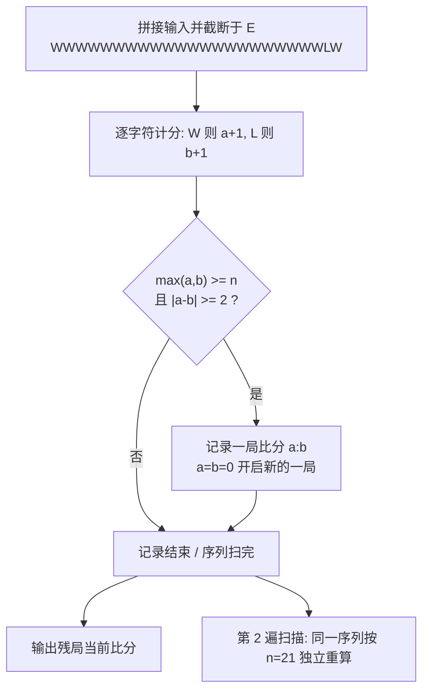

[[TOC]]

## 形式化题目

给定一个只含 `W`、`L`、`E` 的比分记录序列：`W` 表示华华得 1 分，`L` 表示对手得 1 分，`E` 表示记录结束（`E` 及其之后的内容全部忽略）。

一局比赛的结束规则：某一方得分达到 $n$ 分**且**双方分差 $\geqslant 2$ 时，该局立即结束，比分清零重新开始下一局。

要求分别按 $n=11$ 和 $n=21$ 两种分制，按顺序输出每一局的比分 `a:b`（`a` 为华华得分）；记录末尾那一局若尚未结束，也要输出其当前比分（一局刚开始时输出 `0:0`）。两部分结果之间用一个空行分隔。

## 正解

### 思路

这是一道纯粹的模拟题，没有任何算法瓶颈，难点全部在**规则细节**上：

1. **一局结束的判定**：不是"先到 11 分就赢"。必须同时满足"某方得分 $\geqslant n$"和"分差 $\geqslant 2$"，才会出现 `12:10`、`16:18`（21 分制下的 `23:21` 等）这样的比分。也就是说，到达 $n$ 分后如果分差只有 1 分，比赛继续，直到某方把分差拉开到 2。
2. **E 的处理**：读到 `E` 就停，`E` 后面的所有字符都不算比分。最稳妥的做法是先把输入拼成一个大字符串，取 `E` 之前的部分。
3. **末尾残局**：记录结束时正在进行的这一局不能丢掉，要输出当前比分；如果恰好一局刚打完记录就结束（或记录为空），这一步会输出 `0:0`，这也符合题面"一局刚开始比分为 0:0"的规定。
4. **两种分制互相独立**：11 分制和 21 分制都是对**同一条**比分序列独立地从头扫一遍，互不影响。

于是解法非常直接：把两种分制抽象成一个参数化的函数 `play(s, n)`——用一个计数器逐字符累加 `W`/`L` 的得分，每加一分就检查一次"$\max(a,b)\geqslant n$ 且 $|a-b|\geqslant 2$"，成立则记下一局比分并清零；扫描结束后再把当前比分（残局）追加进去。

下面用样例走一遍 21 分制的过程，展示"到达局分但分差不足"时比赛继续的现象。样例记录（`E` 前）为 `WWWWWWWWWWWWWWWWWWWWWWLWE`：

| 阶段 | 已读比分序列 | 当前比分 | 状态 |
| --- | --- | --- | --- |
| 第 1 局 | 连续 21 个 `W` | `21:0` | $\max=21\geqslant 21$ 且分差 $21\geqslant 2$，本局结束 |
| 第 2 局 | `WWL` | `2:1` | $\max=2<21$，继续 |
| 记录结束 | — | `2:1` | 输出残局比分 |

11 分制同理：前 11 个 `W` 结束第一局（`11:0`），再 11 个 `W` 结束第二局（`11:0`），剩下的 `WL` 作为残局输出 `1:1`——注意 `W` 之后来了一个 `L`，分差从 2 缩到 0，但因为还没到 11 分，本局本来就没结束，不影响结果。

### 代码

@include-code(./main.py, python)

### 复杂度

设记录总长度为 $N$（本题 $N \leqslant 2500 \times 25 = 62500$）。每种分制对序列做一次线性扫描，共两遍：

$$
O(N)
$$

时间约 $1.3 \times 10^5$ 次基本操作，空间只需保存输入串和结果行，远低于限制。

## 图示解析

用样例 `WWWWWWWWWWWWWWWWWWWW / WWLWE`（两行拼接后截断于 `E`）完整走一遍 11 分制的逐球流程：

观察要点：同一串比分被 `play(s, n)` 以 $n=11$ 和 $n=21$ **各独立扫描一遍**——11 分制在攒够 11 分且分差达标时清零，21 分制要攒到 21 分才清零，所以两条输出互不相同；`E` 截断了最后进行中的一局，输出的是未完成局的当前比分（11 分制下残局 `1:1`，21 分制下残局 `2:1`）。`12:10` 这类比分只会出现在"先到局分但分差只有 1"的延长赛中。

## 总结

- 模拟题的关键是把规则读准：一局结束 = **达到局分 $n$ 且分差 $\geqslant 2$**，两者缺一不可，这就是 `12:10`、`16:18` 等比分的来源。
- 两个易错点：`E` 之后的内容全部忽略；记录末尾的残局（哪怕 `0:0`）必须输出。
- 把 11 分制 / 21 分制写成同一个以 $n$ 为参数的函数，两遍独立扫描，代码短且不易出错。
- 复杂度 $O(N)$，$N \leqslant 6.25 \times 10^4$，轻松通过。
