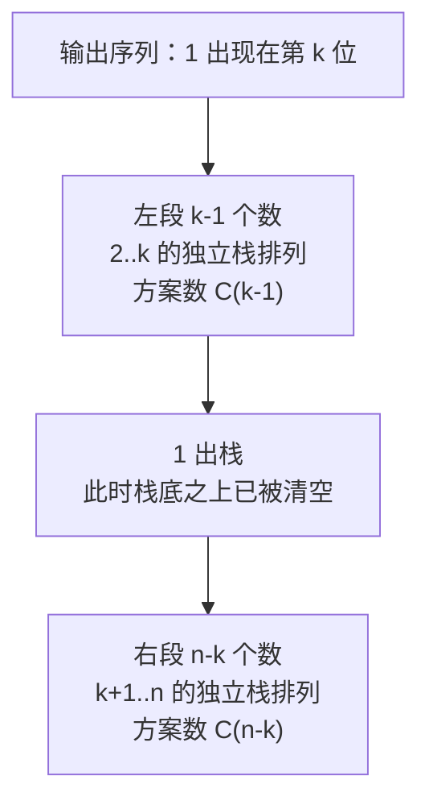

[[TOC]]

## 形式化题目

初始有一个操作数序列 $1, 2, \dots, n$（1 在头端）、一个空栈 $A$（深度大于 $n$）和一个空输出序列。每次操作二选一：

1. **push**：操作数序列非空时，把头端元素移到栈顶；
2. **pop**：栈非空时，把栈顶元素移到输出序列末尾。

经若干次合法操作把 $n$ 个数全部输出，求能得到的不同输出序列总数。

样例 $n = 3$：合法输出序列为 `123`、`132`、`213`、`231`、`321` 共 5 种，输出 5。其中 `312` 不合法——先输出 3 说明 1、2、3 已依次入栈，此时栈内 2 在顶、1 在底，下一个只能输出 2，不能输出 1。

## 正解

### 思路

朴素做法是把 $n!$ 个排列逐个用栈模拟判断（或等价地枚举 $\binom{2n}{n}$ 种 push/pop 操作序列），$n = 18$ 时 $18! \approx 6.4 \times 10^{15}$，完全不可行。瓶颈在于把每个方案当成独立个体逐一验证，没有利用方案内部的独立结构。

**关键观察（1 的首归分解）**：1 是第一个入栈的元素，入栈后压在栈底。它要被 pop 出来，栈里必须只有它自己——比它晚入栈的 $2, 3, \dots$ 必须全部先出栈。设输出序列中 1 出现在第 $k$ 位（$1 \leqslant k \leqslant n$），如下图所示，整个输出序列被 1 切成两段：

- 1 之前的 $k-1$ 个输出必然是 $\{2, \dots, k\}$ 的某种合法栈排列（这些数入栈又全部出栈，互不干扰）；
- 1 出栈后栈已空，剩下的 $\{k+1, \dots, n\}$ 是另一个与前面完全独立的栈排列问题。

分解左右互斥且完备：不同 $k$ 产生的序列不同；对固定 $k$，左右两段各自合法当且仅当拼接后的整体合法。记规模 $m$ 的答案为 $C_m$（$C_0 = 1$），对 $k$ 求和即得卡特兰递推：

$$C_n = \sum_{i=0}^{n-1} C_i \, C_{n-1-i}$$

这个 $O(n^2)$ 递推已经能过。再利用卡特兰数闭式 $C_n = \dfrac{1}{n+1}\dbinom{2n}{n} = \dfrac{(2n)!}{(n+1)!\,n!}$，相邻两项相除化简：

$$
\frac{C_k}{C_{k-1}} = \frac{(2k)(2k-1)}{(k+1) \cdot k} = \frac{2(2k-1)}{k+1}
\quad\Longrightarrow\quad
C_k = C_{k-1} \cdot \frac{2(2k-1)}{k+1}
$$

于是只需 $O(n)$ 一维递推。下表展示前几项的计算过程（每一行都是"上一行乘 $2(2k-1)$ 再除 $k+1$"，除法精确整除）：

| 下标 $k$ | 计算过程 $C_k = C_{k-1} \times 2(2k-1) \div (k+1)$ | $C_k$ |
| --- | --- | --- |
| 1 | 起始值 | 1 |
| 2 | $1 \times 6 \div 3$ | 2 |
| 3 | $2 \times 10 \div 4$ | 5 |
| 4 | $5 \times 14 \div 5$ | 14 |
| 5 | $14 \times 18 \div 6$ | 42 |

第一列是递推下标，第二列是本步的乘除过程，第三列是本步结果。$k = 3$ 时 $C_3 = 5$，与题面样例一致；闭式展开核对：$C_3 = C_0C_2 + C_1C_1 + C_2C_0 = 1 \times 2 + 1 \times 1 + 2 \times 1 = 5$。

实现上先乘后除（`count * 2 * (2*k-1) // (k+1)`），因为 $C_{k-1} \cdot 2(2k-1) = C_k \cdot (k+1)$ 恒被 $(k+1)$ 整除，全程整数运算无精度问题；$n \leqslant 18$ 时答案最大 $477638700$，Python 原生整数直接存储。

### 代码

@include-code(./main.py, python)

### 复杂度

时间复杂度 $O(n)$：递推循环执行 $n-1$ 次，每次常数次算术运算。空间复杂度 $O(1)$：只用一个整数变量累加，迭代写法没有递归栈。对比暴力枚举的 $O(n! \cdot n)$，瓶颈被彻底消除。

## 总结

输出序列总数就是第 $n$ 个卡特兰数。核心是**1 的首归分解**：1 在输出第 $k$ 位时，整个序列被切成 $\{2,\dots,k\}$ 和 $\{k+1,\dots,n\}$ 两个独立子问题，求和得到卡特兰递推；再用闭式比值化简为 $C_k = C_{k-1} \cdot 2(2k-1)/(k+1)$，$O(n)$ 递推即可。合法栈排列、合法括号序列、Dyck 路径是同一个计数模型，见到"固定顺序入栈、任意顺序出栈"就应当想到卡特兰数。
