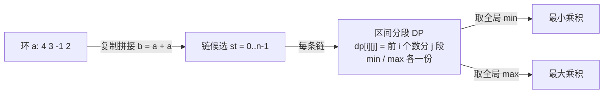

[[TOC]]

## 形式化题目

圆桌上按顺时针摆着 $n$ 个整数 $a_0, a_1, \dots, a_{n-1}$（可能为负）。你要按顺时针顺序把它们切成恰好 $m$ 段（每段至少一个数，不许调换顺序），每一段内的数相加得到一个和，把每个和对 $10$ 取模（负数也取 $0 \sim 9$ 的余数），再把这 $m$ 个模值相乘，得到一个乘积。

在所有切法中，分别求出**乘积的最小值**和**最大值**，各输出一行。

以官方数据实测为准：$n \leqslant 50$，$m \leqslant 10$，$|a_i| \leqslant 10^4$。

样例（$n=4$，$m=2$，$a = 4, 3, -1, 2$）：乘积最小为 $7$，最大为 $81$。两种取值对应的切法：

| 目标 | 断开成链 | 切法 | 各段和 | 段和 $\bmod 10$ | 乘积 |
| --- | --- | --- | --- | --- | --- |
| 最小 $7$ | $4, 3, -1, 2$ | $(4,3) \mid (-1,2)$ | $7,\ 1$ | $7,\ 1$ | $7 \times 1 = 7$ |
| 最大 $81$ | $-1, 2, 4, 3$ | $(-1) \mid (2,4,3)$ | $-1,\ 9$ | $9,\ 9$ | $9 \times 9 = 81$ |

注意最大值的切法里第一段和是 $-1$，取模后变成 $9$——负数取模是本题的关键考点，下文展开。

## 暴力解法

### 思路

环上的分割，最直接的枚举方式是两步：

1. **断环成链**：环有 $n$ 个位置可以"剪开"。从不同位置剪开，得到不同的链。
2. **枚举切法**：一条长度为 $n$ 的链有 $n-1$ 个空隙，从中选 $m-1$ 个作为分割点，共 $\binom{n-1}{m-1}$ 种。每种切法用 $O(n)$ 算出各段和、取模、连乘。

总的枚举量是 $O\!\left(n^2 \binom{n-1}{m-1}\right)$。取 $n = 50$、$m = 10$，仅切法就有 $\binom{49}{9} \approx 1.4 \times 10^9$ 种，再乘上 $n$ 个断点和每次的线性统计，约 $10^{14}$ 次运算，完全不可行。

**但暴力暴露了关键结构**：很多切法共享同一段前缀。例如"前 3 个数已切成 2 段"之后，无论这 2 段当初怎么切，接下来要面对的局面是完全一样的——只取决于"用到第几个数"和"已切几段"这两个量，而与切法历史无关。这正是动态规划要利用的**子结构重叠**。

**样例拆解**（$a = 4, 3, -1, 2$，$m = 2$）：先把环展开成链 $4, 3, -1, 2$，从位置 0 剪开：

| 切法 | 各段和 | 模 10 | 乘积 |
| --- | --- | --- | --- |
| $(4) \mid (3,-1,2)$ | $4,\ 4$ | $4,\ 4$ | $16$ |
| $(4,3) \mid (-1,2)$ | $7,\ 1$ | $7,\ 1$ | $\mathbf{7}$ |
| $(4,3,-1) \mid (2)$ | $6,\ 2$ | $6,\ 2$ | $12$ |

这条链上最小是 $7$。但最大值 $81 = 9 \times 9$ 不在这条链上——它需要换一个位置剪开：把环剪成链 $-1, 2, 4, 3$，取切法 $(-1) \mid (2,4,3)$：两段和为 $-1$ 与 $9$，取模后是 $9$ 与 $9$，乘积 $81$。同一条链换种切法结果完全不同，而固定"剪开位置 + 分割点"逐一枚举的方案数是指数级的，手工枚举也已经容易出错——这正是引出 DP 的动机：让填表代替不靠谱的穷举。

### 代码

<!-- 题目要求不单独提供暴力代码，暴力层仅作思路演示；正确性由官方数据对正解验证 -->

### 复杂度

$O\!\left(n^2 \binom{n-1}{m-1}\right)$，$n = 50, m = 10$ 时约 $10^{14}$，不可行。

### 瓶颈

$\binom{n-1}{m-1}$ 种切法之间存在大量重复子问题：**"前 $i$ 个数切成 $j$ 段"的最优值**被反复重算。把每种"前缀局面"只算一次，就是正解。

## 正解

### 关键观察

1. **状态合并**：定义 $dp[i][j]$ 为"前 $i$ 个数切成 $j$ 段"的最优乘积（min 和 max 各记一份）。它把 $\binom{i-1}{j-1}$ 种前缀切法压缩成 2 个数。
2. **段权值只依赖端点**：第 $j$ 段若是 $a_{k+1}..a_i$，其权值为 $(pre[i] - pre[k]) \bmod 10$，用前缀和 $O(1)$ 得到。
3. **环 → 链的代价可以接受**：断环成链需要枚举 $n$ 个剪开位置，每条链做一次 $O(n^2 m)$ 的 DP，总量 $O(n^3 m)$，$n=50, m=10$ 时约 $1.25 \times 10^6$，绰绰有余。

### 思路

**状态与转移**。设链上前缀和为 $pre$（$pre[i] = a_0 + \dots + a_{i-1}$），

$$
dp_{min}[i][j] = \min_{k} \left\{\, dp_{min}[k][j-1] \times \bigl((pre[i] - pre[k]) \bmod 10\bigr) \,\right\}
$$

$$
dp_{max}[i][j] = \max_{k} \left\{\, dp_{max}[k][j-1] \times \bigl((pre[i] - pre[k]) \bmod 10\bigr) \,\right\}
$$

其中 $k$ 枚举第 $j-1$ 段的结束位置（$j-1 \leqslant k < i$，保证每段非空）。边界 $dp[0][0] = 1$（乘积的单位元）；$i < j$ 的状态不合法（每段至少一个数）。

**为什么 min/max 各记一份就够了？** 注意权值 $w = (\text{段和}) \bmod 10$ 永远在 $0 \sim 9$ 之间——负数取模后也变成非负。所以转移中相乘的因子全部非负，"前缀越小乘积越小"在每一步都成立，不存在"负数乘负数反超"的符号翻转，min 与 max 两条独立递推即可。

**样例 DP 填表**（链 $4, 3, -1, 2$，$m = 2$，`pre = [0, 4, 7, 6, 8]`）。行是"前 $i$ 个数"，列是"已切段数 $j$"，格子里依次写 $dp_{min}$ 和 $dp_{max}$：

| $i \backslash j$ | $j = 1$ | $j = 2$ |
| --- | --- | --- |
| $i = 1$ | $4$ / $4$ | — |
| $i = 2$ | $7$ / $7$ | $12$ / $12$ |
| $i = 3$ | $6$ / $6$ | $8$ / $\mathbf{63}$ |
| $i = 4$ | $8$ / $8$ | $\mathbf{7}$ / $16$ |

观察几个格子的来历：

- $dp[2][2]$：只有一种切法 $(4) \mid (3)$，权值 $4 \times 3 = 12$，min = max = 12。
- $dp[3][2]$：两个来源——$dp[1][1] \times w(2..3) = 4 \times ((-1+2) \bmod 10) = 4 \times 1 = 4$，与 $dp[2][1] \times w(3) = 7 \times ((-1) \bmod 10) = 7 \times 9 = 63$。**这里正是负数取模的考点**：$-1 \bmod 10 = 9$，于是 $7 \times 9 = 63$ 成为 max 的来源；若用 C 语言截断取模 $-1 \% 10 = -1$，会得到 $-7$，答案全错。官方数据正是用含负数的序列检验这一点。
- $dp[4][2] = 7$：来自 $dp[2][1] \times w(3..4) = 7 \times 1 = 7$，即切法 $(4,3) \mid (-1,2)$。

**断环成链**。把数组复制拼接 $b = a + a$，对每个起点 $st \in [0, n)$，把 $b[st..st+n-1]$ 当作一条链做上面的 DP，用前缀和直接取段和；在 $n$ 条链的 $dp[n][m]$ 中取全局 min 与 max。因为环上任何分割方案剪开后一定是从某个位置开始的链，所以 $n$ 条链的并覆盖了所有方案。

上面 $dp[3][2]$ 的 $63$ 就是链 $4,3,-1,2$ 上把 $-1$ 单独成段的结果；而全局最大 $81$ 来自链 $-1, 2, 4, 3$：$dp_{max}[1][1] \times w(2..4) = 9 \times 9 = 81$，即 $(-1) \mid (2,4,3)$——两段都取到模值 $9$。

### 代码

@include-code(./main.cpp, cpp)

@include-code(./main.py, python)

实现说明：

- `b = a + a` 与前缀和 `pre` 完成"环 → 链 + $O(1)$ 段和"；
- `best_products` 对一条链做 min/max 两条 DP，用哨兵 `INF` / `NEG` 标记不合法状态并在转移前过滤；
- Python 的 `%` 天然是数学取模（`-1 % 10 == 9`），与官方数据语义一致；若落地成 C++，需写 `((s % 10) + 10) % 10`。

### 复杂度

- 每条链：状态 $O(nm)$ 个，每个转移 $O(n)$，共 $O(n^2 m)$；
- $n$ 条链合计 $O(n^3 m)$；$n = 50, m = 10$ 时约 $1.25 \times 10^6$ 次乘法；
- 空间 $O(nm)$（每条链复用）。Python 实测 5 组官方数据共 $0.17\,\text{s}$。

## 总结

- **模型**：环上分段统计 → 断环成链 + 分段 DP，是「环形 + 划分型 DP」的标准组合。
- **状态设计**：$dp[i][j]$（前 $i$ 个数分 $j$ 段的最优值），转移枚举最后一段的起点，前缀和 $O(1)$ 取段和。
- **两个易错点**：
  1. **负数取模**：段和可能为负，模 10 必须落在 $0 \sim 9$（Python `%` 天然正确，C++ 要 `((s % 10) + 10) % 10`）；
  2. **乘积不要提前取模**：题目要求的是"模值相乘"的原始乘积，若把乘积也对 10 取模，最大值信息会全部丢失。
- **复杂度**：$O(n^3 m)$，约 $10^6$ 量级，轻松通过。

## 图示解析

流程对应本题三个步骤：断环成链（枚举剪开位置）→ 每条链上以 $dp[i][j]$ 合并指数级切法 → 汇总 $n$ 条链的全局最优。核心压缩发生在第二步：$\binom{n-1}{m-1}$ 种切法被收敛到 $O(nm)$ 个状态。
