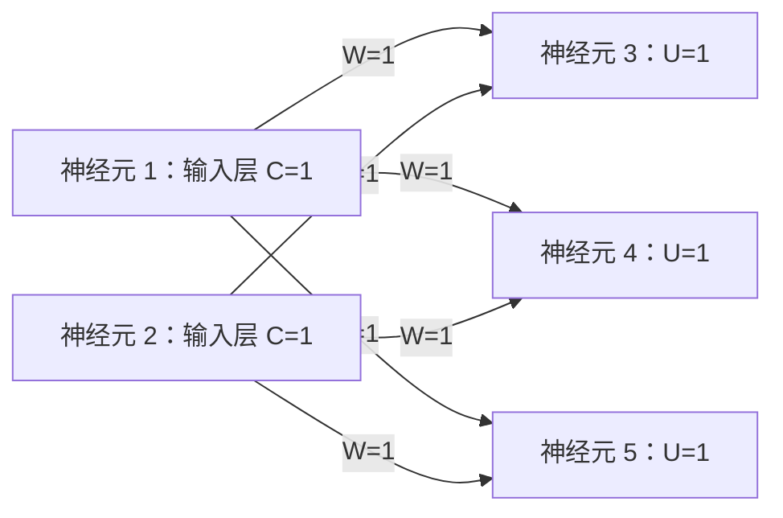

[[TOC]]

## 形式化题目

给定一张分层有向图 $G=(V,E)$，$|V|=n$。两个神经元之间至多一条有向边，
边 $(j,i)$ 带权值 $W_{ji}$（权值可为负）；每个神经元 $i$ 有阈值 $U_i$。
神经元分为输入层、输出层和若干中间层：**每层只向下一层输出、只从上一层接收**，
因此 $G$ 一定无环，是一张 DAG。

每个神经元的状态按公式

$$C_i=\sum_{(j,i)\in E} W_{ji}C_j-U_i$$

更新，并遵守兴奋规则：

- $C_i>0$ 时神经元**兴奋**，下一秒向所有后继发送强度为 $C_i$ 的信号，
  后继 $k$ 把 $W_{ik}\cdot C_i$ 计入自己的求和；
- $C_i\leqslant 0$ 时神经元**平静**，不发送任何信号。

输入层神经元由外部激发，其当前状态 $C_i$ 直接给定（非输入层初始状态必为 $0$）。
网络运转稳定后，求**输出层**（没有出边的神经元）的最终状态：
只输出大于 $0$ 的，按编号从小到大排列；若一个都没有，输出 `NULL`。

题面样例的网络结构如下图（框内为给定初值 $C$ 或阈值 $U$，边标注权值）：

图中 1、2 号是输入层，3、4、5 号没有出边、构成输出层；
每个输出神经元都同时收到 1 和 2 两个上游的信号，这正是「多条边汇合后再扣阈值」
的最小例子，下面的逐点计算表会完整展示这个过程。

## 正解

### 思路

**朴素做法：逐秒同步模拟。**
最直接的写法是按题面时间线走：每一秒，所有兴奋神经元同时沿出边发送
$C_i$ 乘边权的信号，收到信号的神经元累加，再减自己的阈值；重复到一整秒内
状态不再变化为止。因为信号每秒至少前进一层，最多模拟 $O(n)$ 轮，
每轮扫描 $O(p)$ 条边，总复杂度 $O(np)$。也可以按定义写一个递归求值函数
（某点的最终状态 = 兴奋前驱贡献之和 $-\,U_i$，配记忆化），同样正确。

**瓶颈。** 两种朴素写法反复回答的是同一个问题：「神经元 `i` 的最终状态是多少」。
而这个答案只依赖前驱的**最终**状态——前驱一旦定型，`i` 的答案就永远不变。
逐秒模拟却在后续每一轮里让已经定型的点继续参与判断，$O(np)$ 的重复全来自这里。

**关键观察：分层 ⇒ DAG ⇒ 拓扑序一次遍历。**
题面规定网络分层、信号只沿「上一层 → 下一层」流动，所以图中没有环。
DAG 存在拓扑序：每个点排在它所有前驱之后。按拓扑序处理时，点 `i` 被弹出的
那一刻所有前驱都已定型，而且兴奋的前驱离场时已经把 $W_{ji}C_j$ 累加进 `i`，
平静的前驱什么也没加——此时 `state[i]` 恰好等于
$\sum_{(j,i)\in E} W_{ji}C_j$（只含兴奋前驱），扣掉 $U_i$ 就是终值。
于是「多轮传播」被压成「每个点只算一次、每条边只扫一遍」的 $O(n+p)$。

!!! warning 两个必须钉死的细节
- **输入层不套公式**：没有入边的神经元保持题面给定的初值、不扣阈值。
  公式里的 $\sum$ 对输入层为空，它的状态是被外部直接激发出来的；
  若对它也减 $U_i$，单点网络（$C=2,\ U=10$）会算出 $-8$ 而丢失答案。
- **平静的点也要走完出边**：它不发信号，但必须给每个后继的入度减一，
  否则后继永远等不齐上游、不会入队，它的状态（可能恰好是 $-\,U_i$）就漏算了。
!!!

**落地成一次遍历。** 实现用 Kahn 入度法取得拓扑序：读完边后，先把入度大于 $0$
的点的状态减去自己的阈值（输入层保持给定初值），所有入度为 $0$ 的点进就绪栈；
弹出 $u$ 时，若 $C_u>0$ 就对每条出边 $u\to v$ 执行 `state[v] += state[u] * w`，
然后**无条件**把 $v$ 的剩余入度减一，减到 $0$ 的点入栈。全部点处理完后，
扫描出度为 $0$ 的点，输出状态大于 $0$ 的那些。

**样例推演。** 下表按拓扑序展示样例中每个神经元的计算过程，
列依次是：所属层、上游兴奋信号的加权和、阈值、最终状态、是否兴奋。

| 神经元 | 层 | 上游贡献 $\sum W_{ji}C_j$ | 阈值 $U_i$ | 最终状态 $C_i$ | 是否兴奋 |
| --- | --- | --- | --- | --- | --- |
| 1 | 输入层 | 不适用（外部给定） | 不扣减 | $1$ | 是 |
| 2 | 输入层 | 不适用（外部给定） | 不扣减 | $1$ | 是 |
| 3 | 输出层 | $1\cdot 1+1\cdot 1=2$ | $1$ | $2-1=1$ | 是 |
| 4 | 输出层 | $1\cdot 1+1\cdot 1=2$ | $1$ | $2-1=1$ | 是 |
| 5 | 输出层 | $1\cdot 1+1\cdot 1=2$ | $1$ | $2-1=1$ | 是 |

读法：先看输入层两行，初值原样保留且不扣阈值；再看 3 号，
它的两个上游都兴奋，各送来 $1\times 1=1$，汇合成 $2$，减去阈值 $1$ 得 $1$；
4、5 号完全对称。最后 3、4、5 都是出度为 $0$ 的输出层且状态 $1>0$，
按编号升序输出 `3 1`、`4 1`、`5 1`。若某个输出神经元的上游全部平静，
它收到的贡献为 $0$，最终状态就是 $-U_i$，只有它大于 $0$ 时才会被输出；
所有输出神经元的状态都不大于 $0$ 时输出 `NULL`。

### 代码

@include-code(./main.cpp, cpp)

@include-code(./main.py, python)

### 复杂度

- **时间复杂度**：$O(n+p)$。每个神经元入栈、出栈各一次，每条边只在起点
  弹出时扫描一次，预扣阈值是一次 $O(n)$ 扫描；比朴素逐秒模拟的 $O(np)$
  少掉了所有重复轮次。
- **空间复杂度**：$O(n+p)$。邻接表 $O(p)$，状态、入度、出度等工作数组
  与就绪栈各 $O(n)$。

## 总结

- 「分层网络 + 只沿层间传递」= DAG：把**按时间逐秒传播**改写成
  **按依赖拓扑序一次遍历**，每个神经元的终值只算一次，复杂度 $O(n+p)$。
- 兴奋规则是全题唯一陷阱：$C_i>0$ 才发信号，但无论是否兴奋，
  后继的入度都要照常减一，否则下游等不齐上游而漏算。
- 输入层状态由题面给定、不扣阈值；输出层就是出度为 $0$ 的神经元，
  按编号升序输出其中状态大于 $0$ 的，否则输出 `NULL`。
