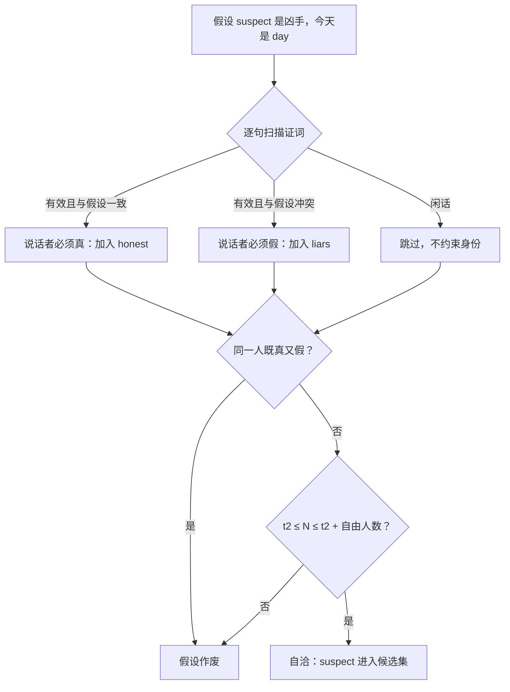

[[TOC]]

## 形式化题目

有 $M$（$1 \leqslant M \leqslant 20$）个人，其中**恰好** $N$（$1 \leqslant N \leqslant M$）个人始终说谎，其余人始终说真；凶手只有一人。给出 $P$（$1 \leqslant P \leqslant 100$）条证词，每条形如 `说话者: 证词`。

只有 5 类证词进入推理：

| 编号 | 句式 | 含义 |
| --- | --- | --- |
| ① | `I am guilty.` | 说话者自认是凶手 |
| ② | `I am not guilty.` | 说话者否认作案 |
| ③ | `<名字> is guilty.` | 指认`<名字>`是凶手 |
| ④ | `<名字> is not guilty.` | 替`<名字>`洗清嫌疑 |
| ⑤ | `Today is <星期>.` | 断言今天是星期几 |

其余所有句子都是闲话，对推理毫无影响。要求判断：若能唯一确定凶手则输出名字；若有多人可能是凶手输出 `Cannot Determine`；若没有任何人可能是凶手输出 `Impossible`。

## 正解

### 思路

**朴素想法。** 谁真谁假有 $2^M$ 种可能，逐一检查每一种下证词是否自洽，效率太低。但仔细想：证词真假其实不是由"谁真谁假"决定的，而是由**事实**决定的——一旦知道了"凶手是谁"和"今天星期几"，每一句有效证词的真假就立即确定，说真/说谎的身份反而被证词推出来。未知事实只有两个：罪犯（$M$ 种）和星期（$7$ 种），所以只需枚举 $M \times 7 \leqslant 140$ 个假设。

**验证一个假设。** 固定假设（罪犯 = suspect，今天 = day）后，逐句扫描证词：

- 有效证词与假设**一致**（如 suspect 说的 "I am guilty."、"Today is Monday." 而假设正是 Monday）→ 说话者必须说真话；
- 有效证词与假设**冲突**（如别人说的 "I am guilty."）→ 说话者必须说谎；
- **闲话** → 不产生任何约束。

扫描中维护两个集合：已确定说真的 `honest` 和已确定说假的 `liars`。若某句要求说话者真但他已在 `liars`（或反之），该假设直接作废。

**名额恰好是 N。** 设最终 $|\text{liars}| = t_2$、$|\text{honest}| = t_1$，还有 $f$ 个**只说过闲话**的人——他们身份完全自由，想真想假都行。于是假设自洽当且仅当说谎者能**恰好**凑成 $N$ 个：

$$t_2 \leqslant N \leqslant t_2 + f$$

注意是"恰好"而不是"不超过"：$t_2 < N$ 时可以靠自由人补足，但 $t_2 + f < N$ 就凑不齐了。这正是本题最容易漏掉的坑——下面 logic0 样例里 `GUILTY` 就是靠一句闲话保住了说谎名额。

**候选与输出。** 每个通过验证的假设把它的 `suspect` 记入候选集（去重）。候选为空输出 `Impossible`；多于一人输出 `Cannot Determine`；否则输出唯一名字。

### 代码

@include-code(./main.py, python)

### 复杂度

- 时间：$O(M \cdot 7 \cdot P \cdot L)$，其中 $L \leqslant 250$ 是证词长度，即约 $140 \times 100$ 次整句匹配，远在 1 秒以内。
- 空间：$O(P \cdot L)$，存下全部证词。

## 图示解析

### 单个假设的验证流程

下面展示枚举到一个假设（罪犯 = suspect，今天 = day）后的验证过程：

观察重点：闲话分支虽然"跳过"，但说闲话的人会被计入自由名额 $f$——闲话并非毫无作用，它给了这个人自由选择真假的权利。名额不等式在最后统一检查，而不是边扫边数。

### 样例推演：为什么 `GUILTY` 说谎、`HELLO` 也能凑数

以原题样例（`M=3, N=1`）为基础稍作变体，看 logic0 测点同款的名单分配：

| 人 | 说过的话 | 身份 | 说谎？ |
| --- | --- | --- | --- |
| HELLO | `What is your name?`（闲话）、`I am not guilty.` | 真话 | 否（假设 HELLO 是凶手，此句为真） |
| GUILTY | `I am GUILTY.`、`Are you guilty?` | 说谎 | 是（自认凶手与假设冲突） |

假设"凶手是 HELLO"下：`honest = {HELLO}`，`liars = {GUILTY}`（`I am GUILTY.` 按变体识别成"自认凶手"），自由名额 $f = 0$，名额检查 $1 \leqslant N \leqslant 1$ 恰好成立。反过来若把 `I am GUILTY.` 当成闲话，`GUILTY` 就变成自由人，$t_2 = 0$ 靠补足也能凑出 $N=1$——表面上结论相同，但换一个测点（比如再补一句 GUILTY 的闲话）名额判定就会出错；数据里专门放了这类句子来区分"识别变体"和"漏识别"两种写法。

## 总结

- **核心转换**：不枚举"谁真谁假"（$2^M$），枚举"事实"——凶手与星期（$M \times 7$），证词真假随之确定。
- **验证规则**：有效证词定说话者真假，闲话留自由名额；检查"无身份冲突 + $t_2 \leqslant N \leqslant t_2 + f$"。
- **经典坑**：说谎人数是"恰好 $N$"；`I am GUILTY.` 这类大小写变体要识别；含 `guilty` 字样的句子未必是有效证词。
