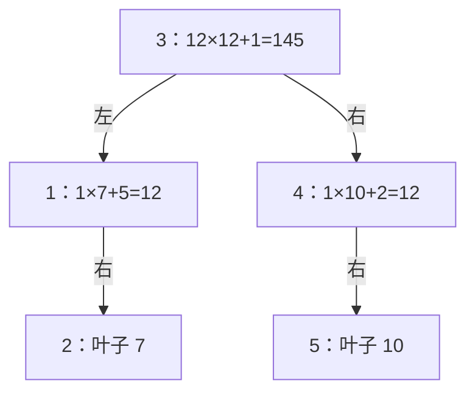

[[TOC]]

## 形式化题目

给定 $n$ 个节点的分数 $d_1, d_2, \dots, d_n$（正整数）。在**所有中序遍历恰好为 $(1,2,\dots,n)$ 的二叉树**中，定义任一子树的加分为

$$\text{subtree 的加分} = \text{左子树的加分} \times \text{右子树的加分} + \text{根的分数}$$

其中空子树的加分规定为 $1$，叶子的加分就是叶节点本身的分数（不考虑它的空子树，即叶子不套用上面的乘加公式）。

求：最高加分，以及取到该加分的那棵树的前序遍历。

例如 $n=5$、分数为 $5,\ 7,\ 1,\ 2,\ 10$ 时，最高加分是 $145$，对应的树如下图（每个节点标出它的加分算式），其前序遍历为 $3\ 1\ 2\ 4\ 5$：

观察这棵树：中序恰好是 $1\ 2\ 3\ 4\ 5$（每个节点的左子树编号都在它左边）；每个节点的加分都按「左 $\times$ 右 $+$ 根」算出，而叶子直接取自身分数；从根 3 出发先根、再左、再右，读出的正是 $3\ 1\ 2\ 4\ 5$。

## 正解

### 思路

**朴素想法与瓶颈。** 最直接的做法是枚举所有中序为 $(1,\dots,n)$ 的二叉树形态，逐棵算分取最大。但形态数是 Catalan 数，$n=30$ 时约 $10^{16}$，枚举整棵树这条路走不通。要绕开它，需要回答：形态为什么多？因为我们在枚举「整棵树」；而题目其实允许把树拆开看——

**观察一：加分公式左右独立。** 乘法两侧的子树只以「加分标量」的身份相乘，左子树怎么长完全不影响右子树的最优性。所以以 $k$ 为根时，左右两段可以**各自独立地取最高**，再用乘法拼起来（加分全为正数，乘法单调，局部最优可拼成全局最优）。

**观察二：中序固定 ⇒ 子树是连续区间。** 中序遍历为 $1..n$ 时，以 $k$ 为根的子树，其节点必然是根左侧的一段 $[l,k-1]$ 和右侧的一段 $[k+1,r]$，不会交错。于是「所有形态」被压缩成「所有区间 $\times$ 所有根」，共 $O(n^2)$ 个子问题——这正是区间 DP 的标准结构。

**状态与转移。** 设 $f[l][r]$ 为中序是区间 $[l,r]$ 的子树能取得的最高加分：

$$f[l][r] = \max_{l \leqslant k \leqslant r} \Big( f[l][k-1] \times f[k+1][r] + d_k \Big) \qquad (l<r)$$

边界：空区间 $f=1$；**叶子是特例**，$f[i][i]=d_i$（题面要求叶子不套乘加公式，若写成 $1\times1+d_i$ 全题都会算错）。按区间长度从小到大求解，短区间先算完，长区间才能引用它们。

**样例的 DP 表。** 下表是样例 $5,\ 7,\ 1,\ 2,\ 10$ 的完整状态，单元格写成 `加分/根`（即 $f[l][r]\,/\,root[l][r]$），行列下标是区间的左右端点：

| $l \backslash r$ | 1 | 2 | 3 | 4 | 5 |
| --- | --- | --- | --- | --- | --- |
| 1 | `5/1` | `12/1` | `13/1` | `25/3` | `145/3` |
| 2 |  | `7/2` | `8/2` | `15/3` | `85/3` |
| 3 |  |  | `1/3` | `3/3` | `13/3` |
| 4 |  |  |  | `2/4` | `12/4` |
| 5 |  |  |  |  | `10/5` |

观察三点：对角线是叶子，直接等于 $d_i$；计算 $[1,5]$ 时用到的子段（如 $[1,2]$、$[4,5]$）都在它的左下方，所以按长度递推是安全的；右上角 `145/3` 给出最终答案——根是 3，左段 $[1,2]$ 最优根是 1、右段 $[4,5]$ 最优根是 4。逐层沿最优根往下走，就还原出了上文那棵树。

**前序遍历还原。** 算分时同时记录每段的最优根 $root[l][r]$（多个根同分时取最靠左的，保证答案确定、与评测数据一致），前序遍历就是「先根、再左段、再右段」：用栈迭代，弹出 $[l,k]$ 输出 $k$，先压右段再压左段，使左段先弹出。样例中即 $3 \to [1,2] \to 1,\ [2,2] \to 2 \to [4,5] \to 4,\ [5,5] \to 5$，得到 `3 1 2 4 5`。

最终答案在 $f[1][n]$。对应到代码，`best(l, r)` 的返回值 `(最高加分, 最优根)` 正是 $f[l][r]$ 与 $root[l][r]$ 的打包：它既参与上层转移，也在前序还原时直接查根，`solve()` 只负责读入、调用和输出。

### 代码

@include-code(./main.cpp, cpp)

@include-code(./main.py, python)

### 复杂度

- 时间复杂度：$O(n^3)$。区间数 $O(n^2)$，每段枚举根 $O(n)$；记忆化保证每个区间只算一次。
- 空间复杂度：$O(n^2)$。缓存所有区间的 `(加分, 根)`，外加 $O(n)$ 的前序栈。$n<30$ 时实测单点约 0.015 s、峰值内存约 15 MB，相对 1000 ms / 32 MB 的限制非常宽裕。

## 总结

这道题的关键是两次视角转换：把「枚举树形态」换成「枚举区间与根」——因为中序遍历固定为 $1..n$，任何子树都是连续编号的一段，根把它劈成左右两个独立子问题；再利用加分公式里左右子树互不干扰，两侧各自取最大即可拼出全局最优。

两个容易踩的点：一是**叶子边界**，题面规定叶子加分就是 $d_i$，不能套 $1\times1+d$ 的公式（套了样例都会算错）；二是**前序还原**，分数之外必须记录每段的最优根，并约定同分取最左，否则同一最高加分可能对应多棵不同的树，前序输出不确定。最终用一个 $O(n^3)$ 的区间 DP 同时拿到分数与结构，7 组真实测试数据全部通过。
