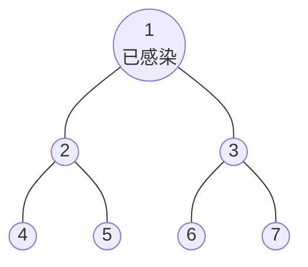

[[TOC]]

## 形式化题目

给定一棵 $n$ 个节点的树，节点 1 已被感染。传播按"代"同步进行：

- 第 0 代只有节点 1 感染；
- 每代开始时，可以切断**一条**连接已感染节点与其尚未感染孩子的边（全局至多一条）；随后所有"已感染节点—未切断边—健康节点"同时传播，健康节点成为该代感染者；
- 当没有健康节点可被继续感染时，传播停止。

求一种逐代切断的顺序，使最终感染的节点总数最少，输出这个最小值。

样例的树与一种最优切断顺序如下（先切 $1\text{-}2$，再切 $3\text{-}6$）：

第 1 代候选边是 $\{1\text{-}2,\,1\text{-}3\}$，切断 $1\text{-}2$ 后只有 3 被感染；第 2 代候选边是 $\{3\text{-}6,\,3\text{-}7\}$，切断 $3\text{-}6$ 后 7 被感染；第 3 代 7 没有孩子，传播停止。感染集合 $\{1,3,7\}$ 共 3 人，与输出一致。

一个容易被忽略的点：**切断机会与"代"绑定**。孩子边只能在父节点被感染的下一代被切断——那一代没切，孩子就永久感染，之后再无切断价值。因此第 $k$ 代的候选边恰好是"第 $k-1$ 代新感染者的孩子边"，我们称这个集合为该层的**前沿**。切断 $u$ 与父节点之间的边，就能保住以 $u$ 为根的整棵子树，于是：

$$\text{最终感染人数} = n - \sum \text{各层被切断子树的大小}$$

问题转化为：**逐层在前沿中选一条边切断，最大化被切断子树的大小之和**。

## 正解

### 思路

**朴素做法：每层枚举所有候选边递归。** 拿到本层前沿 $F$，逐个尝试切断 $u \in F$：本层救下 $\mathrm{size}[u]$，下一层前沿变成"其余前沿节点的孩子" $\bigcup_{v \in F \setminus \{u\}} \mathrm{children}(v)$，递归到前沿为空时结算、取最大。做法正确，但搜索树是**各层分支数的连乘**——一层有 $f$ 条候选边、连续 $d$ 层就是 $f^d$ 条路径，$n = 300$ 时轻松构造出天文数字级的路径数，必然超时。

**第一反应的优化是贪心：每层切断子树最大的候选。它不正确。** 反例是一棵 $n = 24$ 的树：根的两个孩子中，$A$ 只有一个孩子 $a_1$、$a_1$ 挂 10 片叶子（$\mathrm{size}(A) = 12$），$B$ 直接挂 10 片叶子（$\mathrm{size}(B) = 11$）。

| 方案 | 第 1 层切断 | 第 2 层切断 | 总保住 | 最终感染 |
| --- | --- | --- | --- | --- |
| 贪心（先切大） | $A$，救 12 | $B$ 的 1 片叶子，救 1 | 13 | 11 |
| 先切小 | $B$，救 11 | $a_1$，救 11 | 22 | 2 |

贪心先切 $A$，把 $B$ 留进感染区，第 2 层候选只剩 10 片孤叶，每层最多救 1；先切 $B$，第 2 层前沿只剩 $\{a_1\}$，可以整棵切掉。**当前层的收益和未来层会长出什么候选耦合，逐层贪心看不到未来，只能搜索。**

**关键观察：决策只依赖本层前沿。** 切断选择影响的只有下一层前沿，与更早的历史无关——不同切断路径会**汇聚到同一个前沿集合**，它们的后续最优收益完全相同。朴素搜索慢不是状态多，而是把同一个子问题沿不同路径算了无数遍。于是把"前沿为 $F$ 时，之后每层各切一条边最多救下多少人"定义为记忆化对象：

$$
\mathrm{saved}(F) =
\begin{cases}
0, & F = \varnothing \\
\max\limits_{u \in F} \Big(\mathrm{size}[u] + \mathrm{saved}\big(\mathrm{kids}(F) \setminus \mathrm{children}(u)\big)\Big), & \text{否则}
\end{cases}
$$

其中 $\mathrm{kids}(F) = \bigcup_{u \in F} \mathrm{children}(u)$ 是"不切断时"的下一层候选；切断 $u$ 后，它的孩子随子树一起出局，所以下一层前沿是 $\mathrm{kids}(F) \setminus \mathrm{children}(u)$。

两个细节把递推钉死：

1. **每层必切，不切不会更好。** 若某层不切，全部前沿感染。对任意候选 $u$：切断立得 $\mathrm{size}[u]$；不切的方案里，$u$ 子树内部未来的切断互不相交，总收益至多 $\sum_{c \in \mathrm{children}(u)} \mathrm{size}[c] = \mathrm{size}[u] - 1$，且 $u$ 自己必然感染；而其余区域的切断序列沿各自的祖先链进行，与 $u$ 子树互不干扰，可以原样保留。所以"切一条"逐层替换总不劣，递推只需枚举切断选择。
2. **原问题的答案**：初始前沿是根的孩子，$\text{感染人数} = n - \mathrm{saved}(\mathrm{children}(1))$。

把样例代入递推，就是下面这张状态表（行即 `saved` 的三个缓存状态）：

| 状态 $F$（本层前沿） | 切断后下一层前沿 | 枚举切断的收益 | $\mathrm{saved}(F)$ |
| --- | --- | --- | --- |
| $\{4,5\}$ | $\varnothing$ | 切 4：$1+0$；切 5：$1+0$ | 1 |
| $\{6,7\}$ | $\varnothing$ | 切 6：$1+0$；切 7：$1+0$ | 1 |
| $\{2,3\}$ | 切 2 → $\{6,7\}$；切 3 → $\{4,5\}$ | $3+\mathrm{saved}(\{6,7\})=4$；$3+\mathrm{saved}(\{4,5\})=4$ | 4 |

最终 $7 - \mathrm{saved}(\{2,3\}) = 7 - 4 = 3$。这正是一棵"DFS 按层枚举切断选择"的搜索树，`@cache` 把到达同一前沿的分支合并、只保留最优值——等价于对搜索树做最优性剪枝：先算出的状态直接复用，后续到达该状态的分支不再展开。

**实现上的最后一块拼图是位图。** $n \leqslant 300$，前沿集合用一个 Python 大整数编码（第 $i$ 位为 1 表示节点 $i$ 在前沿中）：累 $\mathrm{kids}(F)$ 是按位或，转移 `nxt & ~kids[u]` 是按位与非，取位下标靠 `m & -m` 取最低位——全部是机器字级操作，与 C++ `bitset` 解法同阶。

### 代码

@include-code(./main.py, python)

代码分三层：`bits` 产出位图中的节点下标；`saved` 承载递推（基例 $F = \varnothing$ 返回 0，否则先按位或累出 $\mathrm{kids}(F)$，再枚举本层每条候选边取最大收益）；`solve` 只做读入、层序 BFS 建树、逆序算子树大小 `size`、预计算孩子位图 `kids`，最后输出 `n - saved(kids[0])`。注意 BFS 用 `if v and parent[v] < 0` 同时排除根回边与重复访问；$n = 1$ 时 `kids[0] = 0`，直接输出 1。

### 复杂度

- **时间复杂度** $O(S \cdot n)$：$S$ 为可达前沿状态数，每个状态遍历前沿中 $|F|$ 个位做位图合并与缓存查询（Python 大整数位运算按机器字计）。朴素无记忆化搜索是各层分支数的连乘（指数级），记忆化把路径数塌缩成状态数——实测 $n = 300$ 的最大数据 14887 个状态、单测例 $0.309$ 秒，全部 10 组真实数据均低于 $0.31$ 秒，小于 OJ 的 1000ms 限制。
- **空间复杂度** $O(S + n)$：缓存 $S$ 个 `int -> int` 条目，加 `size`/`kids`/`children` 各 $O(n)$；实测峰值 16.8MB（限制 32MB）。递归深度为传播代数，不超过树高 300，在默认递归上限内。

## 总结

- 传播按代同步推进，第 $k$ 代的候选切断边恰好是第 $k-1$ 代新感染者的孩子边（前沿），切断 $u$ 与父的边救下以 $u$ 为根的整棵子树，故 $\text{感染人数} = n - \text{各层切断子树大小之和}$。
- 逐层贪心（每层切最大子树）不正确：切断选择决定未来层的候选结构，收益跨层耦合，必须搜索。
- 状态 = 本层前沿集合，转移 = 枚举本层切断哪条边；每层必切（不切的方案可逐层替换成切一条而不变差），递推 $\mathrm{saved}(F) = \max_{u \in F}(\mathrm{size}[u] + \mathrm{saved}(\mathrm{kids}(F) \setminus \mathrm{children}(u)))$。
- 不同切断路径汇聚到相同前沿，`functools.cache` 记忆化把指数级搜索树合并成可达状态图；前沿用位图编码，转移全是字级位运算。
- 易错点：切断机会只有一次（父节点感染的下一代），不能推迟到更晚的代；$n = 1$ 时输出 1。
