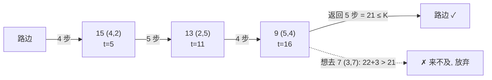

[[TOC]]

## 形式化题目

在一个 $M \times N$ 的网格中，部分格子上有权值（花生数），且这些权值**互不相同**。多多从网格外的"路边"出发，每个单位时间可以：跳到第一行的某个格子、移动到四邻接的格子、收集当前格子的权值（每格至多一次）、或从第一行的格子跳回路边。给定时间上限 $K$，求按"每次都去当前剩余权值最大的格子"这一固定顺序（题目强制要求）能收集到的权值总和的最大值。若时间不足以采集某个格子并返回，就跳过后续所有采集直接返回。

## 正解

### 思路

**第一步：确定采摘顺序。** 题面规定多多必须"先摘花生最多的，再摘剩下里最多的，依此类推"。所以行走路线不是我们自由规划的，而是唯一确定的：把所有长花生的格子按花生数**从大到小排序**，依次访问即可。

**第二步：计算时间。** 记路边在网格上方，从路边跳到第 $r$ 行、第 $c$ 列的植株需要 $r$ 步（向下移动 $r$ 次，横向移动自由），从 $(r,c)$ 跳回路边也只需要 $r$ 步（横向移动在跳跃前后自由进行）。于是一条完整路线的时间构成为：

- 进田：从路边跳到第一棵植株 $(r_1,c_1)$，花 $r_1$ 步；
- 每采一棵：移动 $|r_i - r_{i-1}| + |c_i - c_{i-1}|$ 步，再花 $1$ 步采摘；
- 出田：从最后一棵 $(r,c)$ 跳回路边，花 $r$ 步。

**第三步：贪心判定。** 按排序后的顺序模拟，维护已用时间 $t$ 和当前位置。对于下一棵植株，先假设"移动过去 + 采摘"，检查此时剩余时间是否还够从它跳回路边；够就采，不够就立刻停止——因为后面的植株花生更少，采它们不会更优，题目也要求时间一到必须回路边。

用样例 1 验证一下时间公式（$M=6, N=7, K=21$）。花生按个数排序为 $15(4,2),\ 13(2,5),\ 9(5,4),\ 7(3,7)$，行走过程如下（进入花 $4$ 步、返回花 $4$ 步）：

| 步骤 | 目标 | 移动 | 采摘 | 累计时间 $t$ | 是否返回得及 | 累计花生 |
| --- | --- | --- | --- | --- | --- | --- |
| 进田+采 15 | $(4,2)$ | $4$（进田） | $1$ | $5$ | $5+4=9 \leqslant 21$ ✓ | $15$ |
| 采 13 | $(2,5)$ | $2+3=5$ | $1$ | $11$ | $11+2=13 \leqslant 21$ ✓ | $28$ |
| 采 9 | $(5,4)$ | $3+1=4$ | $1$ | $16$ | $16+5=21 \leqslant 21$ ✓ | $37$ |
| 采 7 | $(3,7)$ | $2+3=5$ | $1$ | $22$ | $22+3=25 > 21$ ✗ | $37$ |

最后停在累计 $37$，与样例输出一致。样例 2 只把 $K$ 改成 $20$：采完 $9$ 之后 $16+5=21 > 20$，返回来不及，所以答案停在 $28$——正好体现"必须留出返程时间"这个关键判定。

| 步骤 | 目标 | 累计时间 $t$ | 返回检查 | 累计花生 |
| --- | --- | --- | --- | --- |
| 进田+采 15 | $(4,2)$ | $5$ | $9 \leqslant 20$ ✓ | $15$ |
| 采 13 | $(2,5)$ | $11$ | $13 \leqslant 20$ ✓ | $28$ |
| 采 9 | $(5,4)$ | $16$ | $21 > 20$ ✗，停止 | $28$ |

### 代码

@include-code(./main.py, python)

### 复杂度

设共有 $P$（$P \leqslant MN \leqslant 400$）棵长花生的植株：排序 $O(P \log P)$，模拟 $O(P)$，总复杂度 $O(MN \log(MN))$，对 $400$ 棵植株来说远在限制之内。

## 图示解析

把样例 1 的完整行走路线画在网格上，可以直观看到"按花生数从大到小折返走"的形状：

观察要点：

1. 路线完全由"花生数从大到小"决定，多多在网格里走的是一条折返的锯齿形路径，与人类直觉"就近采摘"无关。
2. 每个节点上标注的 $t$ 是"移动 + 采摘完成"的时刻，返回检查用的正是这个 $t$ 加上当前行数。
3. 最后一个节点 $7$ 放弃的原因要算总账：移动后 $t=22$ 已超 $K$，加上返回更是 $25 > 21$。代码里不分"移动超时"还是"返回超时"，用一次 `if` 对"移动 + 采摘 + 返回"的总时间统一判定。

## 总结

- 题目把行走顺序锁死为"花生数从大到小"，本题因此从"带时间窗的采集规划"退化成一道**排序 + 模拟**题。
- 两个易错点：一是第一段路（进田）和最后一棵植株的返回时间都要计入；二是判定时机是"移动 + 采摘之后还能否返回"，而不是"能否移动过去"。
- 时间构成：进田 $r_1$ 步，转移 $|r_i-r_{i-1}|+|c_i-c_{i-1}|+1$ 步，出田 $r$ 步；按顺序模拟到第一棵"返回来不及"的植株为止。
- 复杂度 $O(MN \log(MN))$，$M, N \leqslant 20$ 下规模极小。
