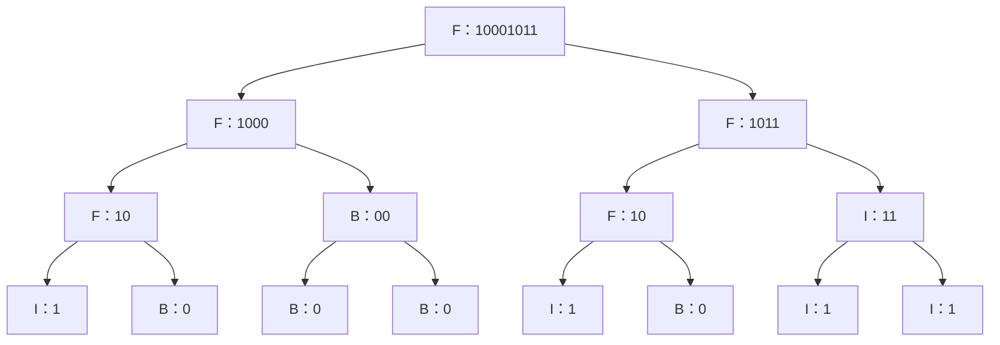

[[TOC]]

## 形式化题目

对 `01` 串定义三类：全 `0` 为 B，全 `1` 为 I，两者都有为 F。

给定长度 $2^N$ 的 `01` 串 $S$，递归构造一棵二叉树：根结点类型等于 $S$ 的类型；若 $|S| > 1$，把 $S$ 从中间对半分成等长的 $S_1$（左）、$S_2$（右），分别递归构造左右子树。求所得 FBI 树的后序遍历序列（左子树 → 右子树 → 根）。

样例 $N = 3$、$S = 10001011$ 构造出的树如下，结点内为类型与对应子串：

叶子是 $2^3 = 8$ 个单字符，内部结点的类型由它那一段子串决定；后序遍历输出 `IBFBBBFIBFIIIFF`，长度 $2^4 - 1 = 15$，与题面样例一致。

## 正解

### 思路

朴素做法是照题面把树真的建出来：递归里创建保存「类型 + 左右孩子指针」的结点对象，等整棵树建完，再写一个后序遍历函数去收集字符。但结点对象携带的信息只有「子串 + 左右孩子」，而子串本身就是全部信息——多出的那层结构没有增加任何信息量，也没有被后续步骤用到。

于是把两步折叠成一步：递归函数 `build(seg, out)` 处理子串 `seg`，**调用顺序直接按后序走**——先递归左半，再递归右半，返回前把自己的类型追加进输出列表 `out`。这样每次「访问结点」的时刻恰好就是后序里该输出根的时刻，建树与遍历同时完成，不需要任何显式结点。

类型判定放在递归进入时立刻做，因为某个结点的类型只取决于它自己的子串里 `0`/`1` 是否同时出现，与子树算完与否无关：

- `'1' not in seg`（没有 1）→ 全 0 → B；
- `'0' not in seg`（没有 0）→ 全 1 → I；
- 否则两者都有 → F。

以样例展示「左片段 + 右片段 + 根」的拼接过程，按递归返回的先后（自底向上）排列：

| 子串 | 类型 | 左子树后序 | 右子树后序 | 根 | 本树后序 |
| --- | --- | --- | --- | --- | --- |
| `10` | F | `I` | `B` | `F` | `IBF` |
| `00` | B | `B` | `B` | `B` | `BBB` |
| `1000` | F | `IBF` | `BBB` | `F` | `IBFBBBF` |
| `11` | I | `I` | `I` | `I` | `III` |
| `1011` | F | `IBF` | `III` | `F` | `IBFIIIF` |
| `10001011` | F | `IBFBBBF` | `IBFIIIF` | `F` | `IBFBBBFIBFIIIFF` |

表中 `10` 这一段在左右子树里各出现一次，两次递归各自输出一份 `IBF`；最后一行左右两列拼上根字符，正是答案。逐行往下看就是「先递归、后记根」在每一层的效果，整棵树没有任何一行之外的输出。

递归边界是长度为 1 的子串：它不再对半分，直接把单字符的类型（`0`→B、`1`→I）追加进 `out`，即满二叉树的叶子。

### 代码

`build` 中 `node` 即当前子串类型，`out.append(node)` 位于两次递归之后，对应后序的「根最后输出」；`solve` 只做读入、调用与输出。

@include-code(./main.py, python)

### 复杂度

- 时间复杂度：$O(2^N \cdot N)$。树深 $N+1$ 层，每层所有结点的子串长度之和恰为 $2^N$，每层的类型扫描共 $O(2^N)$，合计 $O((N+1) \cdot 2^N)$；$N \leqslant 10$ 时不超过万余次字符检查。与标准 C++ 解法同阶。
- 空间复杂度：$O(2^N)$。输出列表存放 $2^{N+1} - 1$ 个字符，递归栈深 $N + 1 \leqslant 11$ 层；不需要 `setrecursionlimit`。

## 总结

- 树的递归定义可以直接翻译成递归函数：一次递归调用 = 一个结点，对半切分 = 左右孩子，长度 1 = 叶子。**调用结构本身就是树结构**，不必先建树再遍历。
- 后序遍历的实现只有一行顺序要求：递归左、递归右、记根——把「记根」写在两次递归之后，输出序列天然正确。
- 类型判定是局部量：判断一段串是 B/I/F 只看 `0`/`1` 是否同时出现，不需要等子树算完，因此判定可以提到进入时做。
- 复杂度 $O(2^N \cdot N)$ 与显式建树 + 遍历同阶；实测 10 组真实数据全部一致，单点约 $0.017\ \mathrm{s}$、峰值 $14.6\ \mathrm{MB}$，相对 1000 ms / 32 MB 的限制十分宽裕。
