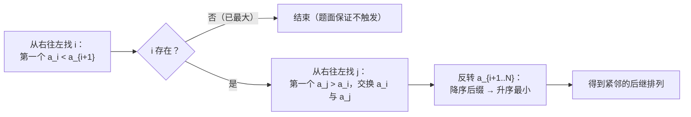

[[TOC]]

## 形式化题目

给定 $1\sim N$ 的一个排列 $a$，把排列按字典序从小到大排列后，第 $k$ 小的排列表示整数 $k$。求表示整数「$a$ 表示的整数 $+M$」的排列，即字典序上 $a$ 之后的第 $M$ 个排列。题目保证结果仍在 $1\sim N$ 的全排列范围内。

## 正解

### 思路

**朴素想法**：$N$ 根手指能形成 $N!$ 个排列，若枚举全部排列再定位，复杂度是 $O(N \cdot N!)$，$N=10^4$ 时完全不可行（只能过 $N \leqslant 15$ 的部分分）。

**关键观察**：排列与整数的对应就是「字典序排列 → 序号」的双射，所以「加上 $M$」不需要知道具体数值，只要在排列序列上**向后走 $M$ 步**。而「走一步」就是求当前排列的**下一个排列**（`next_permutation`），它有一个 $O(N)$ 的经典做法。$M \leqslant 100$，总共做 $M$ 次即可，复杂度 $O(NM) \approx 10^6$。

`next_permutation` 的推导只有一个不变量：**降序后缀已经是这段后缀能组成的最大排列**。因此从右往左找到第一个 $a_i < a_{i+1}$ 的位置 $i$（右侧后缀整体降序），整个排列要变大，唯一的机会就是把 $a_i$ 换大：

1. 从右往左找第一个大于 $a_i$ 的 $a_j$——右后缀降序保证它就是"比 $a_i$ 大的数中最小的"；
2. 交换 $a_i$ 与 $a_j$，让第 $i$ 位增大得尽量少；
3. 交换后右后缀仍然降序，把它**反转**成升序，后缀取到最小——于是得到紧邻的后继。

用样例 `1 2 3 4 5` 加 $3$ 走三步：

| 步 | 当前排列 | 枢轴 $a_i$（含位置） | 交换对象 | 反转后缀 | 得到的排列 |
| --- | --- | --- | --- | --- | --- |
| +1 | `1 2 3 4 5` | $4$（第 4 位） | $5$ | `5` | `1 2 3 5 4` |
| +2 | `1 2 3 5 4` | $4$（第 4 位） | $5$ | `5` | `1 2 4 3 5` |
| +3 | `1 2 4 3 5` | $3$（第 4 位） | $5$ | `4 3` | `1 2 4 5 3` |

观察重点：前两步枢轴都在最后一位（后缀长度为 2），只发生局部交换；第三步 `3 5` 后缀里 $3$ 变大后，`4 3` 这段降序后缀被反转成 `3 4`——"换最小可增大者 + 后缀取最小"正是保证结果**恰好**是后继、而不是更靠后某个排列的原因。

### 代码

@include-code(./main.py, python)

### 复杂度

- 时间：单次 `next_permutation` 从右扫描与反转都是 $O(N)$，共做 $M$ 次，总计 $O(NM)$，$N \leqslant 10^4$、$M \leqslant 100$ 时约 $10^6$ 次基本操作。
- 空间：$O(N)$，只存排列本身。

## 总结

- 排列按字典序与整数一一对应，「加 $M$」= 在排列序列上向后走 $M$ 步。
- 一步 = 一次 `next_permutation`：找枢轴 $a_i < a_{i+1}$、与右后缀中最小的大于 $a_i$ 者交换、反转降序后缀。
- 复杂度 $O(NM)$，与 C++ 正解同阶；边界上对"已是最大排列"（$i<0$）做了兜底，虽然题面保证不会出现。

## 图示解析

上图是单次 `next_permutation` 的完整决策流程：一切动作都发生在那个降序后缀里——枢轴 $i$ 是后缀左侧第一个"还能变大"的位，$j$ 的选取让增量最小，反转让后缀最小。三步合起来，恰好产生字典序加一的效果；把这图跑 $M$ 遍，就是本题的加法。
