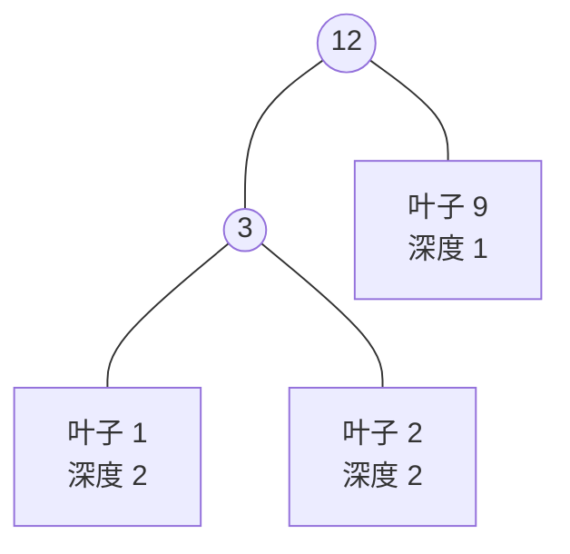
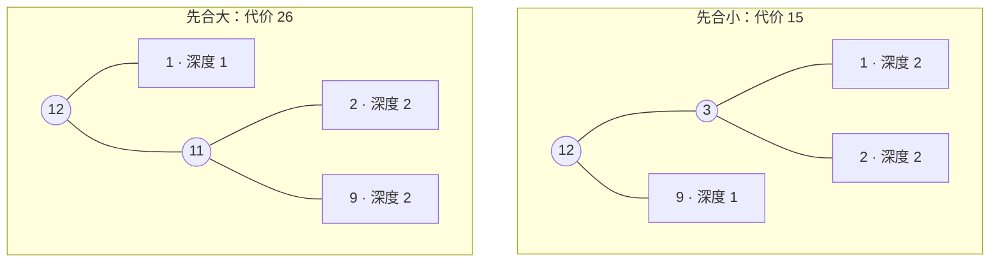

[[TOC]]

## 形式化题目

给定 $n$ 个正整数 $a_1, a_2, \dots, a_n$，代表 $n$ 堆物品的重量。每次操作可以任选两堆合并成一堆，新堆重量为二者之和，本次操作代价为二者之和。经过恰好 $n-1$ 次操作后只剩一堆。求所有操作方案中，代价总和的最小值。

例如 $a = \{1, 2, 9\}$：先合并 $1, 2$，代价 $3$；再把 $3$ 与 $9$ 合并，代价 $12$；总计 $3 + 12 = 15$，是最小值。

样例合并过程如下（展示每次合并哪两堆、本次代价、合并后剩余的堆）：

| 轮次 | 合并前各堆 | 合并的两堆 | 本次代价 | 合并后各堆 |
| --- | --- | --- | --- | --- |
| 1 | 1, 2, 9 | 1 和 2 | 3 | 3, 9 |
| 2 | 3, 9 | 3 和 9 | 12 | 12 |

总代价 $3 + 12 = 15$。观察表格可以发现：第一轮合并的 $1$ 被计了两次价（第一次自己 $1$，第二次藏在 $3$ 里），而 $9$ 只被计了一次。**越小的堆被合并的次数（计价次数）越多**，这就是本题贪心的直觉来源。

## 正解

### 思路

**第一步：从合并方案到合并树。** 每堆果子看成一个带权叶子，每次合并新建一个内部节点，权值为两个孩子之和。$n-1$ 次合并恰好构造出一棵有 $n$ 个叶子的二叉树。一份重量为 $a_i$ 的果子，每"参与"一次合并就被计一次价，而它参与的次数正好等于它在合并树中的深度，所以：

$$\text{总代价} = \sum_{i=1}^{n} a_i \times \text{depth}_i$$

即合并树叶子的**带权路径长度（WPL）**。问题变成：构造一棵二叉树，最小化 WPL——这正是经典的**哈夫曼树**问题。

上图就是样例的最优合并树。每个叶子的权值 × 深度求和：$1 \times 2 + 2 \times 2 + 9 \times 1 = 15$，与逐次模拟的结果一致。深度越深的叶子对代价贡献越大，所以**大的权值应该放在浅处、小的权值放在深处**。

**第二步：从朴素到贪心。** 最朴素的做法是每一步线性扫描当前所有堆，找出最小的两堆合并，共 $n-1$ 步，复杂度 $O(n^2)$。它已经包含了正确的贪心结论，只是"找最小的两堆"太慢。

为什么"每次合并最小的两堆"是对的？用归纳法看：

1. 最优合并树中，深度最大的叶子必然成对出现（若最深叶子的"兄弟位"空着，把别的叶子挪过去做兄弟不会增大代价）；
2. 于是权值最小的两个叶子可以放在同一最深深度且互为兄弟——把它们的权值 $x, y$ 换成权值 $x+y$ 的新叶子后，得到规模为 $n-1$ 的子问题；
3. 子问题最优解 $T'$ 对应原问题代价 $T' + (x + y)$，反之原问题任何方案都能调整成"先合并 $x,y$"而不变差。所以每轮贪心地合并当前最小的两堆，逐轮归纳，得到全局最优。

**第三步：用堆消除瓶颈。** 贪心全程只需要两种操作：反复"取出最小的两个元素"和"插入一个新元素"——这正是小根堆的标准场景。把所有堆重量建一个小根堆，每轮 `heappop` 两次求和、累加进答案、再把和 `heappush` 回去，单轮 $O(\log n)$，总复杂度降到 $O(n \log n)$。

### 代码

@include-code(./main.py, python)

代码只有两层：`huffman_total` 承载全部算法（`heapify` 原地建堆，循环 $n-1$ 轮，每轮弹两个最小值求和压回），`solve` 只做读入和输出。注意 $n=1$ 时循环范围为空，直接输出 $0$——只有一堆时无需任何合并。

### 复杂度

- **时间复杂度** $O(n \log n)$：建堆 $O(n)$，$n-1$ 轮、每轮 2 次弹出 + 1 次插入各 $O(\log n)$。$n \leqslant 10^4$ 时约 $1.4 \times 10^5$ 次堆操作，实测全部测试数据单测例不超过 $0.021$ 秒，远小于 1 秒限制。
- **空间复杂度** $O(n)$：堆直接建在输入数组上。
- 对比：$O(n^2)$ 的朴素扫描版在 $n = 10^4$ 时是 $10^8$ 级别运算，Python 下会超时；堆版只替换了"取最小"的实现，贪心结论不变。

## 总结

- 合并果子 = 构造合并树，总代价等于叶子的带权路径长度 $\sum a_i \times \text{depth}_i$，是最小化 WPL 的哈夫曼树问题。
- 贪心策略：每次取出当前最小的两堆合并，代价累加；正确性由"最小两权值可放在最深兄弟位"的归纳论证保证。
- 数据结构：小根堆把"反复取最小 + 插入"做到 $O(\log n)$，整体 $O(n \log n)$，轻松通过 $n \leqslant 10^4$。
- 易错点：$n = 1$ 要输出 $0$；C++ 实现需注意累加值可能超过 `int` 范围（Python 无此顾虑）。

## 图示解析

### 合并次序如何决定代价

同一个例子 $a = \{1, 2, 9\}$，对比"先合大"与"先合小"两种次序：

| 次序 | 合并过程 | 总代价 |
| --- | --- | --- |
| 先合小（最优） | $(1+2)=3$，$(3+9)=12$ | $3 + 12 = \mathbf{15}$ |
| 先合大 | $(2+9)=11$，$(1+11)=12$ | $11 + 12 = 26$ |

两张合并树对比（前者小权值沉底，后者大权值 $9$ 被压到深度 2）：

观察重点：代价是"权值 × 深度"的和，先合小让最重的 $9$ 留在深度 1，只计一次价；先合大则 $9$ 和 $2$ 被压到深度 2，各多计一次价，多出的恰好是 $26 - 15 = 11$。哈夫曼贪心的本质就是**让大权值尽量浅、小权值尽量深**。
