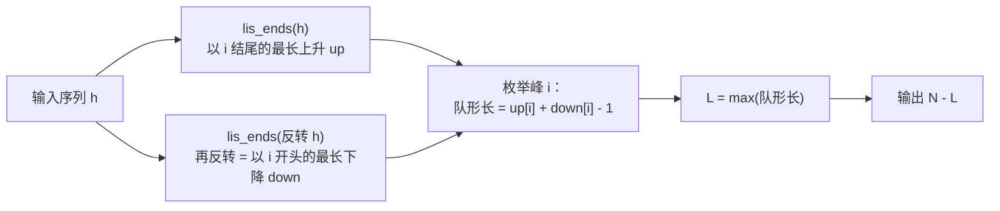

[[TOC]]

## 形式化题目

给定长度 $N$（$2 \leqslant N \leqslant 100$）的整数序列 $T_1, \dots, T_N$（$130 \leqslant T_i \leqslant 230$，可重复）。删掉若干个元素、保持相对顺序不变，使剩下的序列存在一个位置 $p$ 满足

$$T_1 < \cdots < T_p > \cdots > T_K \quad (1 \leqslant p \leqslant K),$$

即先严格上升、到峰 $p$ 后严格下降（峰在两端时退化为纯上升或纯下降）。求最少删除数。等价地，先求最长的这种"单峰子序列"长度 $L$，答案 $= N - L$。

样例：$N=8$，序列 `186 186 150 200 160 130 197 220`，输出 `4`——保留 `150 200 160 130`（峰为 200）或 `150 160 197 220`（纯上升）都得到长度 4 的合法队形，故最多留 4 人、最少删 $8-4=4$。

## 正解

### 思路

**朴素想法**：枚举全部 $2^N$ 个保留子集，逐个检查"先严格升后严格降"，取最长合法者。$N=100$ 时 $2^{100}$ 完全不可行——指数枚举把"每位选/不选"当成独立决策，没有利用子序列的子结构（合法队形的前缀本身也是合法上升段），只能过 $N \leqslant 20$ 的部分数据。

**关键观察**：一个合法队形被峰 $p$ 唯一切成两半——左侧（含 $p$）是以 $p$ **结尾**的严格上升子序列，右侧（含 $p$）是以 $p$ **开头**的严格下降子序列。于是对每个 $p$ 分别求两段最优值再拼接，指数问题化成两个多项式子问题：

- `up[i]` = 以第 $i$ 位结尾的最长严格上升子序列长度，转移 $up[i] = 1 + \max\{up[j] \mid j < i,\ T_j < T_i\}$（无前驱时为 1）；
- `down[i]` = 以第 $i$ 位开头的最长严格下降子序列长度——把序列**反转**后就是同一个 LIS，求完再反转回来，复用同一段代码；
- 两段都算了峰 $p$ 自己一次，拼接长度为 $up[p] + down[p] - 1$。枚举峰取最大：

$$L = \max_{1 \leqslant i \leqslant N} \big(up[i] + down[i] - 1\big), \qquad \text{答案} = N - L.$$

转移条件用**严格** $T_j < T_i$，相等身高（样例里两个 186）天然不能互接，与题面严格不等号一致；$up[i]=1$ 或 $down[i]=1$ 覆盖了峰在两端的退化情形。

在样例上把两张 DP 表逐位算出并合成（下表即 `main.py` 的执行过程）：

| 位置 $i$ | 0 | 1 | 2 | 3 | 4 | 5 | 6 | 7 |
| --- | --- | --- | --- | --- | --- | --- | --- | --- |
| $T_i$ | 186 | 186 | 150 | 200 | 160 | 130 | 197 | 220 |
| $up[i]$ | 1 | 1 | 1 | 2 | 2 | 1 | 3 | 4 |
| $down[i]$ | 3 | 3 | 2 | 3 | 2 | 1 | 1 | 1 |
| $up[i]+down[i]-1$ | 3 | 3 | 2 | **4** | 3 | 1 | 3 | **4** |

观察重点：位置 3（$T=200$）的 $up=2$ 来自左边更矮的 150，$down=3$ 来自右边递减的 160、130，拼出 `150 200 160 130`；位置 7（$T=220$）的 $up=4$ 是纯上升段 `150 160 197 220`、$down=1$。两处都取到 $\max = 4$，故输出 $8-4=4$，与题面一致。位置 1 的 186 因前一位 186 不满足严格小于，$up$ 仍是 1——重复身高被严格条件挡住。

### 代码

@include-code(./main.py, python)

### 复杂度

- 时间：`lis_ends` 对每个 $i$ 扫遍所有前驱并比较身高，单次 $O(N^2)$；正、反各调用一次，再枚举峰合成 $O(N)$，总计 $O(N^2)$。$N \leqslant 100$ 时约 $2\times 10^4$ 次比较，与 C++ 正解（同为按位 LIS DP）同阶。用 `bisect` 维护 tails 可降到 $O(N \log N)$，但 $N=100$ 下没有实际收益。
- 空间：$O(N)$，`up`、`down` 各一个长度 $N$ 的列表，无递归栈。

## 总结

- 最少删除数 $= N -$ 最长单峰子序列长度；单峰 = 一个峰左侧严格上升 + 右侧严格下降。
- 枚举峰：以 $i$ 结尾的 LIS `up` + 以 $i$ 开头的 LDS `down`（反转序列复用同一函数），峰处拼接要 $-1$ 去重。
- 严格比较 $T_j < T_i$ 保证重复身高不会被接进同一段；`default=0` 让首位自然取长度 1。
- 复杂度 $O(N^2)$，与正解同阶；本题 $N=100$，Python 远不会 TLE。

## 图示解析

上图是 `main.py` 的完整数据流：同一个 `lis_ends` 被正、反两个方向各调用一次（这也是它值得抽成函数的原因），"反转"把下降段问题整体变成上升段问题；合成阶段唯一的坑是峰被两段各算一次，所以要 $-1$。整个算法只有读入、两次 DP、一次取最大四步，没有递归与额外数据结构。
