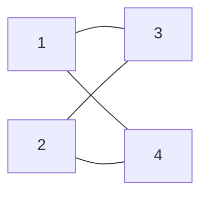

[[TOC]]

## 形式化题目

$n$ 个编号为 $1 \dots n$ 的人初始按 $1,2,\dots,n$ 的顺序坐成一圈。每人给出两个互不相同的"愿望邻居"。一条命令形如 $(b_1,b_2,\dots,b_m)$，在被点名的 $m$ 个人之间循环换座：$b_1$ 移到 $b_2$ 的座位、$\dots$、$b_m$ 移到 $b_1$ 的座位，代价等于 $m$。求用若干条命令使**每个人左右两侧恰好是自己愿望中的两人**时的最小总代价；不可能做到则输出 $-1$。

样例 $n=4$，愿望为 $1:\{3,4\}$、$2:\{4,3\}$、$3:\{1,2\}$、$4:\{1,2\}$。把愿望连成无向边，得到下面这张愿望图——它恰好是一个环：



初始圈 $1\text{-}2\text{-}3\text{-}4$ 与愿望环 $1\text{-}3\text{-}2\text{-}4$ 不同，例如 1 号的邻座是 2、4 而愿望是 3、4。一条命令 $(2,3)$ 互换 2、3 号的座位（代价 $2$），得到 $1,3,2,4$，每个人的邻座都恰好是愿望中的两人，故答案为 $2$。

## 正解

### 思路

**第一步：把"有没有解"变成图论判定。**

把每条愿望连成无向边。若合法座次存在，那么 $i$ 的左右邻座就是 $G$ 中 $i$ 的两个邻居，也就是说座次必须沿愿望图走一整圈。输入必须"互相愿望"（$i$ 愿望 $a$ 则 $a$ 也愿望 $i$），否则连出的图不是每个点度数为 $2$ 的图，直接 $-1$；互相成立时每个点度数恰为 $2$，这样的无向图一定是**若干不相交环的并**。合法座次要覆盖全部 $n$ 人，所以愿望图必须是单一的 $n$ 环——走环时若回到起点却没走完 $n$ 人，说明还有别的环，输出 $-1$。

**第二步：合法座次只有 $2n$ 种候选。**

单一环上的循环序由"起点 × 方向"决定，而座位圈没有起点、也不分左右，所以全部合法座次就是：正向环序的 $n$ 个旋转，加上反向环序的 $n$ 个旋转，共 $2n$ 种。

**第三步：朴素枚举 $O(n^2)$ 会超时——瓶颈在重复比较。**

朴素做法是枚举 $2n$ 个候选、每个候选逐人比较当前座位与目标座位。但不同旋转之间只差一个整体平移：固定一个方向，设人 $p$（0 基）的目标座位是 $\mathrm{seat}(p)$，当前座位就是它自己 $p$（初始按 $1 \dots n$ 入座），整体旋转 $r$ 后目标座位变成 $\mathrm{seat}(p)+r \bmod n$，于是

$$p \text{ 已坐对} \iff r \equiv p - \mathrm{seat}(p) \pmod n .$$

也就是说，每个方向只需要把 $n$ 个人的偏移 $r=p-\mathrm{seat}(p) \bmod n$ 记进一张长度 $n$ 的直方图，**直方图的众数就是该方向最优旋转下的坐对人数 $\mathrm{keep}$**；反向环序的座位是 $-\mathrm{seat}(p) \bmod n$，偏移为 $p+\mathrm{seat}(p)$，再统计一张，两个方向取大。枚举旋转的 $O(n^2)$ 就被压成了 $O(n)$。

**第四步：总代价恰好等于错位人数，答案 $= n - \mathrm{keep}$。**

- **下界**：任何方案的最终座次必是那 $2n$ 个候选之一，设它最初坐对 $k$ 人。坐错的 $n-k$ 人最终座位不同于初始座位，每人至少被搬动一次；而每条命令的代价恰等于它搬动的人数，所以总代价 $\geqslant n-k$。又 $k \leqslant \mathrm{keep}$（$\mathrm{keep}$ 对全体候选取最大），故总代价 $\geqslant n-\mathrm{keep}$。
- **上界**：取达到 $\mathrm{keep}$ 的候选环序。坐对的人不选入任何命令；坐错的人占据的恰好是剩下的座位（坐对者已占住自己的目标座位），错位映射限制在其上是一个置换，拆成若干不相交循环。对每个长度 $c$ 的循环发一条命令——让当前坐在 $P_j$ 的人依次是 $b_j$，$b_j$ 会被送到 $b_{j+1}$ 的座位 $P_{j+1}$——一次就让整段循环归位，代价 $c$。总代价等于错位人数 $= n-\mathrm{keep}$。

上下界相等，所以最小总代价就是 $n-\mathrm{keep}$。样例的推演如下（行序即正向环序；偏移 $r$ = 当前座位 $-$ 该方向目标座位 $\bmod 4$，座位用 1 基显示）：

| 同学 | 当前座位 | 正向目标座位 | 正向偏移 $r$ | 反向目标座位 | 反向偏移 $r$ |
| --- | --- | --- | --- | --- | --- |
| 1 | 1 | 1 | 0 | 1 | 0 |
| 3 | 3 | 2 | 1 | 4 | 3 |
| 2 | 2 | 3 | 3 | 3 | 3 |
| 4 | 4 | 4 | 0 | 2 | 2 |

正向直方图 $\{0{:}2,\,1{:}1,\,3{:}1\}$、反向直方图 $\{0{:}1,\,2{:}1,\,3{:}2\}$，两个方向的众数都是 $\mathrm{keep}=2$（正向的 1、4 号或反向的 2、3 号白坐对），答案 $4-2=2$。正向候选下坐错的 2、3 号恰好互为目标座位，构成一个长度 $2$ 的循环，一条命令 $(2,3)$ 修好——与样例输出一致。

### 代码

@include-code(./main.cpp, cpp)

@include-code(./main.py, python)

正文的每一步在代码里都能对上：`min_cost()` 依次做互相愿望检查、`walk_cycle()` 走环核对是否为单一 $n$ 环、正反两张直方图 `hit_fwd` / `hit_rev` 并取众数，最后返回 $n-\mathrm{keep}$；`solve()` 只做读入和输出。两个取模表达式 `(person - seat) % total` 与 `(person + seat) % total` 正是正文的正、反两个偏移公式。

### 复杂度

- 时间复杂度：$O(n)$：互相愿望检查、走环、正反两张直方图各扫一遍。$n \leqslant 50000$，实测每组真实数据 $\leqslant 0.04\,\mathrm{s}$，远低于 $1000\,\mathrm{ms}$。
- 空间复杂度：$O(n)$：愿望表 $2n$ 个整数、环序 $n$、两张直方图 $2n$，实测峰值约 $28\,\mathrm{MB}$，低于 $32\,\mathrm{MB}$ 限制。

## 总结

- 本题是 NOIP2005 提高组第三题，拆开是两件事：**有解性**看愿望图是不是覆盖全部人的单一整环（互相愿望 + 走环核对环长），**最小代价**看哪个候选环序让最多的人"白坐对"。
- 圈没有起点、不分左右 → 合法座次只有 $2n$ 个候选；把"逐个旋转比较"改写成"偏移 $r$ 的直方图众数"，是本题从 $O(n^2)$ 到 $O(n)$ 的关键一步。
- 代价模型的上下界都压在同一个量上：坐对的人不用动，坐错的人按目标位置拆循环、一循环一条命令，总代价恰等于错位人数，于是答案就是 $n-\mathrm{keep}$。
- 实现上是典型的 python-oj-short 写法：一次读入迭代消费、走环与直方图都是推导式级别的短循环、模运算交给 Python 的非负取余。

## 图示解析

这张图串起本题从输入到答案的主线：

```text
输入：每人两个愿望
`- 愿望互相且构成单一整环？ 否 → -1
   `- 合法座次 = 2n 个候选（n 旋转 × 正反两方向）
      `- 每人算偏移 r，直方图取众数 keep
         `- 答案 = n − keep（上下界同为错位人数）
```

顺着分支从上往下看：先用图判定把"不可能"筛掉，再把候选环序的比较降维成一次偏移统计，最后由代价的上下界夹出精确答案。图中只保留正文已证明的关键关系，样例的具体数字与命令见上文的表格推演。
