[[TOC]]

## 形式化题目

给定 $m$ 台机器、$n$ 个工件。工件 $j$ 有 $m$ 道工序，第 $k$ 道工序记为操作 $j\text{-}k$，在指定机器上加工指定时长。另给定一个长度为 $n \times m$ 的**安排顺序**（工件号序列，每个工件恰好出现 $m$ 次）。

按安排顺序逐个安排操作，已安排的操作不再改动。每个操作必须满足：

1. 同一工件的工序按 $1,2,\dots,m$ 依次完成（第 $k$ 道开始前，前 $k-1$ 道必须已完成）；
2. 同一时刻每台机器至多加工一个操作。

插入规则：每个操作要放入某台机器的一个**空档**（机器上尚空闲的时间段，机器末尾的空闲部分也算一个空档），在满足约束的前提下**尽量靠前插入**；若多个空档可行，选**最前面**的一个。

在该规则下实施方案唯一，求全部操作完成的总时间。数据规模：$m, n < 20$，每个加工时间 $\leqslant 20$。

## 正解

### 思路

最直觉的做法是：按安排顺序处理每个操作，让它在 `max(工件当前完成时刻, 机器最后一段的完成时刻)` 开始——即把操作**接在机器末尾**。对样例这样算出的总时间是 $13$，而标准答案是 $11$：把操作一股脑往后排，正是题面约定排除掉的安排方式。

问题出在哪？看样例（$n=3, m=2$）的第 4 步：按顺序安排完 $1\text{-}1, 1\text{-}2, 2\text{-}1$ 后，接着安排 $3\text{-}1$（机器 2，耗时 2）。此时机器 2 上虽然"已安排"了 $1\text{-}2$，但工件 1 的第 1 道工序 $1\text{-}1$ 要到时刻 3 才完成，所以 $1\text{-}2$ 实际占据的时间段是 $[3,5)$——机器 2 的 $[0,3)$ 是空洞。后安排的 $3\text{-}1$ 在时刻 $0$ 就绪，按"尽量靠前"的约定，它应该**回填**这个空洞，占 $[0,2)$，而不是接在机器末尾从时刻 $5$ 开始。

也就是说：**机器上已安排的操作之间会留下空档，新操作必须扫描整条时间轴找空档，而不是追加到末尾。** 题面约定的"最前面的空档"有精确的判定方式：

- 每台机器维护一个**已占用区间的有序列表**（区间 $[\text{start}, \text{end})$，按 start 升序）。一旦写入就不再改动——因为已安排的操作不许动，所以这个有序性天然保持。
- 安排操作 $(j,k)$（机器 $\text{mach}$，时长 $\text{dur}$）时，它的开始时刻不能早于工件 $j$ 当前完成时刻（约束 1），记 $\text{release} = \text{job\_free}[j]$。
- 从左往右扫过机器的区间，相邻区间之间形成空档 $[\text{prev\_end}, s)$：取 $\text{start} = \max(\text{prev\_end}, \text{release})$，若 $\text{start} + \text{dur} \leqslant s$，这个空档就能放下，且它就是**最前面**的可行空档（更靠左的空档都已被排除，更靠右的 start 只会更大）。
- 扫完全部区间还没放下，就用机器末尾的空档（右端视为 $+\infty$，一定可行）。

把这套判定式按样例跑一遍（安排顺序 `1 1 2 3 3 2`，即 $1\text{-}1, 1\text{-}2, 2\text{-}1, 3\text{-}1, 3\text{-}2, 2\text{-}2$）：

| 步骤 | 操作 | 机器/时长 | 释放时刻 | 扫描过程 | 放入区间 |
| --- | --- | --- | --- | --- | --- |
| 1 | $1\text{-}1$ | 机器 1 / 3 | 0 | 机器空，末尾空档 | $[0,3)$ |
| 2 | $1\text{-}2$ | 机器 2 / 2 | 3 | 机器空，但 $0 < \text{release}=3$ | $[3,5)$ |
| 3 | $2\text{-}1$ | 机器 1 / 2 | 0 | 空档 $[0,3)$ 已被 $1\text{-}1$ 占用，机器末尾空档可放 | $[3,5)$ |
| 4 | $3\text{-}1$ | 机器 2 / 2 | 0 | 空档 $[0,3)$：$0+2\leqslant 3$ ✓ | $[0,2)$ |
| 5 | $3\text{-}2$ | 机器 1 / 4 | 2 | 空档 $[0,3)$ 放不下，$[5,?)$ 可放 | $[5,9)$ |
| 6 | $2\text{-}2$ | 机器 2 / 6 | 5 | 空档 $[2,3)$ 放不下，末尾空档可放 | $[5,11)$ |

每个操作的落点都被"空档左端"和"工件释放时刻"两个下界共同卡住：如第 2 步 $1\text{-}2$ 虽然机器 2 全空，但工件 1 要到时刻 3 才就绪，所以从 3 开始；第 4 步 $3\text{-}1$ 则相反，工件早就绪，卡住它的是空档右端 $3$（再往后就撞上 $1\text{-}2$）。全部安排完，$\max(\text{工件完成时刻}) = 11$。

机器视角的最终时刻轴如下（空档即图中留白）：

```mermaid
gantt
    title 样例最终时刻轴（总时间 11）
    dateFormat X
    axisFormat %s
    section 机器1
    1-1 (3)      :0, 3
    2-1 (2)      :3, 5
    3-2 (4)      :5, 9
    section 机器2
    3-1 (2)      :0, 2
    1-2 (2)      :3, 5
    2-2 (6)      :5, 11
```

观察要点：机器 2 上 $3\text{-}1$ 反而排在 $1\text{-}2$ 左边——安排顺序与实际时间顺序无关；$2\text{-}1$ 必须等到时刻 7 才真正开工的说法在本方案里不再出现，因为第 4 步 $3\text{-}1$ 先回填了机器 2 的开头空洞，$2\text{-}2$ 从时刻 5 排到 11，工件 2 的工序约束由 $\text{release}$ 自然保证。

### 代码

@include-code(./main.cpp, cpp)

@include-code(./main.py, python)

### 复杂度

设操作总数 $N = nm \leqslant 400$。每个操作做一次空档扫描和一次有序插入，均为 $O(n)$，总时间 $O(n^2 m) \approx 10^4$ 量级，空间 $O(nm)$；在 1 s 限制内绰绰有余。

## 总结

- 本题的考点不是搜索或优化，而是**精确读懂并实现插入约定**：新操作要放入机器上最前面的可行空档，而不是接在机器末尾。样例答案 $11$ 与"接末尾"方案 $13$ 的差就是检验点。
- 核心模型：每台机器维护按 start 有序的占用区间表；判定式 $\text{start} = \max(\text{空档左端}, \text{工件完成时刻})$，$\text{start} + \text{dur} \leqslant \text{空档右端}$ 同时编码了工序约束与机器互斥。
- 由于已安排的操作不再移动，区间表天然有序，插入只需 `insort`；无任何数据结构上的难点，难点全部在对题意的理解上。

## 图示解析

上图（正解思路中的时刻轴）就是本题的完整图示：它把"安排顺序"（表格的行序）与"机器上的实际时间顺序"（甘特图的左右位置）区分开，并标出了唯一的空档回填——$3\text{-}1$ 插入机器 2 的 $[0,2)$。若把每个操作都改成接在机器末尾，会得到 $3\text{-}1$ 占 $[5,7)$、$3\text{-}2$ 占 $[7,11)$、$2\text{-}2$ 占 $[7,13)$，总时间变成 $13$——这正是题面判定"不正确"的那类方案。
