[[TOC]]

## 形式化题目

守望者位于起点，每秒必须在三种动作中**恰好选一种**：

- 跑步：前进 $17$ 米；
- 休息：不前进，魔法值 $+4$；
- 闪烁：前进 $60$ 米，魔法值 $-10$（魔法值不足 $10$ 时这一秒不能选）。

初始魔法值为 $M$（$0 \leqslant M \leqslant 1000$），求在 $T$ 秒内（$1 \leqslant T \leqslant 3 \times 10^5$）能否累计前进至少 $S$ 米（$1 \leqslant S \leqslant 10^8$）。能则输出最短的逃离秒数，否则输出 $T$ 秒内能走到的最远距离。

## 正解

### 思路

**第一步：识别真贪心。** 最诱人的做法是逐秒模拟：魔法够 $10$ 点就闪，不够就休息攒着——这也是流传最广的"NOIP 标准解法"。但它建立在一个没有验证的假设上："每一秒，闪烁都不劣于其他选择"。反例 $M=25,\ T=8$：按"能闪就闪"得到 $60,120,120,120,180,\dots$；而前两秒休息（魔法 $25 \to 33 \to 37$）、从第三秒起每"闪-休-休-闪"循环，同样 $8$ 秒能走 $240$ 米，中途第 3 秒就已经是 $137 > 120$。某几秒"牺牲"去休息，换来的是后续每 $3.5$ 秒 $60$ 米的循环——**贪心按秒局部最优，全局却被锁死在错误的节奏里**。

**第二步：数闪烁次数，而不是排时间表。** 距离只由各动作的秒数决定，与先后次序无关（休息只生产魔法，不消耗别的资源；任何时刻的魔法都不会攒到超过"下次闪烁所需"，先休后闪总能调整成合法顺序）。设 $t$ 秒内闪烁 $f$ 次，则：

- 消耗魔法 $10f$，初始只有 $M$，缺口 $10f - M$ 靠休息补，每秒回 $4$ 点，故休息秒数
  $$r(f) = \max\!\Big(0,\ \Big\lceil \frac{10f - M}{4} \Big\rceil\Big)\text{；}$$
- 剩下的秒数全部跑步，距离
  $$D(f) = 60f + 17\,\big(t - f - r(f)\big)\text{，要求 } f + r(f) \leqslant t\text{。}$$

**第三步：一维扫描。** $D(f)$ 不是纯凸的：$r(f)$ 是向上取整，$D$ 在 $f$ 增加 $1$ 时可能不升反降（比如 $M=6,\ t=5$：$f=1$ 时 $r=1$、$D=102$；$f=2$ 时 $r=4$、$D=102$；$f=3$ 时 $r=6>5$ 不合法）。所以不能直接对 $f$ 三分，但也不用：合法的 $f$ 上界 $f_{\max} = \min\!\big(t,\ \lfloor \frac{4t+M}{14} \rfloor\big)$（由 $f + r(f) \leqslant t$ 整理解出），而 $D$ 唯一可能的"坑"出现在 $r(f)$ 跳档的边界，即 $f_{\max}$ 处——最大值只能在 $f_{\max}$ 或 $f_{\max}-1$ 中取到。对每秒 $t$ 检查这两个候选，$O(1)$ 得到该秒能走的最远距离。

| 秒 $t$ | 合法 $f$ | 最优 $f^*$ | 最远距离 | 对照逐秒全状态 DP |
| ---: | :---: | :---: | ---: | ---: |
| 1 | $0$ | $0$ | $17$ | $17$ |
| 2 | $0$ | $0$ | $34$ | $34$ |
| 3 | $0, 1$ | $1$ | $60$ | $60$ |
| 4 | $0 \sim 2$ | $2$ | $120$ | $120$ |
| 5 | $0 \sim 2$ | $2$ | $154$ | $154$ |
| 6 | $0 \sim 2$ | $2$ | $188$ | $188$ |
| 7 | $0 \sim 3$ | $3$ | $214$ | $214$ |
| 8 | $0 \sim 3$ | $3$ | $248$ | $248$ |

（$M=25$：第 3 秒起可以开始"闪-休-休"循环，均速 $\frac{60}{3.5} \approx 17.1 > 17$，所以 $f$ 越大越好，$f^*$ 顶到上界。）

**第四步：逐秒判定。** 定义 $F(t)$ 为 $t$ 秒能走的最远距离。$F$ 单调不降（多一秒至少可以再跑 $17$ 米），所以"最短逃离时刻"就是最小的满足 $F(t) \geqslant S$ 的 $t$，从头扫到 $T$ 即可；扫完仍没有就输出 $F(T)$。总复杂度 $O(T)$，远优于任何按魔法值展开的状态 DP。

用 Mermaid 把 $M = 25$、$t = 7$ 时的最优节奏画出来（$f^* = f_{\max} = 3$、$r(3) = 2$，距离 $180 + 2 \times 17 = 214$）：

```mermaid
gantt
    title M=25，7 秒内的最优动作序列（f=3，r=2，距离 214）
    dateFormat X
    axisFormat 秒%s
    section 动作
    休息 1（魔 25→29）      :done, r1, 0, 1
    休息 2（魔 29→33）      :done, r2, 1, 2
    闪烁 1（魔 33→23，+60） :active, f1, 2, 3
    休息 3（魔 23→27）      :done, r3, 3, 4
    闪烁 2（魔 27→17，+60） :active, f2, 4, 5
    闪烁 3（魔 17→7，+60）  :active, f3, 5, 6
    跑步（+17）             :crit, run1, 6, 7
```

注意 $f$ 停在 $3$ 而不是硬凑 $4$ 次：$r(4) = \lceil \frac{40-25}{4} \rceil = 4$，$4 + 4 > 7$ 已不合法。"再多闪一次"的直觉正是第三步说的陷阱——上界 $f_{\max} = \lfloor \frac{4t + M}{14} \rfloor$ 已经把休息的代价算进去了。

### 代码

@include-code(./main.py, python)

### 复杂度

- 时间复杂度：$O(T)$。每秒做常数次算术（两个 $f$ 候选、一次取 $\max$），$T \leqslant 3 \times 10^5$ 时 Python 也在毫秒级完成。
- 空间复杂度：$O(1)$。不需要任何按秒或按魔法值的数组。

## 总结

- **贪心要证明，不能只凭直觉**："能闪就闪"每秒局部最优，却在 $M=25$ 这样的输入上被"先攒后闪"的节奏反超；反例的关键是闪烁和休息绑定后存在"均速 $\approx 17.1$"的循环，比跑步快。
- **把资源问题压成计数问题**：距离与动作顺序无关时，方案由各动作秒数决定，状态从（时间, 魔法值）坍缩成一个整数 $f$，公式 $D(f) = 60f + 17(t - f - r(f))$ 一行写完。- **向上取整会破坏凸性**：$r(f)$ 的跳档让 $D(f)$ 出现局部低谷，不能三分；但跳档只发生在 $f_{\max}$ 边界，检查 $f_{\max}$ 与 $f_{\max}-1$ 两个候选即可。
- **逃离时刻的判定**利用 $F(t)$ 的单调性：最短时间就是第一个 $F(t) \geqslant S$ 的 $t$，无需二分。
- 本题模型与经典 NOIP 文字题的常见"贪心模拟"写法不同：本仓库测试数据按"三种动作最优决策"的模型给出答案，本文公式与全部 10 组官方数据及按秒全状态 DP 暴力（4000 组随机小数据）对拍一致。
